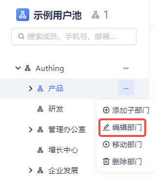
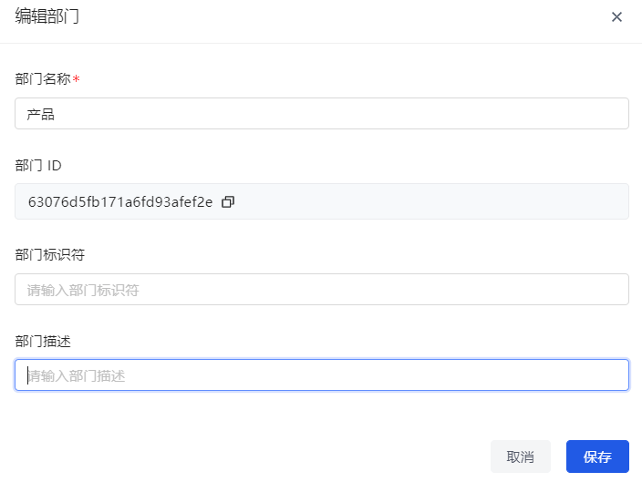
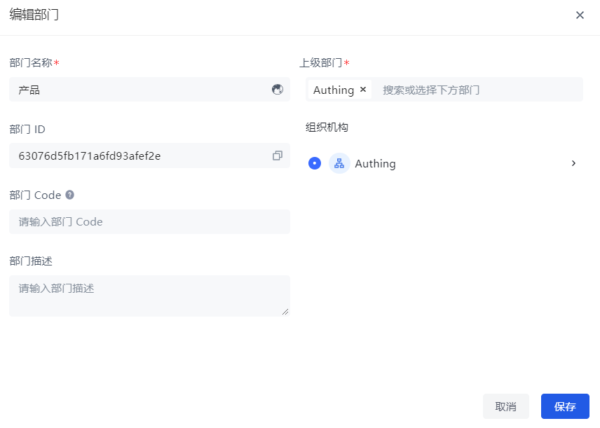

#### 旧版

1. 在组织树中点击待编辑部门后的 **编辑部门** 按钮。

2. 更新字段。

3. 点击 **确认**。

#### 新版

1. 在组织树中点击待编辑部门后的 **编辑部门** 按钮。

2. 更新字段。

::: hint-info
除了可以修改 **部门名称**、**部门 Code**、**部门描述**，还可以更改 **上级部门**。
::: 

3. 点击 **保存**。