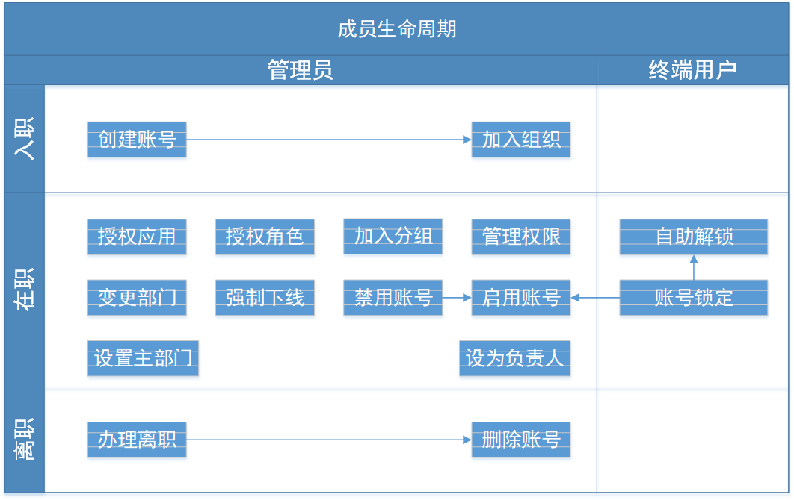

# 管理成员生命周期

<LastUpdated/>

随着公司的发展，企业内部应用和人员数量会不断增加。不断的员工入职、离职，人员组织架构频繁调整，企业内部的应用账号体系错综复杂，管理员手动操作账号的工作量陡增。同时，缺乏统一的账号管理控制方案也会给企业安全生产带来隐患，经常出现员工离职但是应用账号未关停的安全风险案例。

用自动化的 **账号生命周期管理（Lifecycle Management，简称 LCM）** 代替手动账号管理，是将企业 IT 人员从灵活用工所涉及的繁琐复杂的身份信息管理工作中解放出来的关键，同时也可以通过及时关停人员账号和减少授权错误率来提升企业整体的业务安全系数。

自动化 LCM 涵盖了员工生命周期所涉及的多个节点，从员工入职、员工在职，到员工离职，既包含了管理员的操作行为，也包含了终端用户的触发行为，具体如下：

账号生命周期管理，有以下几个优势：

- 提高生产力并降低成本；
- 降低复杂度；
- 更为安全合规。

你可以阅读了解更多 [账号生命周期管理](/concepts/account-life-cycle-management.md) 相关的内容。

## 员工入职

你可以在控制台组织机构管理页面进行员工入职操作：

### 创建账号

你可以使用手机号或者邮箱创建账号：

### 选择员工所在的部门

### 授权该员工能够访问的应用

### 给该用户授权角色

## 员工账号停用

账号停用之后，将会自动执行以下操作：

- 取消应用授权关系；
- 取消策略授权关系；
- 该账号无法登录；
- 依旧保留部门关系。

## 员工离职

员工离职之后，将会自动执行以下操作：

- 取消应用授权关系；
- 取消策略授权关系；
- 该账号无法登录；
- 移出原有部门，移动至已离职部门；

## 员工账号归档

员工账号归档之后，将会自动执行以下操作：

数据可读，但是不可修改和新增。
- 账号数据保留；
- 删除授权、部门、角色、分组关系；
- 用户池目录不可见（需要单独查询已归档账号）；
- 不能再次注册
  - 提示：用户已归档，请联系管理员解除归档。

## 删除员工账号

会彻底删除所有用户相关数据。如：

- 用户数据
- 应用授权
- 策略授权
- 部门关系
- 分组关系
- 角色关系
- 从用户池中删除
- 登录历史记录

