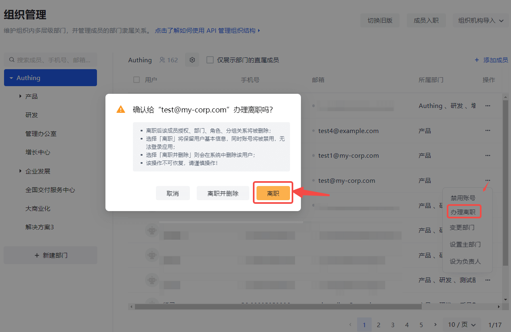

# 管理成员生命周期

<LastUpdated/>

随着公司的发展，企业内部应用和人员数量会不断增加。不断的员工入职、离职，人员组织架构频繁调整，企业内部的应用账号体系错综复杂，管理员手动操作账号的工作量陡增。同时，缺乏统一的账号管理控制方案也会给企业安全生产带来隐患，经常出现员工离职但是应用账号未关停的安全风险案例。

用自动化的 **账号生命周期管理（Lifecycle Management，简称 LCM）** 代替手动账号管理，是将企业 IT 人员从灵活用工所涉及的繁琐复杂的身份信息管理工作中解放出来的关键，同时也可以通过及时关停人员账号和减少授权错误率来提升企业整体的业务安全系数。

自动化 LCM 涵盖了员工生命周期所涉及的多个节点，从员工入职、员工在职，到员工离职，既包含了管理员的操作行为，也包含了终端用户的触发行为，具体如下：

账号生命周期管理，有以下几个优势：

- 提高生产力并降低成本；
- 降低复杂度；
- 更为安全合规。

你可以阅读了解更多 [账号生命周期管理](/concepts/account-life-cycle-management.md) 相关的内容。

## 成员入职

### 旧版

你可以在控制台组织机构管理页面进行成员入职操作：

#### 创建账号

你可以使用手机号或者邮箱创建账号：

#### 选择员工所在的部门

#### 授权该员工能够访问的应用

#### 给该用户授权角色

### 新版

你可以在控制台组织机构管理页面进行成员入职操作：

你可以使用手机号或者邮箱创建账号，在 **成员入职** 窗口输入 **姓名**、**手机号 / 邮箱**，**选择部门**：

新加入的成员会显示在用户列表中：

点击列表中新加入成员，进入用户详情页，可对其进行角色授权和应用授权：

::: img-description
角色授权
:::

::: img-description
应用授权
:::

## 变更部门

成员在职阶段，如需更换部门，可以在 **组织管理** 页面点击 **变更部门** 按钮，在打开窗口中勾选目标部门，也可以在搜索框进行搜索后勾选：

## 设置主部门

如果当前成员属于多个部门，可以设定一个为主部门。为此，只需在上面 **变更部门** 窗口右侧部门列表中点击 **设为主部门**，然后点击 **确定**。

也可在 **组织管理** 页面用户列表中点击目标成员所在行 **设置主部门** 按钮。

然后在打开窗口选择并确定主部门。

## 设为负责人

可以为不同层级的组织、部门设定负责人。要设定负责人，执行以下步骤：

1. 在左侧组织机构列表中选定组织 / 部门。

2. 在右侧当前组织 / 部门的用户列表中点击相应成员所在行 **设为负责人**。

## 移除成员

若要将某成员从当前组织 / 部门中移除，执行以下步骤：

1. 在左侧组织机构列表中选定组织 / 部门。

2. 在右侧当前组织 / 部门的用户列表中点击相应成员所在行 **移除成员**。

## 禁用员工账号

禁用账号之后，将会自动执行以下操作：

- 取消应用授权关系。
- 取消策略授权关系。
- 该账号无法登录。
- 依旧保留部门关系。

## 办理离职

员工离职之后，将会自动执行以下操作：

- 取消应用授权关系。
- 取消策略授权关系。
- 该账号无法登录。
- 移出原有部门，移动至已离职部门。

## 删除员工账号

会彻底删除所有用户相关数据。如：

- 用户数据
- 应用授权
- 策略授权
- 部门关系
- 分组关系
- 角色关系
- 从用户池中删除
- 登录历史记录

可以在 **办理离职** 时同步删除员工账号：

离职和删除账号也可以分步进行：
1. 先在 **组织管理** 页面 **办理离职**。

2. 然后在 **成员管理** 中 **删除账号**。

