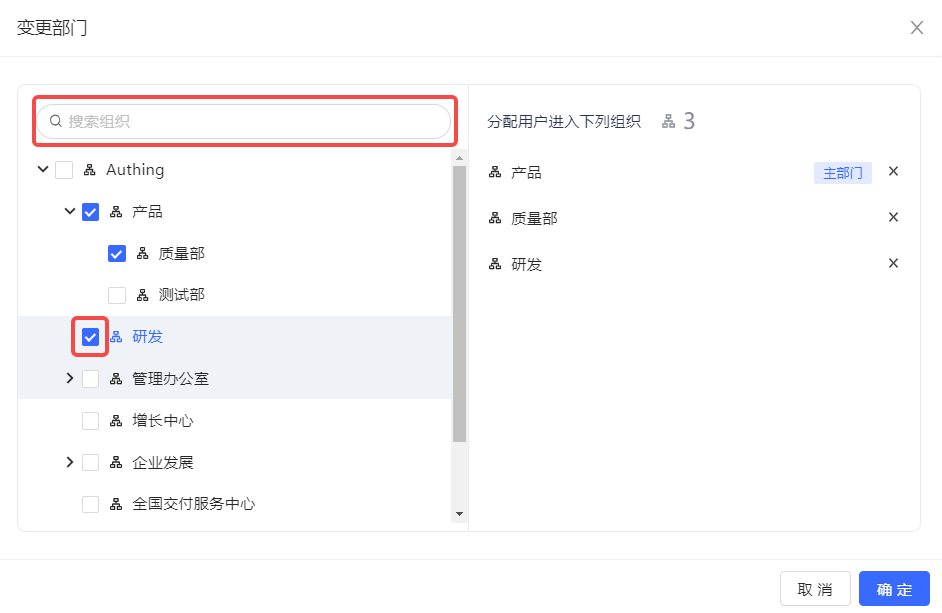
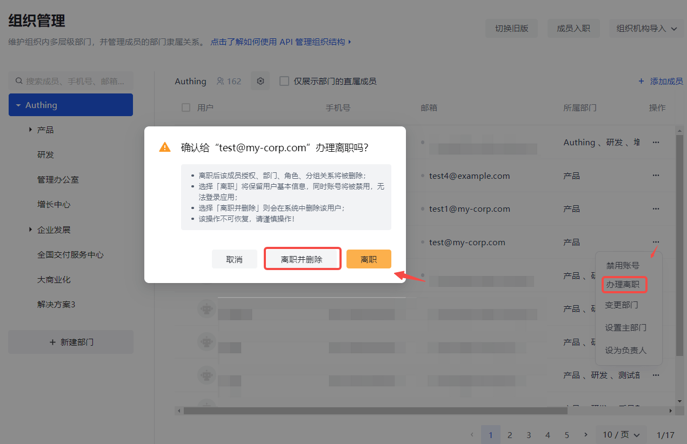

# 管理成员生命周期

<LastUpdated/>

随着公司的发展，企业内部应用和人员数量会不断增加。不断的员工入职、离职，人员组织架构频繁调整，企业内部的应用账号体系错综复杂，管理员手动操作账号的工作量陡增。同时，缺乏统一的账号管理控制方案也会给企业安全生产带来隐患，经常出现员工离职但是应用账号未关停的安全风险案例。

用自动化的 **账号生命周期管理（Lifecycle Management，简称 LCM）** 代替手动账号管理，是将企业 IT 人员从灵活用工所涉及的繁琐复杂的身份信息管理工作中解放出来的关键，同时也可以通过及时关停人员账号和减少授权错误率来提升企业整体的业务安全系数。

自动化 LCM 涵盖了员工生命周期所涉及的多个节点，从员工入职、员工在职，到员工离职，既包含了管理员的操作行为，也包含了终端用户的触发行为，具体如下：

账号生命周期管理，有以下几个优势：

- 提高生产力并降低成本。
- 降低复杂度。
- 更为安全合规。

你可以阅读了解更多 [账号生命周期管理](/concepts/account-life-cycle-management.md) 相关的内容。

## 旧版组织管理

### 成员入职

你可以在控制台组织机构管理页面进行成员入职操作：

#### 创建账号

你可以使用手机号或者邮箱创建账号：

#### 选择组织

你可以为新加入员工指定所在部门：

#### 授权应用

你可以为新加入员工授权可以访问的应用：

#### 授权角色

你可以给该员工授权角色，从而该成员自动继承赋予该角色的所有权限：

### 查看详情

点击相应组织层级下某个员工的 **查看详情** 按钮可以跳转至该用户在 **成员管理** 中的详情页面（对于 B2B 和 B2C 场景，跳转至 **用户列表** 页面）。

::: img-description
查看详情按钮
:::

你可以在员工详情页面查看用户信息，为该员工授予角色，授权应用，及查看该员工的应用访问日志。

::: img-description
查看员工详情
:::

### 锁定 / 解锁账号

你可以临时锁定某个员工的账号。锁定后，该用户无法登录应用直到解锁。

::: img-description
锁定账号
:::

::: img-description
解锁账号
:::

### 变更部门

成员在职阶段，如需更换部门，可以在 **组织管理** 页面点击该员工所在行 **变更部门** 按钮，在打开窗口中勾选目标部门，也可以在搜索框进行搜索后勾选：

你也可以在相应层级组织下勾选成员列表中成员，然后点击成员列表上方的 **变更部门** 按钮，打开 **变更部门** 窗口进行变更。

### 设置主部门

如果当前成员属于多个部门，可以设定一个为主部门。为此，可以在 **组织管理** 页面用户列表中点击目标成员所在行 **设置主部门** 按钮：

然后在打开窗口选择并确定主部门：

### 禁用 / 启用员工账号

在出现账号被盗等紧急情况，需要临时禁用员工账号。可以在 **成员管理** 页面（对于 B2B 和 B2C 场景是 **用户列表** 页面）点击该员工所在行 **禁用账号** 按钮。

禁用账号之后，将会自动执行以下操作：

- 取消应用授权关系。
- 取消策略授权关系。
- 该账号无法登录。
- 依旧保留部门关系。
- 仍可以编辑用户信息。

在确认安全后，可以在同一个路径下 **启用账号**。则账号权限恢复正常。

### 办理离职

你可以在 **组织管理** 页面为员工办理离职。

员工离职之后，将会自动执行以下操作：

- 取消应用授权关系。
- 取消策略授权关系。
- 该账号无法登录。
- 移出原有部门，移动至已离职部门。
- 保留用户基本信息，删除该员工部门、角色、分组关系。

::: hint-info
该操作不可恢复，请谨慎操作！
:::

### 删除账号

在给某员工办理离职后，**成员管理** 下该员工的 **删除账号** 按钮被激活：

删除员工账号会彻底删除所有用户相关数据。如：

- 用户数据
- 应用授权
- 策略授权
- 部门关系
- 分组关系
- 角色关系
- 从用户池中删除
- 登录历史记录

## 新版组织管理

### 成员入职

你可以在控制台组织机构管理页面进行成员入职操作：

你可以使用手机号或者邮箱创建账号，在 **成员入职** 窗口输入 **姓名**、**手机号 / 邮箱**，**选择部门**：

新加入的成员会显示在用户列表中：

点击列表中新加入成员，进入用户详情页，可对其进行角色授权和应用授权：

::: img-description
角色授权
:::

::: img-description
应用授权
:::

### 禁用 / 启用员工账号

在出现账号被盗等紧急情况，需要临时禁用员工账号。

禁用账号之后，将会自动执行以下操作：

- 取消应用授权关系。
- 取消策略授权关系。
- 该账号无法登录。
- 依旧保留部门关系。
- 仍可以编辑用户信息。

可以在两个路径下禁用 / 启用员工账号。

#### 在组织管理下禁用 / 启用账号

在 **组织管理** 页面点击该员工所在行 **禁用账号** 按钮，并在弹窗中进行确认。

你也可以在同路径下重新启用该账号：

#### 在成员管理下禁用 / 启用账号

可以在 **成员管理** 页面（对于 B2B 和 B2C 场景是 **用户列表** 页面）点击该员工所在行 **禁用账号** 按钮。

在确认安全后，可以在同一个路径下 **启用账号**。则账号权限恢复正常。

### 变更部门

成员在职阶段，如需更换部门，可以在 **组织管理** 页面点击 **变更部门** 按钮，在打开窗口中勾选目标部门，也可以在搜索框进行搜索后勾选，变更部门会显示在窗口右侧列表中：

### 设置主部门

如果当前成员属于多个部门，可以设定一个为主部门。为此，只需在上面 **变更部门** 窗口右侧部门列表中点击 **设为主部门**，然后点击 **确定**：

也可在 **组织管理** 页面用户列表中点击目标成员所在行 **设置主部门** 按钮：

然后在打开窗口选择并确定主部门：

### 设为负责人

可以为不同层级的组织 / 部门设定负责人。要设定负责人，执行以下步骤：

1. 在左侧组织机构列表中选定组织 / 部门。

2. 在右侧当前组织 / 部门的用户列表中点击相应成员所在行 **设为负责人**。

则所选成员成为该 组织 / 部门的负责人。

### 办理离职

可以在 **组织管理** 页面为员工办理离职。

员工离职之后，将会自动执行以下操作：

- 取消应用授权关系。
- 取消策略授权关系。
- 该账号无法登录。
- 移出原有部门，移动至已离职部门。

### 删除账号

可以在 **办理离职** 时同步删除员工账号：

离职和删除账号也可以分步进行：

1. 先在 **组织管理** 页面 **办理离职**。

2. 然后在 **成员管理** 中 **删除账号**。

会彻底删除所有用户相关数据。如：

- 用户数据
- 应用授权
- 策略授权
- 部门关系
- 分组关系
- 角色关系
- 从用户池中删除
- 登录历史记录