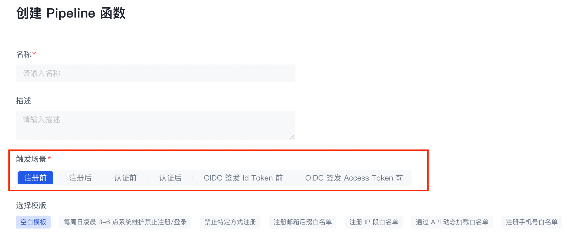
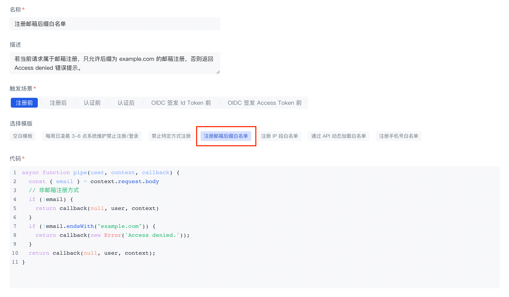
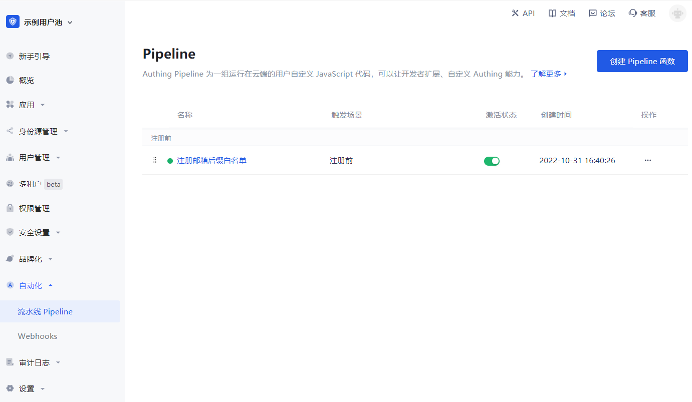
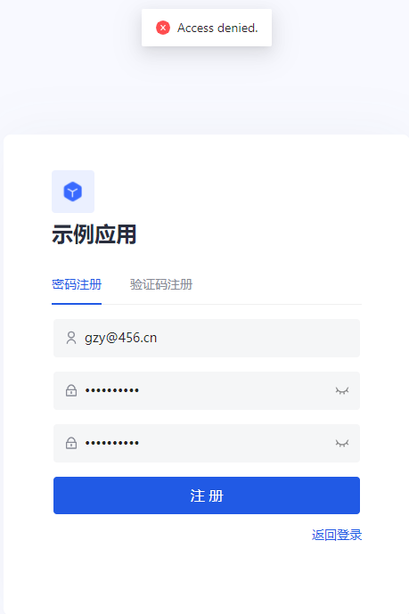
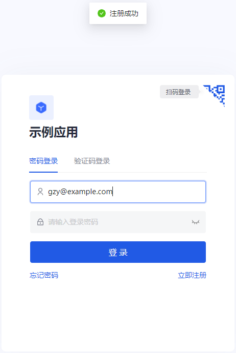

---
meta:
  - name: description
    content: 创建你的第一个 Pipeline 函数
---

# 创建你的第一个 Pipeline 函数

<LastUpdated/>

Pipeline 函数是 {{$localeConfig.brandName}} 认证流程中执行的自定义 JavaScript 代码。借助 Pipeline，开发者可以轻易自定义和扩展
{{$localeConfig.brandName}} 的能力。

## 第一步：选择一个 Pipeline 模版

{{$localeConfig.brandName}} 提供了很多开箱即用的模版，帮助你快速上手。

::: hint-success
你也可以在这里查看 Pipeline 模版函数列表：[https://github.com/authing/pipeline](https://github.com/authing/pipeline)。同时欢迎你发挥才智，为我们贡献 Pipeline 模版函数。
:::

1. 选择某个触发场景：

2. 选择访问控制中的 **注册邮箱后缀白名单**。

## 第二步：创建一个 Pipeline 函数

1. 这里我们设置的域名白名单是 `example.com`，你也可以自定义。

2. 点击左下角的 **创建** 按钮，我们将此函数部署到云端，需要一定时间，请耐心等待。

页面返回到 Pipeline 函数列表页，可以看到我们刚刚添加的 Pipeline 函数。

::: hint-success
如果你有多个 Pipeline 函数，可以拖拽最左侧按钮进行排序。
:::

## 第三步：验证白名单是否有效

1. 首先使用非 `example.com` 后缀的邮箱注册，系统提示「Access Denied.」提示，这是我们在自定义 Pipeline 函数中自己指定的提示信息。

2. 之后再使用后缀为 `example.com` 的邮箱注册，注册成功！

## 第四步：接下来你可能还需要

- 详细阅读 [Pipeline 函数开发指南](pipeline-function-api-doc.md)。
- 了解可以在 pipe 函数中获取那些请求信息：[user 对象](user-object.md) 和 [context 对象](context-object.md)。
- 了解如何 [在 Pipeline 中使用环境变量](env.md)。
- 了解在 Pipeline 函数中 [可用的 Node Modules](available-node-modules.md)。你可以直接使用 [Node.js/JavaScript](/reference/sdk-for-node/)！
- 我们提供了很多丰富的 [Pipeline 函数模板](https://github.com/authing/pipeline)。
- 我们还提供了方便的 [在线调试手段](./how-to-debug.md)，方便开发者在线调试。
