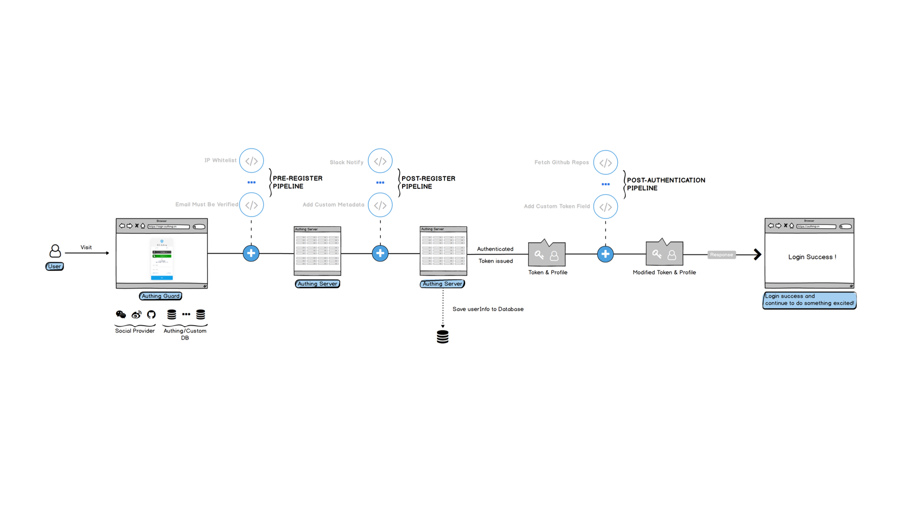

# 自定义认证流程

<LastUpdated/>

Authing Pipeline 为一组运行在云端的用户自定义 JavaScript 代码，可以让开发者扩展、自定义 Authing 能力。

Authing Pipeline 函数均可用户自定义，同时我们还提供了丰富的函数模版 (Opens New Window)，帮助开发者快速上手开发。

同时 Pipeline 为一组函数，和普通 Hooks 的区别在于，Pipeline 整个流程中的函数数据可以相互传递，实现工业流水线效果。这种设计模式，可以使得开发者的自定义函数更加模块化，便于管理。

Authing Pipeline 后端使用 serverless 架构，所有的用户自定义代码均运行在云端，保证不同租户之间的隔离性，同时能弹性伸缩，既保证了安全性，又提升了运行效率。

借助 Authing Pipeline，开发者可以实现以下功能：

* 白名单机制：如注册邮箱后缀白名单、注册 IP 白名单等。

* 事件通知：如用户注册之后发送群通知、用户登录 IP 异常通知等。

* 权限控制：如用户登录之后根据邮箱将其加入某用户组等。

* 自定义 token：如往 token 中加入自定义字段等。

* ... 还有更多，想象空间是无穷的。
