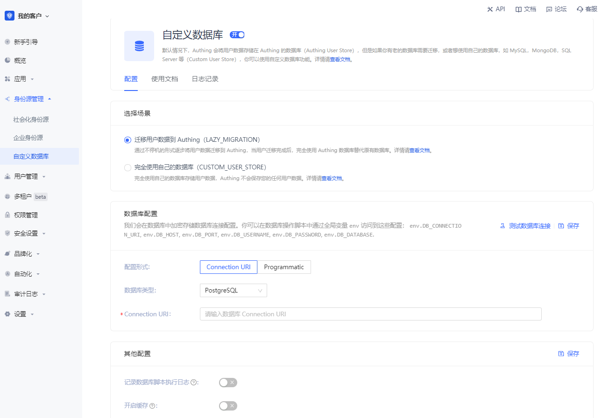

# 自定义数据库

使用自定义数据库可以满足以下场景的需求：

* 使用自己的数据库保存用户数据：完全使用自己的数据库保存用户数据。这种模式下，Authing 将不会存储任何用户信息。

* 惰性迁移用户到 Authing：这种迁移用户的模式称为惰性迁移（Lazy Migration）。简单来说原理如下：最开始所有的原始用户数据在您的数据库。当用户第一次尝试在 Authing 登录时，Authing 会通过配置的自定义数据库脚本在您的数据库查找并验证用户。如果成功，将该用户迁移到 Authing 中。该用户第二次登录时，将使用  Authing 的数据库对其进行验证。当所有的用户都至少登录一次时，意味着迁移上云任务完成。

您可以通过以下方式配置自定义数据库：前往 Authing 控制台的 **身份源管理->自定义数据库** 页面开启自定义数据库连接。

