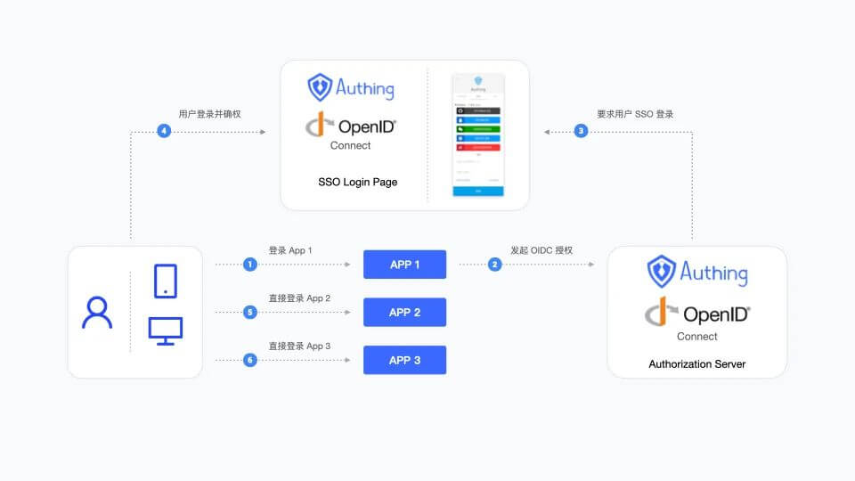
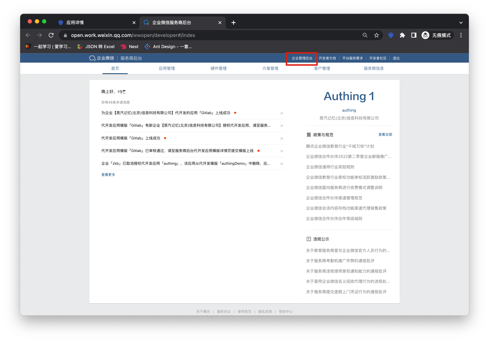
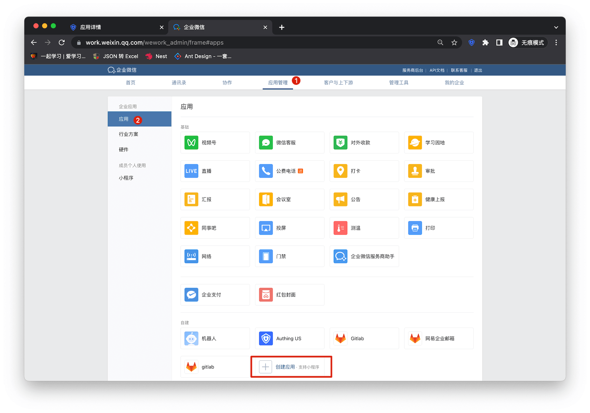
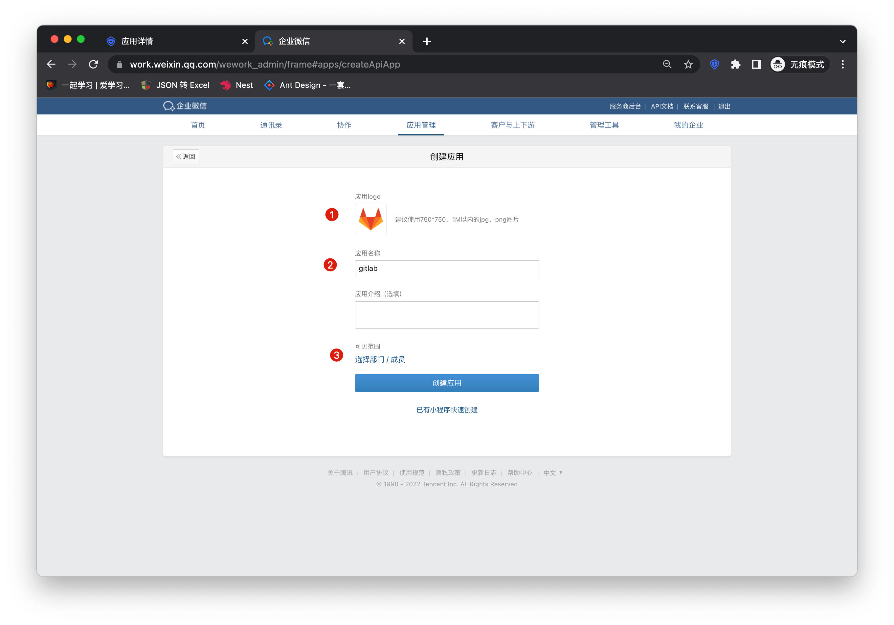
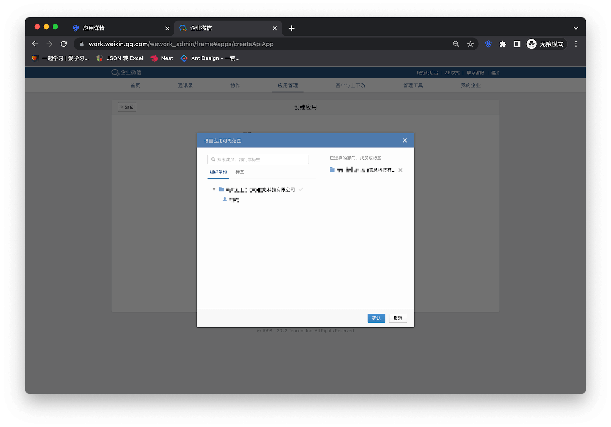
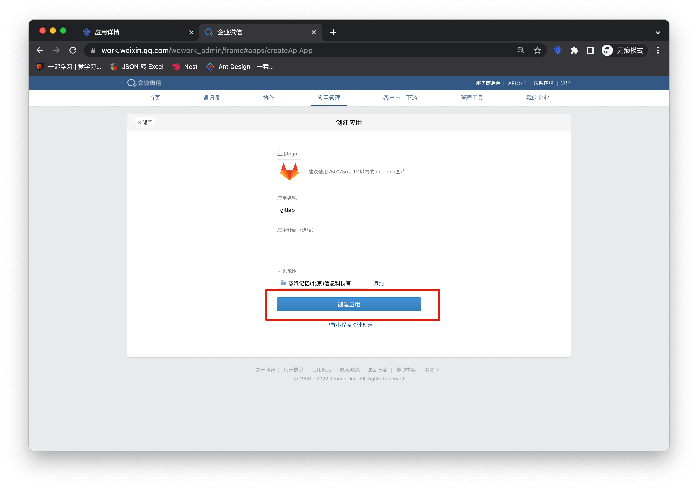
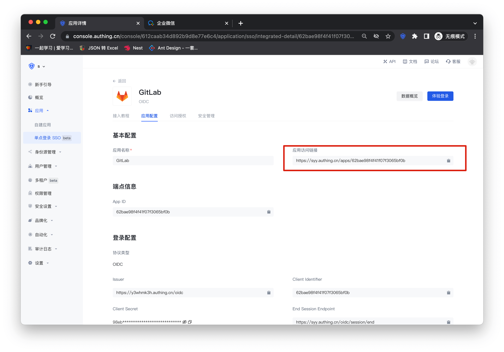
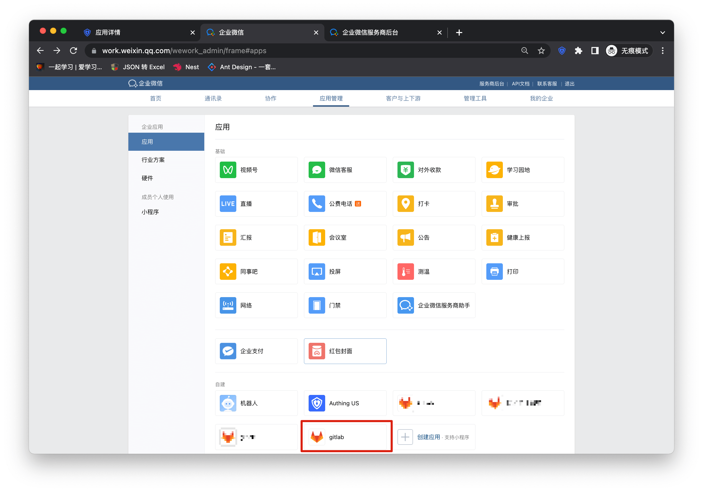
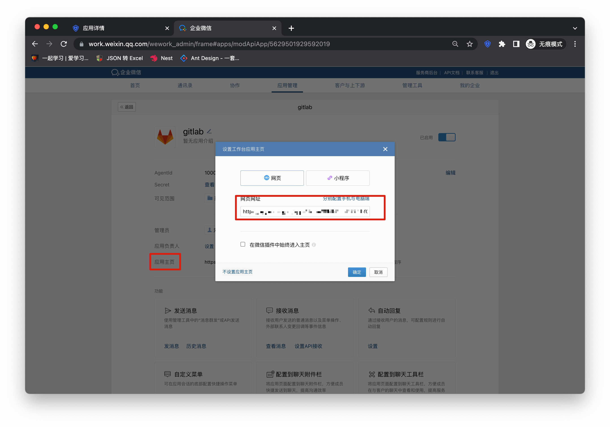

# 企业微信 SSO 方案

<LastUpdated/>

传统的身份系统往往是由各种解决方案拼凑而成的，“身份数据”相互分离。统一账户管理的需求越发频繁且必要，通过使用集中的身份管理平台，可以极大改善用户的登录体验和 IT 办公效率，并有效提升访问安全。

我们经常被开发者问到，如何实现通过单一身份源、同一平台登录所有应用，并统一进行细颗粒度的权限管理。以企业微信作为企业单一身份源快速添加 Gitlab 为例，为大家提供一个极简的统一账户管理的解题思路。

## 设计思路

## 如何实现

### 步骤一：将企业微信配置为 Authing 身份源

具体企微的身份源配置操作可见文档，[企业微信自建应用扫码（代开发模式）](https://docs.authing.cn/v2/guides/connections/enterprise/wecom-agency-qrconnect/)

### 步骤二：以 GitLab 为例，使用企微账号单点登录 GitLab

### 集成应用

1. 进入[企业微信服务商后台](https://open.work.weixin.qq.com/wwopen/login)，点击「企业管理后台」

2. 点击「创建应用」

3. 在表单中填入应用名称等基础配置信息

4. 选择应用可见范围

5. 点击「创建应用」，完成应用创建

6. 进入 Gitlab 配置详情页，复制应用访问链接

7. 回到企微管理后台进入刚创建应用的详情页

8. 填写应用主页网页网址

### 自建应用

对于自建应用，你需要进行如下操作：

1. 创建自建应用

> 首先需要创建自建应用并完成配置，创建应用参考 [如何创建自建应用](/guides/app-new/create-app/create-app.md)

2. 用户需要进入配置好的自建应用详情页，将其认证地址进行复制

3. 填写应用主页网页网址，其他与集成应用一致即可

