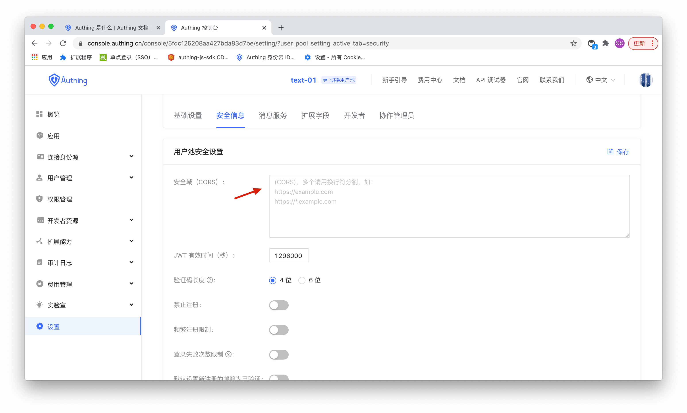

# 配置 Web 安全域

对于 Web 应用来说，存在 userPoolId／secret 被盗取的风险，所以我们需要做一些特别的防御措施。关键点是，我们要能够保证其他人获取到你的 userPoolId ，也无法直接使用你的服务器资源。Web 端可以通过 Web 安全域名 来对请求来源做限制，可以简单的防御住 Web 的服务器资源盗取。

设置「Web 安全域名」后，仅可在该域名下通过 JavaScript SDK 调用服务器资源。注意：域名配置策略与浏览器域安全策略一致，要求域名协议、域和端口号都需严格一致，不支持子域和通配符，否则会导致访问被禁止。举例说明一下域名的区别：

```
// 跨域
www.a.com:8080
www.a.com

// 跨域
www.a.com:8080
www.a.com:80

// 跨域
a.com
www.a.com

// 跨域
xxx.a.com
www.a.com

// 不同协议，跨域
http:
https:

```

这样就可以防止其他人通过外网其他地址盗用你的服务器资源。但是要注意，Web 安全域名所能达到的目的是防御恶意部署，而不是防御伪造脏数据（恶意用户通过绑定 host 方式还是有可能访问到应用的数据），所以要想对数据进行更多细粒度的控制，需要配合 ACL 来使用。

在 WebView 中使用，建议通过 WebView 去加载一个部署好的、有域名的 Web，然后缓存在本地，这样可以通过 Web 安全域名来做限制。

如果在前端使用 JavaScript SDK，当你打算正式发布出去的时候，请务必配置 Web 安全域名，方法是进入 控制台 > 设置 >安全信息> 安全域（CORS）。


