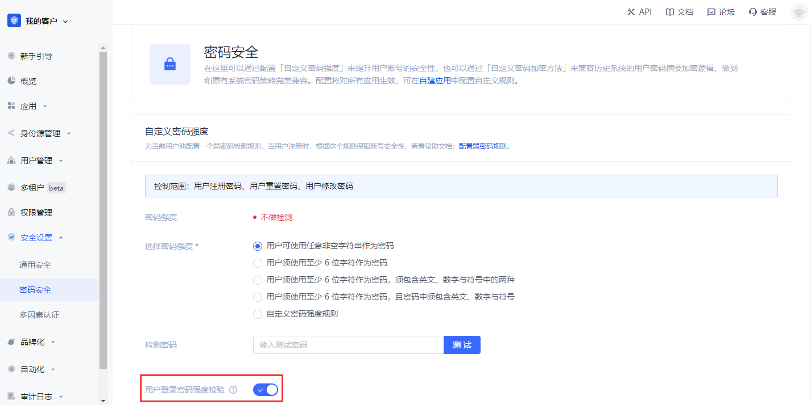
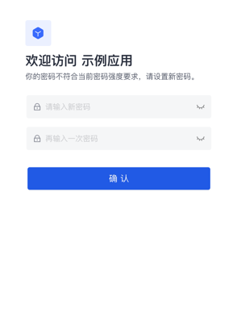
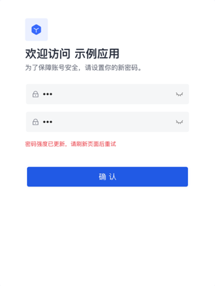

# 密码安全

<LastUpdated/>

## 配置用户池密码强度方式

路径：**安全设置->密码安全**

::: hint-info
免费版暂不支持此功能。
::: 

密码关系着企业和用户的信息安全。系统会要求用户在注册、修改密码时，密码必须满足一定的复杂度。

此外，企业可能包含不同的用户群体：内部员工、外包员工、合作伙伴等，不同群体需要不同的密码规则。{{$localeConfig.brandName}} 支持对不同的主体配置差异化的密码策略，以及通过上下移动策略顺序调整执行优先级。同时，也支持通过 **自定义密码加密方法** 来兼容历史系统的用户密码摘要加密逻辑，做到和原有系统密码策略完美兼容。

::: hint-info
配置将对所有应用生效。
::: 

<table>
<tr>
<th>序号</th>
<th>元素</th>
<th>说明</th>
</tr>

<tr>
<td valign="center">1</td>
<td>创建密码策略</td>
<td>
<ul>
<li>点击该按钮可新建密码策略。</li>
<li>最多可创建 30 条密码策略（含默认策略）；达到上限后，该按钮置灰。</li>
</ul></td>
</tr>

<tr>
<td valign="center">2</td>
<td>密码策略</td>
<td>展示密码策略列表，包括系统默认策略及管理员所建策略。</td>
</tr>

<tr>
<td valign="center">3</td>
<td>自定义密码加密方法</td>
<td>兼容历史系统的用户密码摘要加密逻辑。</td>
</tr>

<tr>
<td valign="center">4</td>
<td>执行顺序</td>
<td>由上至下执行密码策略，可通过按住左侧图标（鼠标悬浮时可见）拖动调整策略的执行顺序。</td>
</tr>

<tr>
<td valign="center">5</td>
<td>状态</td>
<td>新建一条密码策略后，该策略默认开启。可根据需要关闭，关闭后，当前策略不会执行。</td>
</tr>

<tr>
<td valign="center">6</td>
<td>删除</td>
<td>点击 <b>操作</b> 列更多按钮可删除当前选中的密码策略。 <b>注意：</b> 
<ul>
<li>删除后将无法恢复，请谨慎操作！</li>
<li>如当前策略的应用主体被全部删除，则系统会自动删除该策略。</li>
</ul>
</td>
</tr>

<tr>
<td valign="center">7</td>
<td>默认策略</td>
<td>
<ul>
<li>默认策略对所有用户主体生效，全局适用。</li>
<li>默认不检测密码强度。</li>
<li>可点击进入策略详情修改 <b>密码强度</b> 和 <b>密码轮换策略</b>。</li>
<li>默认策略置于策略列表底部，不可调整顺序，不可关闭，不可删除。</li>
</ul>
</td>
</tr>
</table>

## 密码策略

要为主体配置密码策略，执行以下步骤：

1. 在 **密码安全** 页点击页面右上角 **创建密码策略** 按钮。 打开 **创建密码策略** 页面。

2. 在 **基础信息** 模块填写 **策略名** 和 **描述**。

::: hint-info
密码策略名必须唯一。
**描述** 最多 200 字符。
::: 

3. 在 **策略应用主体** 模块选择 **策略应用主体类型**。

::: hint-info
可以按照 **用户**、**组织机构**（toE可选）、**分组** 来筛选主体。
::: 

4. 选择 **策略应用主体**。

::: hint-info
* **用户**、**组织机构**（toE可选）和 **分组** 的数据源分别来自 **用户管理** 中的 **用户列表**、**组织机构**（toE可选）和 **用户组管理**。
* 支持选择同一类型下的多个主体。
* 如已选主体在数据源中被删除，则该主体所在密码策略会联动删除该主体。
::: 

5. 选择适用的密码强度（**不作检测**、**低强度**、**中强度**、**高强度**、**自定义强度**）。

::: hint-info
* 此处设置的密码强度适用于用户注册密码、用户重置密码和用户修改密码。
* 默认不检测密码强度。
* 对于自定义密码强度规则，需要在下方定义正则表达式，并输入密码错误提示。
::: 

6. 在 **检测密码** 字段输入密码，检测该密码是否符合上方设置的密码强度规则。 如符合，在输入框后显示绿色对钩；如不符合，在输入框后显示错误提示，需根据提示进行修改。

7. 开启 **用户登录密码强度检验** 开关（默认关闭）。

::: hint-info
开启后，在设置了较高密码强度规则的情况下，登录较低强度密码的账号，跳转进入密码修改页。
::: 

::: hint-info
若用户在修改密码时，管理员同时提高了密码强度，页面会提示用户刷新页面重试。
:::

8. 设置密码轮换策略（默认关闭）。

* **强制修改密码周期**：超过选定周期，用户登录将强制修改密码。

* **密码到期提示**：临期内每天给用户发送一次邮件提醒，直到用户成功修改密码。

::: hint-info
* 用户登录必须修改密码。
* 管理员可以在 **品牌化->消息设置** 中修改邮件模板。
:::

* **密码不可重复周期**：选定周期内，用户修改密码、重置密码时，历史使用过的密码不可以再次使用。

9. 点击 **创建**。

新建的密码策略会显示在 **密码安全->密码策略** 列表顶部。

::: hint-info
* 修改已有密码策略时，下方为 **保存** 和 **重置** 按钮。
* 点击 **重置**，所有已修改未保存的配置将恢复至上一次保存后的状态。
::: 

## 自定义密码加密方法

有关详情，请参阅 [配置自定义密码函数]( /guides/extensibility/custom-password-script.md)。
