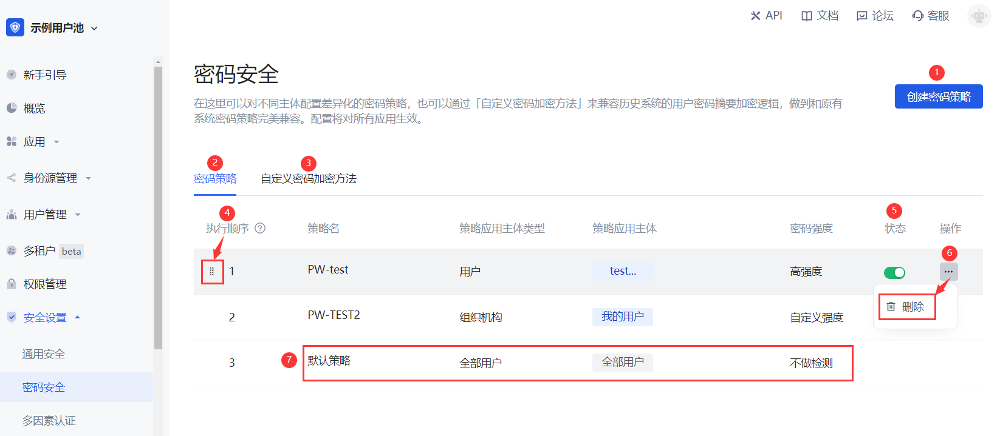

# 密码安全

<LastUpdated/>

路径：**安全设置->密码安全**

::: hint-info
有关支持「密码安全」功能各项权益的 {{$localeConfig.brandName}} 用户池版本信息，请查看 [官网「价格」页](https://authing.cn/pricing)。如你的版本不支持此权益，且想试用，可开通体验期。有关体验期介绍及开通方式，请查看 [体验期](/guides/basics/trial/README.md)。
::: 

密码关系着企业和用户的信息安全。系统会要求用户在注册、修改密码时，密码必须满足一定的复杂度。

此外，企业可能包含不同的用户群体：内部员工、外包员工、合作伙伴等，不同群体需要不同的密码规则。{{$localeConfig.brandName}} 支持对不同的主体配置差异化的密码策略，以及通过上下移动策略顺序调整执行优先级。同时，也支持通过 **自定义密码加密方法** 来兼容历史系统的用户密码摘要加密逻辑，做到和原有系统密码策略完美兼容。

::: hint-info
配置将对所有应用生效。
::: 

<table>
<tr>
<th>序号</th>
<th>元素</th>
<th>说明</th>
</tr>

<tr>
<td valign="center">1</td>
<td>创建密码策略</td>
<td>
<ul>
<li>点击该按钮可新建密码策略。</li>
<li>最多可创建 30 条密码策略（含默认策略）；达到上限后，该按钮置灰。</li>
</ul></td>
</tr>

<tr>
<td valign="center">2</td>
<td>密码策略</td>
<td>展示密码策略列表，包括系统默认策略及管理员所建策略。</td>
</tr>

<tr>
<td valign="center">3</td>
<td>自定义密码加密方法</td>
<td>兼容历史系统的用户密码摘要加密逻辑。</td>
</tr>

<tr>
<td valign="center">4</td>
<td>执行顺序</td>
<td>由上至下执行密码策略，可通过按住左侧图标（鼠标悬浮时可见）拖动调整策略的执行顺序。</td>
</tr>

<tr>
<td valign="center">5</td>
<td>状态</td>
<td>新建一条密码策略后，该策略默认开启。可根据需要关闭，关闭后，当前策略不会执行。</td>
</tr>

<tr>
<td valign="center">6</td>
<td>删除</td>
<td>点击 <b>操作</b> 列更多按钮可删除当前选中的密码策略。 <b>注意：</b> 
<ul>
<li>删除后将无法恢复，请谨慎操作！</li>
<li>如当前策略的应用主体被全部删除，则系统会自动删除该策略。</li>
</ul>
</td>
</tr>

<tr>
<td valign="center">7</td>
<td>默认策略</td>
<td>
<ul>
<li>默认策略对所有用户主体生效，全局适用。</li>
<li>默认不检测密码强度。</li>
<li>可点击进入策略详情修改 <b>密码强度</b> 和 <b>密码轮换策略</b>。</li>
<li>默认策略置于策略列表底部，不可调整顺序，不可关闭，不可删除。</li>
</ul>
</td>
</tr>
</table>