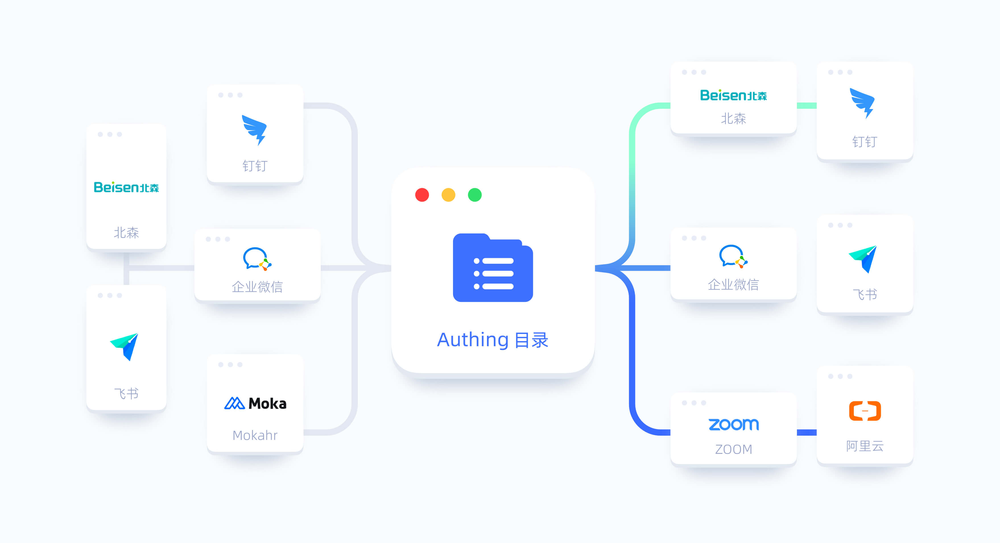

# 同步中心概览

<LastUpdated/>

## 什么是同步中心?

为了解决员工目录散落在多个系统中，难以统一、高效地维护、管理的问题，{{$localeConfig.brandName}} 推出同步中心。同步中心连接上下游数据源，实现组织信息和成员信息的同步。同步中心可以使企业管理者免于在各个系统中手动维护应用账号， 真正实现 **一处管理、处处同步**，既提高了员工生命周期流转效率，又帮助企业降低了运维成本。

## 同步中心使用场景

本章节给出示例，诠释同步中心如何解决业务场景中数据同步的需求。

某公司采购了一套 HR 系统，用于员工的生命周期管理，又使用飞书、企业微信、钉钉作为企业级 IM 工具，同时采购了阿里云、Jira、Zoom、GitHub Enterprise、泛微等业务应用（以下简称「下游应用」）。
HR 同学需要在员工入职时，手动在各个 IM 工具、业务应用中为新员工创建账号；员工离职时，再手动删除相关账号。

这是一个非常繁琐且易出错的过程。借助同步中心，你可以通过自动化的方式完成以下操作：

* 在 HR 系统中入职一名员工，自动在所有下游应用创建相应的账号。
* 在 HR 系统中离职一名员工，自动将其在下游所有应用的账号冻结或删除。
* 在 HR 系统中设置员工 A 为员工 B 的直属上级，同步至下游应用时，员工 A 依然是员工 B 的直属上级，确保审批流关系是正常的。

## 什么是同步身份源？

同步身份源存储了所有部门、员工的信息，且是一个最根本、可信的用户目录。管理员可以将任意的上游应用作为同步身份源，也可以将 {{$localeConfig.brandName}} 本身作为同步身份源，最终所有下游应用会依据同步身份源的状态作为自身的最新状态。

## 什么是上游同步？

上游同步就是将其他同步身份源的数据同步至 {{$localeConfig.brandName}}。例如将企业微信的数据同步至 {{$localeConfig.brandName}}，那么企业微信就是一个上游应用，将上游数据同步至 {{$localeConfig.brandName}} 的操作就是 **上游同步**。

## 什么是下游同步？

下游同步就是将 {{$localeConfig.brandName}} 的数据同步至其他应用。例如将 {{$localeConfig.brandName}} 的数据同步至企业微信，那么企业微信就是一个下游应用，将 {{$localeConfig.brandName}} 数据同步至企业微信的操作就是 **下游同步**。

## 用户数据同步最佳实践

{{$localeConfig.brandName}} 为客户提供组织和用户数据同步场景下的最佳实践：

* 无需代码，在控制台简单配置即可。
* 自定义字段映射，灵活控制同步数据内容。
* 支持手动同步、定时同步、实时同步三种同步时机。
* 支持企业微信、钉钉、飞书等常见应用。

**以上功能无法满足你的需求？请联系 [销售顾问](sales@authing.cn) 或官网客服了解更多详情。**

以下是同步中心相关操作，你可以阅读以下详细操作说明：

* [创建同步任务](/guides/sync-new/create-sync-new/README.md)：开始创建你的第一个同步任务。

* [执行同步任务](/guides/sync-new/perform-sync-new.md)：执行你创建的同步任务并查看执行结果。

* [处理删除保护](/guides/sync-new/risky-operation.md)：{{$localeConfig.brandName}} 中删除用户或组织会触发删除保护，需要手动确认。此部分描述下游同步中删除操作的处理方法。

* [维护同步任务](../sync-new/maintain-sync.md)：执行同步任务维护操作，包括查看同步任务执行状态，修改同步任务信息，启用 / 禁用同步任务，删除同步任务等。

* [常见问题](/guides/faqs/sync.md)：提供同步中心相关常见问题及解答。