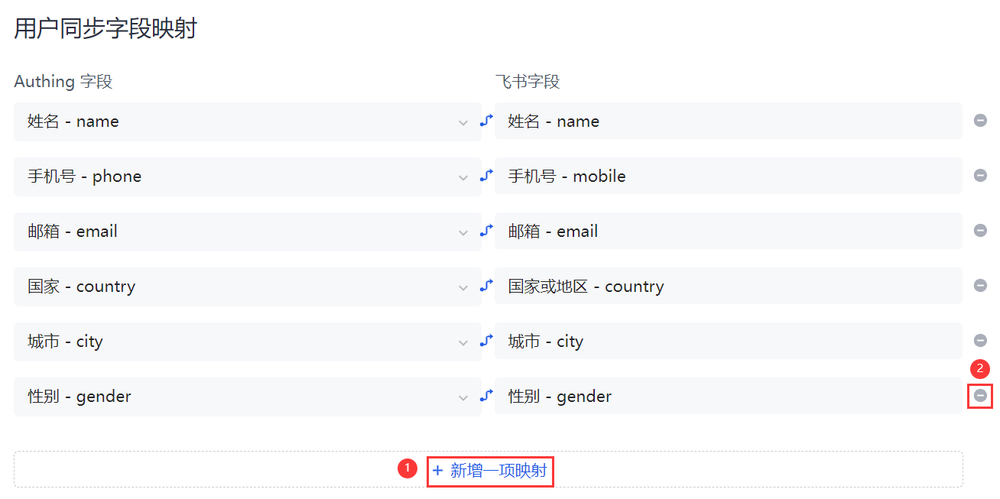

# 配置同步字段映射

<LastUpdated/>

自定义字段映射用于用户自主选择需要同步的数据。支持用户在此模块增加及删除字段映射。

## 新增字段映射

要新增字段映射，执行以下步骤：

1. 点击 **新增一项映射**（上图标号 1）。 在 **用户同步字段映射** 列表底部新增一条记录。

2. 分别选择应用字段和 **Authing 字段**。

## 删除字段映射

要删除字段映射，执行以下步骤：

1. 点击待删除的字段映射所在行尾 **'—'** 按钮（标号 2）。

2. 确认删除。

::: hint-info
* 如果是新建的同步任务，完成所有配置后点击 **创建** 即可。
* 如果是 **修改** 已创建的同步任务，修改之后要点击 **保存**。
::: 