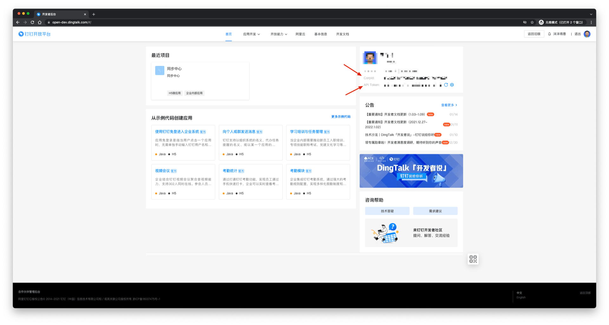
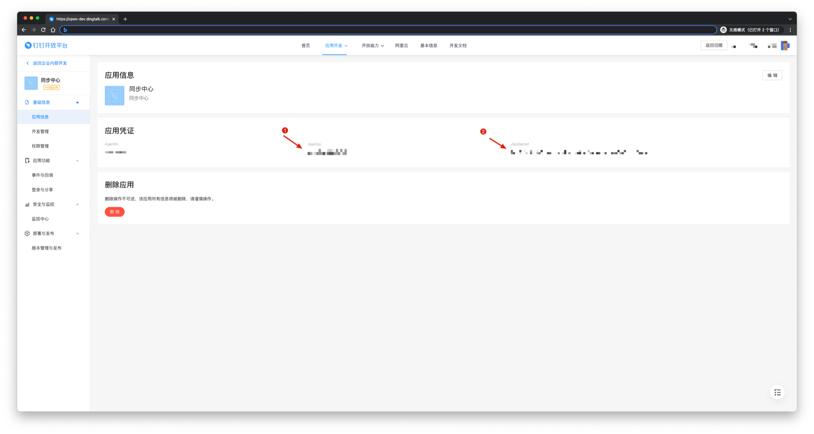
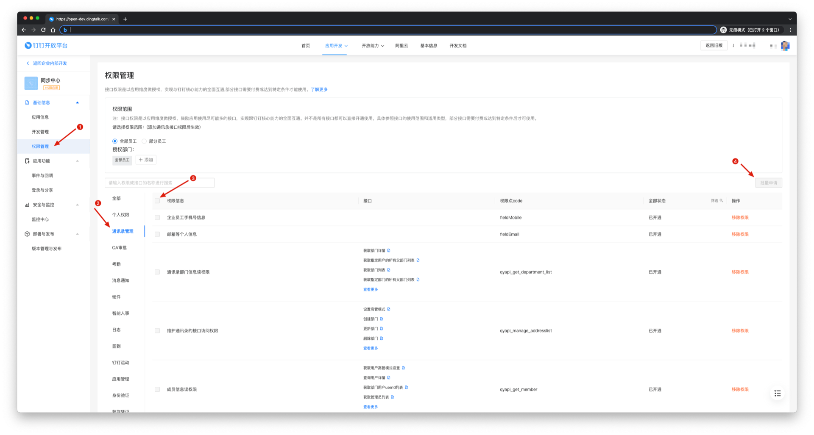
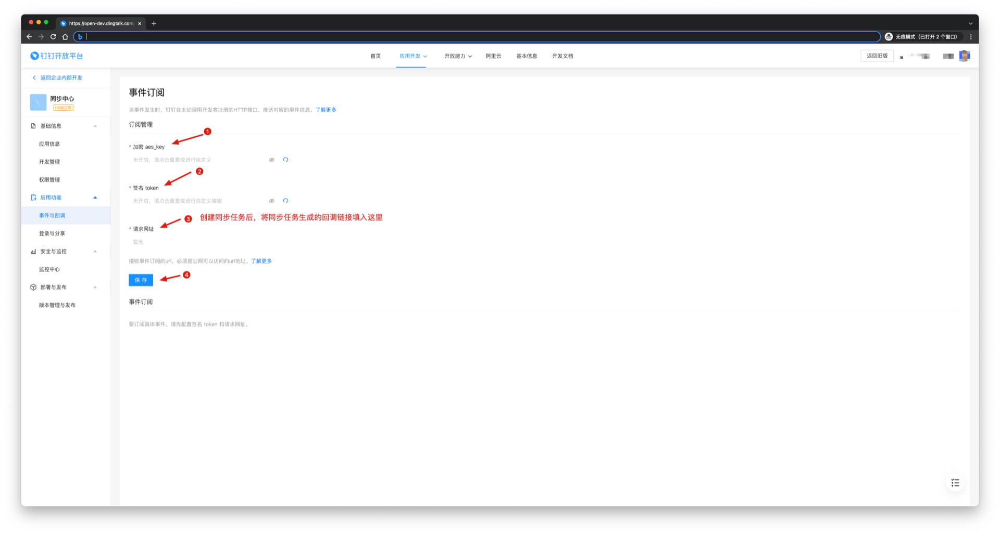
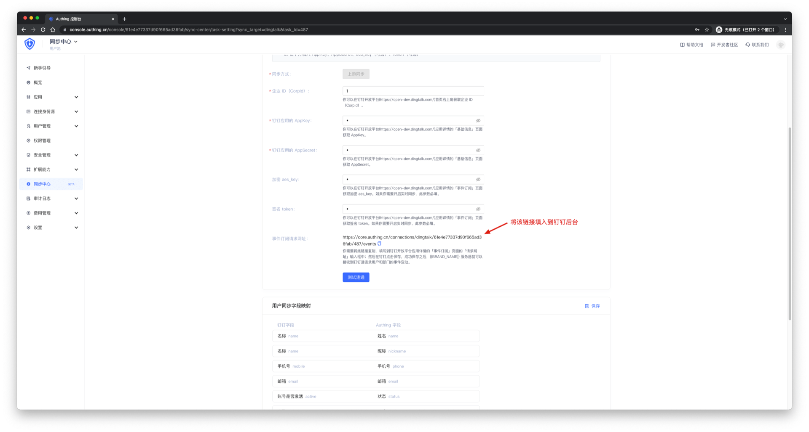

# 获取钉钉配置项和权限

<LastUpdated/>

1. 进入 [钉钉后台管理页面](https://open-dev.dingtalk.com/#/)。

2. 进入 **首页**，获取 **CropId**。

3. 在 **应用开发** 页面创建一个应用，然后进入应用详情，获取 **AppKey** 和 **AppSecret**。

4. 进入 **权限管理**，申请 **通讯录管理** 所有权限，如果不需要实时同步，到这里就可以得到所需参数和权限了。

5. 进入 **事件订阅** 页面，获取 **aes_key** 和 **token**。

6. 将所有参数填入配置，[创建一个同步任务](/guides/sync-new/create-sync-new/README.md)，得到一个接收事件 URL，将该 Url 填入上图步骤三位置。

