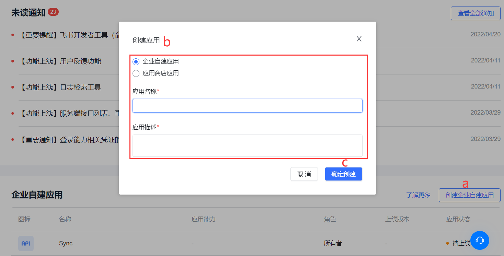
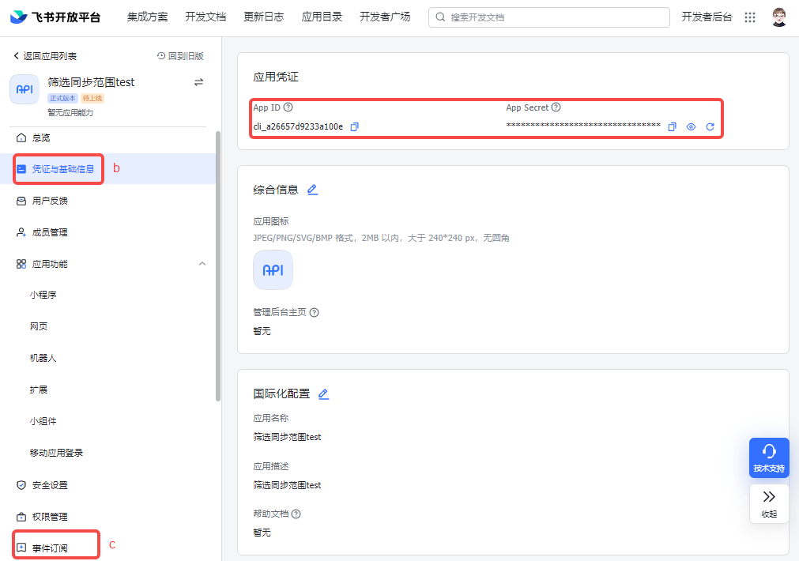
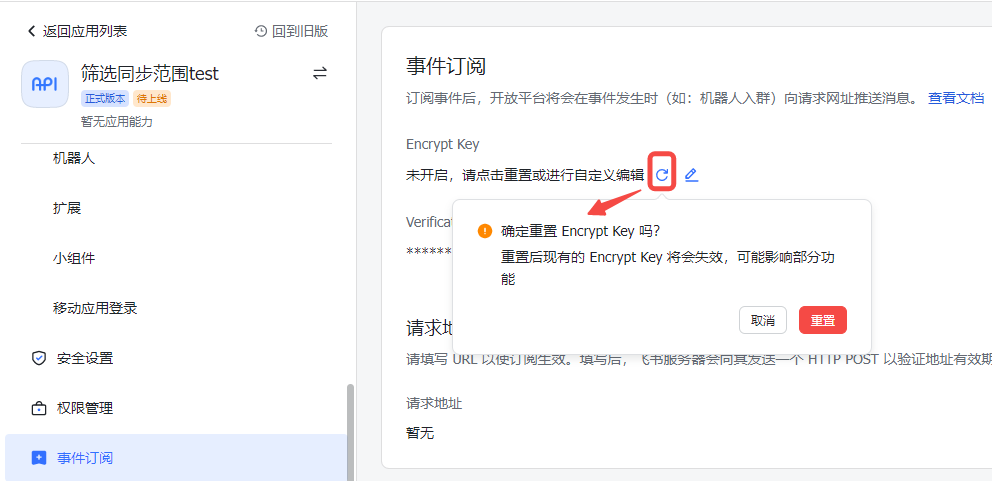
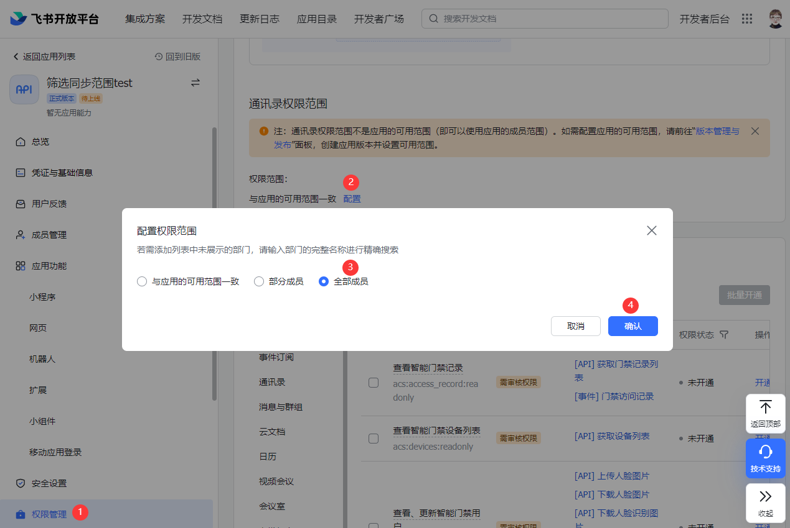
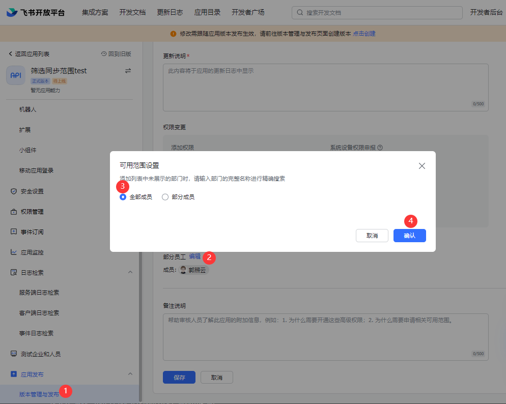

# 获取飞书配置项和权限

## 获取飞书配置项

1. 进入[飞书开放平台](https://open.feishu.cn/)，打开 **开发者后台**。

2. 创建一个**企业自建应用**。

a. 点击 **企业自建应用** 模块右上角 **创建企业自建应用** 按钮。

b. 选择 **企业自建应用** 选项，自定义 **应用名称** 和 **应用描述**。

c. 点击 **确定创建** 按钮。

3. 获取 **App ID**、**App Secret** 和 **Encrypt Key**、**Verification Token**（后两者用于上游实时同步）。

a. 在 **企业自建应用** 列表单击刚创建的自建应用，进入应用详情页。

b. 点击左侧导航栏 **凭证与基础信息** 菜单获取 **App ID** 和 **App Secret**。

c. 点击导航栏 **事件订阅** 菜单获取 **Encrypt Key** 和 **Verification Token**（本步骤仅适用于上游实时同步）。

4. 在 {{$localeConfig.brandName}} 控制台在建同步任务的 **配置信息** 模块配置同步任务信息：

a. 选择 **同步路径**（**上游同步** 或者 **下游同步**）。

b. 填入 **App ID** 和 **App Secret**。
   
c. 对于上游实时同步，仍需填入 **Encrypt Key** 和 **Verification Token**。

::: hint-info
如果飞书开放平台 **事件订阅** 处显示 **Encrypt Key** 未开启，点击重置按钮生成新值，或者点击编辑按钮自定义。需要注意的是，重置 **Encrypt Key**，则现有值会失效，可能影响部分功能。
:::

5. 点击 {{$localeConfig.brandName}} 控制台 **连接测试** 按钮。 提示检验成功。

## 配置飞书权限

要配置飞书权限，执行以下步骤：

1. 将从 {{$localeConfig.brandName}} 控制台同步任务 **配置信息** 拷贝的 **事件订阅请求网址 URL** 填入飞书开放平台应用详情页 **事件订阅** 的 **请求地址配置**，点击 **保存**。

::: hint-info
本步骤仅适用于上游同步。
:::

2. 添加需要监听的事件。

a. 在飞书应用详情 **事件订阅->已添加事件** 点击右上角 **添加事件** 按钮。

b. 勾选以下事件并点击 **确认添加**，如： 
   - 用户状态变更 
   - 部门新建 
   - 部门被删除 
   - 部门信息变化 
   - 通讯录范围权限被更新 
   - 员工入职 
   - 员工离职 
   - 员工信息变化 
   - 用户组被创建 
   - 用户组被删除 
   - 用户组信息变化 

3. 设置权限。

a. 设置 **通讯录权限范围**。

::: hint-info
必须设置为 **全部成员**，否则同步时系统会报错。
:::

b. 在飞书应用详情的 **权限管理->权限配置** 选择该应用所需的权限，如： 
   - 获取用户邮箱 
   - 获取用户手机号 
   - 获取用户 user ID 
   - 通过手机号或者邮箱获取用户 ID 
   - 获取用户基本信息 
   - 以应用身份访问通讯录

c. 点击右上角 **批量开通** 申请开通并生效权限。

::: hint-info
* **免审权限** 开通即生效，无需发布版本。
* 如果有 **需审核权限**，你需要发布最新版本。创建新版本时，注意 **可用范围** 选择 **所有员工** 和 **通讯录权限范围** 保持一致。
:::

