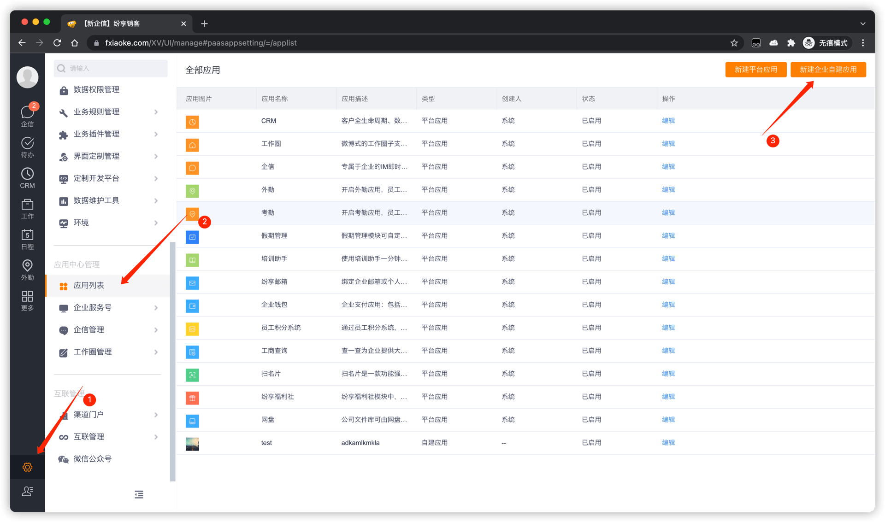
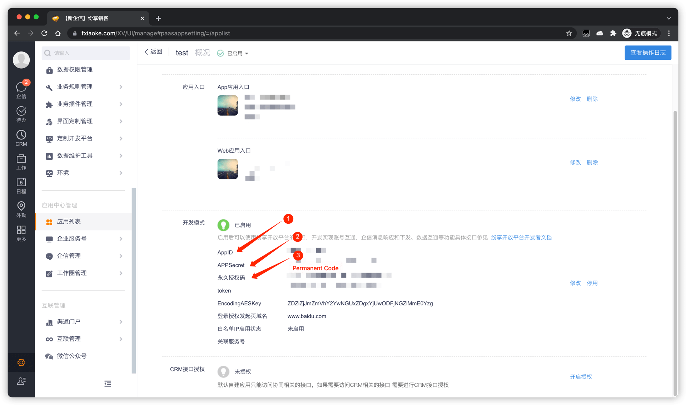

# 获取纷享销客配置项和权限

<LastUpdated/>

1. 进入 [纷享销客后台管理页面](https://www.fxiaoke.com/XV/UI/manage)。

2. 创建一个自建应用。

3. 进入应用详情页面获取 **AppId**、**AppSecret** 和 **Permanent Code**。

4. 进入 [纷享销客开放平台](http://open.fxiaoke.com/wiki.html#artiId=1122)，通过 **手机号查询员工** 接口获取管理员 ID，然后将管理员ID 填入 **Current Open User Id**。
