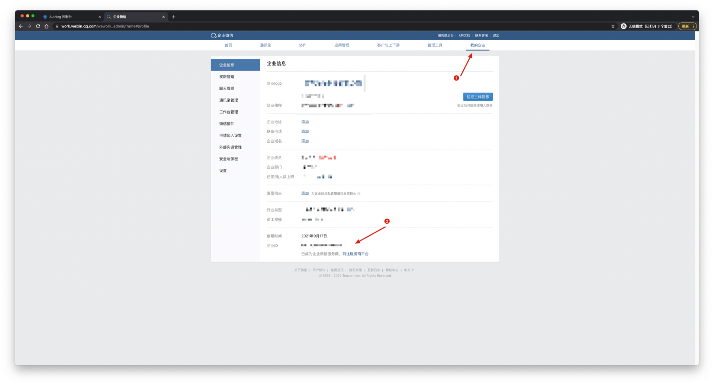
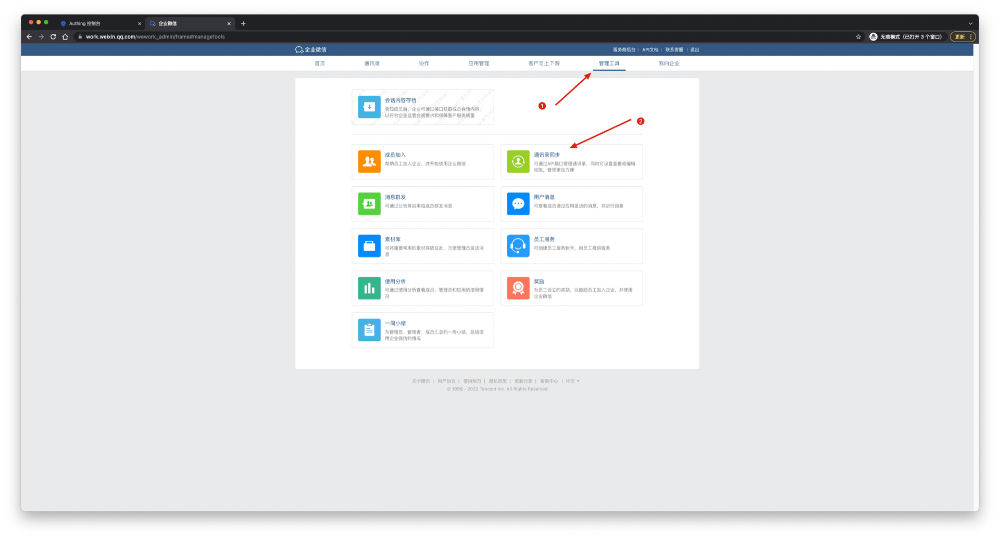
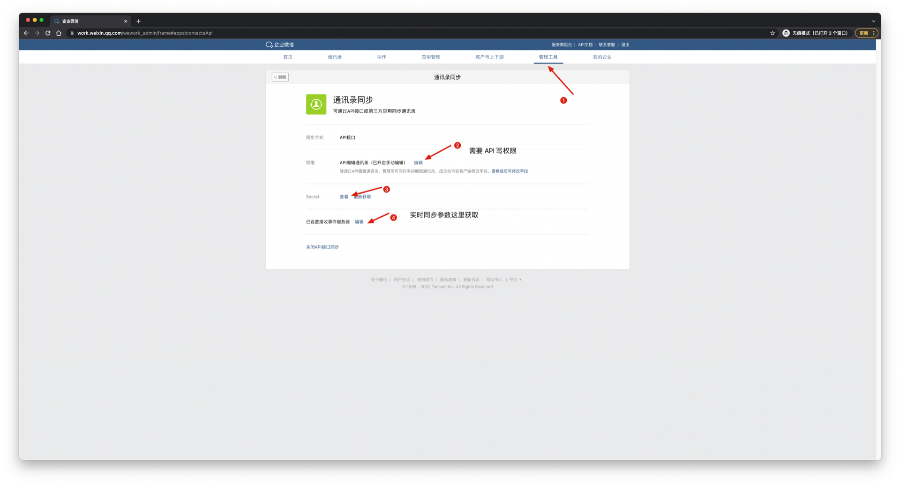
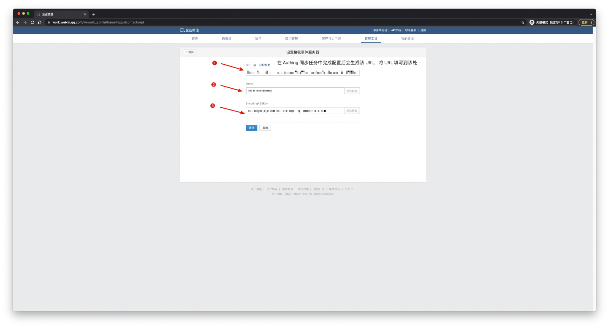
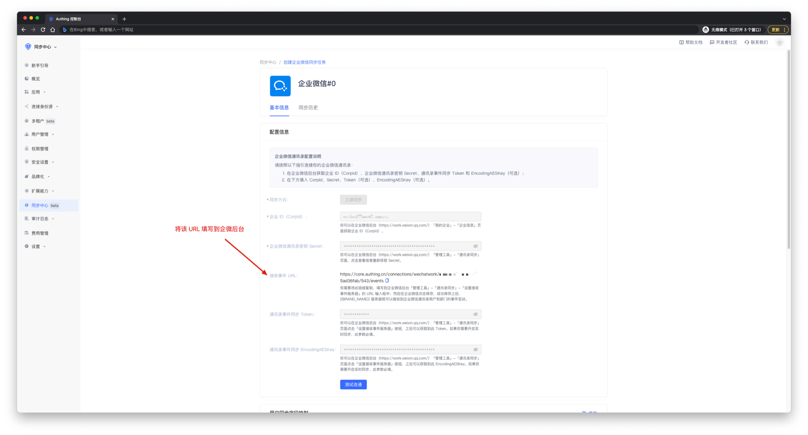

# 获取企业微信配置项和权限

<LastUpdated/>

1. 进入 [企业微信后台管理页面](https://work.weixin.qq.com/wework_admin/frame)。
2. 进入 **我的企业** 页面，获取 **企业 ID**。

3. 进入 **管理工具** 页面，打开 **通讯录同步** 获取权限和 Secret。如果不需要实时同步，到这里就可以得到所需参数和权限了。

4. 继续上图步骤四，设置事件接收服务器，获取 **Token** 和 **EncodingAESKey**。

5. 将所有参数填入配置，[创建一个同步任务](/guides/sync-new/create-sync-new/README.md)，得到一个接收 **事件 URL**，将该 Url 填入上图步骤三位置。

