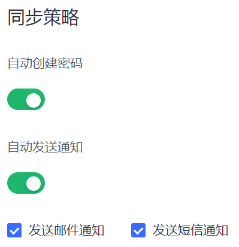

# 配置同步策略

<LastUpdated/>

<<<<<<< HEAD
Authing 支持管理员自定义是否启用 **自动创建密码**。启用后，为同步中心导入的用户自动创建密码（密码规则符合用户池密码规则）。默认关闭开关。

Authing 支持管理员自定义是否启用 **自动发送通知**。启用后，同步中心导入用户时（仅针对首次创建的用户），自动发送通知。默认同时开启邮件通知和短信通知。

::: hint-info
管理员可以自定义短信和邮件模板。
=======
::: hint-info
**同步策略** 仅适用于上游同步。
:::

{{$localeConfig.brandName}} 支持管理员自定义是否启用 **自动创建密码**。启用后，为同步中心导入的用户自动创建密码（密码规则符合用户池密码规则），默认关闭开关。

{{$localeConfig.brandName}} 支持管理员自定义是否启用 **自动发送通知**。启用后，同步中心导入用户时（仅针对首次创建的用户），自动发送通知。默认同时开启邮件通知和短信通知。

::: hint-info
管理员可以自定义短信和邮件模板。有关详情，请参阅 [配置短信服务和模板](/guides/userpool-config/sms/README.md) 及 [配置邮件服务和模版](/guides/userpool-config/email/README.md)。
>>>>>>> ba53c2dd0bf518dbfa90efa3ac5d7ac5dfcd8126
:::