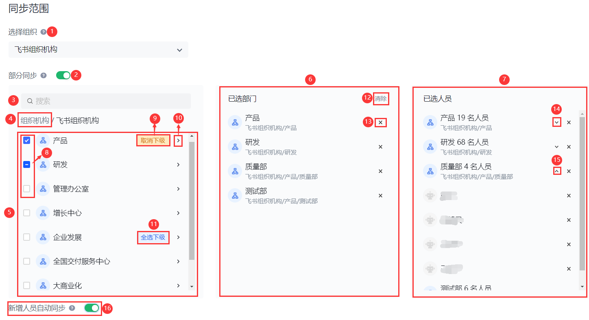
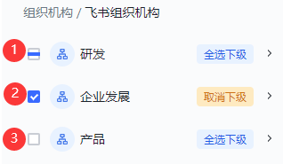
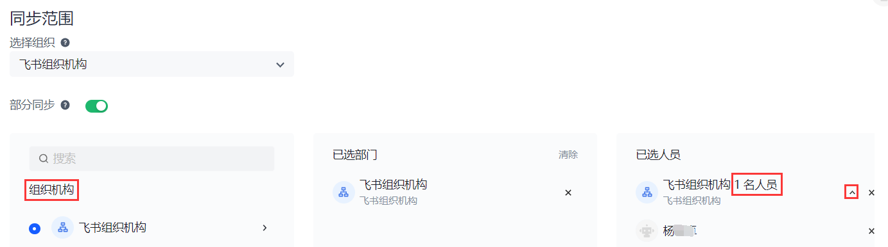
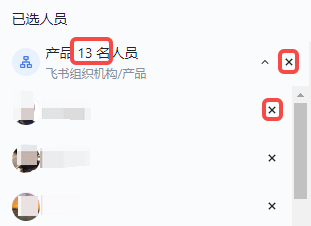

# 筛选同步范围

<LastUpdated/>

路径：**同步中心->某应用下游同步任务配置详情页面->同步范围**

::: hint-info
筛选同步范围仅适用于下游同步。
:::

直接进行全量下游同步会造成组织及业务风险。{{$localeConfig.brandName}} 支持基于组织机构筛选同步范围，降低下游组织及用户信息同步的风险。

#### 筛选同步范围说明

| 序号 | 字段 / 元素 | 说明 | 
| :---: | --- | --- | 
| 1 | 选择组织 | 选择要进行同步的组织机构。 **注意**：每个同步任务只能固定同步一棵组织树。
| 2 | **部分同步** 开关 | 默认关闭，表示进行全量下游同步。 开启后，可对下游同步范围进行筛选，仅同步选中的部门和人员信息。 **注意**：如在开启此开关后切换组织，则此开关默认关闭。如要作同步筛选，需重新开启。|
| 3 | 搜索 | 按照关键字搜索部门。|
| 4 | 选择框 | 可在此 **选择框** 选择待同步的部门及顶级部门直属人员。有关详情，请参阅 [选择框](#选择框)。 |
| 5 | 已选部门展示框 |展示所选部门及其下级部门。可在此展示框作进一步部门筛选。有关详情，请参阅 [已选部门展示框](#已选部门展示框)。 |
| 6 | 清除 |清楚所选部门及相关人员。 |
| 7 | 已选人员展示框 |展示所选部门的直属人员以及下级部门的所属人员。可在此展示框作进一步人员筛选。有关详情，请参阅 [已选人员展示框](#已选人员展示框)。 |
| 8 | 当前部门选择状态 |   1. 半选：当前部门及全部下级部门及人员存在被选中，但未全部选中。 2. 全选：当前部门及全部下级部门及人员均被选中。 3. 未选：当前部门及全部下级部门及人员均未被选中。|
| 9 | 展开部门按钮 |展开当前部门，从而在 **选择框** 展示当前所选部门的所有下级部门及对应人员。 **注意**：**选择框** 中最深可以展开到人员层级。点击选择框上路径的任意部门节点，可返回至该节点下。|
| 10 | 删除按钮 |删除 **已选部门展示框** 中对应的部门、**已选人员展示框** 中按部门作的人员统计汇总或者单个人员。 |
| 11 | 展开人员列表按钮 |在 **已选人员展示框** 展开所属部门的人员列表。折叠状态下显示所选部门的人员统计数。|
| 12 | 折叠人员列表按钮 |在 **已选人员展示框** 折叠所属部门的人员列表。展开状态下，展示所选部门的详细人员列表。 |
| 13 | 新增人员自动同步开关 |开启后，选中部门内的新增人员将自动加入同步范围。默认关闭。 |

要配置同步范围，执行以下步骤：

## 步骤一：选择组织机构

在下游同步任务配置详情页面 **同步范围** 模块选择目标组织机构。

::: hint-info
同步任务执行后组织不可更改，请慎重选择。
:::

## 步骤二：打开 **部分同步** 开关

如要对下游同步范围进行筛选，打开 **部分同步** 开关。

页面下方打开部门及人员 **选择框**、**已选部门展示框** 及 **已选人员展示框**。

## 步骤三：筛选同步范围

::: hint-info
部门和人员的增删可以在 **选择框**、**已选部门展示框** 及 **已选人员展示框** 间实现联动。
:::

### 仅选择顶级部门及人员

如需选择顶级部门及直属人员，执行以下步骤：

1. 点击 **选择框** 上方路径的根节点（**组织机构**）。 则下方 **选择框** 展示的是顶级部门。 

2. 在 **选择框** 勾选顶级部门。 则 **已选部门展示框** 为当前顶级部门；同时 **已选人员展示框** 显示顶级部门的直属人员统计数，点击展开按钮可查看顶级部门直属人员详细列表。

 

### 选择待同步部门及人员

打开 **部分同步** 开关后，**选择框** 默认展示组织机构顶级部门的直属人员及一级部门。可在 **选择框** 选择待同步的部门和人员。

#### 选择框

* 要选择某个部门（不限部门层级）及全部下级部门和全部人员，只需勾选该部门前复选框。

::: hint-info
* 此时，该复选框呈全选状态（详见 [表格标号 8](#筛选同步范围)），且当前部门及所有下级部门所在行 **全选下级** 按钮变成 **取消下级** 按钮。
* 点击某个部门所在行 **全选下级** 按钮，会全选当前部门的所有下级部门及下级部门全部人员，但不包含当前部门及当前部门的直属人员。
* 支持跨层级、跨部门选择；粒度可以精细到人员。
:::

* 要选择指定的某个部门或某个人员，只需在 **选择框** 按照该部门 / 人员的组织架构路径点击 **展开部门按钮**（详见 [表格标号 9](#筛选同步范围)）定位并勾选该部门 / 人员。

::: hint-info
如选择了某个部门，则从顶级部门到所选部门整个路径下的部门信息（不包括人员信息）都会同步给下游。
:::

* 要在 **选择框** 取消某个已选部门 / 人员，只需点击当前部门 / 人员前的复选框，使其变为 **未选** 状态（详见 [表格标号 8](#筛选同步范围)）。

* 点击 **取消下级** 按钮，可取消选择当前部门的所有下级部门及下级部门所属人员，但无法取消选择当前部门及其直属人员。

#### 已选部门展示框

在 **选择框** 选择部门后，所选各层级部门会展示在 **已选部门展示框** 中。

::: hint-info
默认按照层级先后展示，即顶部展示所选部门中的较高层级，之后再顺序展示下级部门。
:::

支持管理员在 **已选部门展示框** 通过点击某个已选部门后的删除按钮（x）删除该部门。

#### 已选人员展示框

在 **选择框** 选择部门及人员后，所选各层级部门所属人员会展示在 **已选人员展示框** 中。

| 序号 | 说明 | 
| :---: | --- |
| 1 | 在 **已选人员展示框** 默认折叠人员列表，仅展示各级部门所属人员的统计数。|
| 2 | 要查看详细的部门下人员信息，可点击相应部门后的 **展开人员列表按钮**。|
| 3 | 支持管理员在 **已选人员展示框** 通过点击某个部门人员统计后的删除按钮（x）删除所选部门下全部人员。|
| 4 | 支持在展开人员列表后，单独删除某个人员。|

## 步骤四：开启新增人员自动同步开关

管理员选择了部门或人员后，在 **选择框** 下方出现 **新增人员自动同步** 开关。开启后，所选部门如有新增人员，将自动加入同步范围。