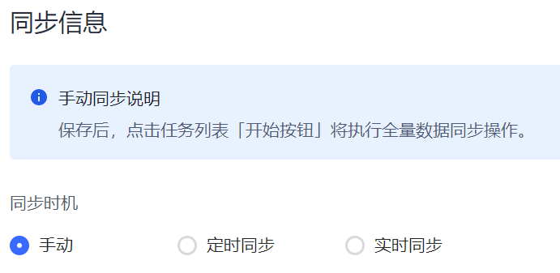

# 配置同步时机

<LastUpdated/>

Authing 为用户提供三种同步时机，包括 **手动同步**、**定时同步** 和 **实时同步**。

::: hint-info
* 下游同步中的 **删除** 操作需要在 **风险操作** 手动确认。有关详情，请参阅 [风险操作提示](/guides/sync-new/risky-operation.md)。
* 如果是首次执行数据同步，建议先执行手动全量同步，防止数据丢失。
:::

## 手动同步

通过手动点击执行同步任务按钮的方式执行同步任务，手动同步的特点是 **全量、点击即执行**。

### 手动上游同步

当上游数据发生变更，需要在 Authing 控制台手动点击执行同步，变更数据才会同步到 Authing。

### 手动下游同步

当 Authing 数据发生变更，需要在 Authing 控制台手动点击执行同步，变更数据才会同步到下游。

## 定时同步

通过设定具体执行周期实现定时触发同步任务，定时同步执行效果和手动同步一致，特点是 **按时触发，不需要手动点击**。

定时同步支持每月、每周、每天、每六小时、每两小时执行。设置定时同步，除了需要设置 **定时频率**，还需 **选择同步开始时间**。

### 定时上游同步

当上游数据发生变更，变更数据会定时同步到 Authing。

### 定时下游同步

当 Authing 数据发生变更，变更数据会定时同步到下游。

## 实时同步

实时同步是一种细粒度的同步方式。实时同步会根据组织机构或者人员实时信息的变化，进行差量同步。实时同步的特点是 **同步速度快、响应及时、无需排队等待**。目前只有钉钉、企业微信、飞书支持实时同步。

### 实时上游同步

当上游数据发生变更，变更数据会实时同步到 Authing。

### 实时下游同步
当 Authing 数据发生变更，变更数据会实时同步到下游。