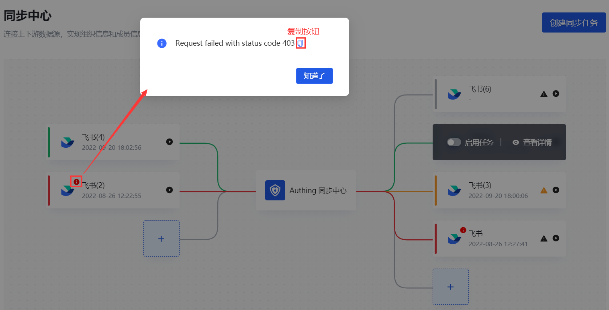
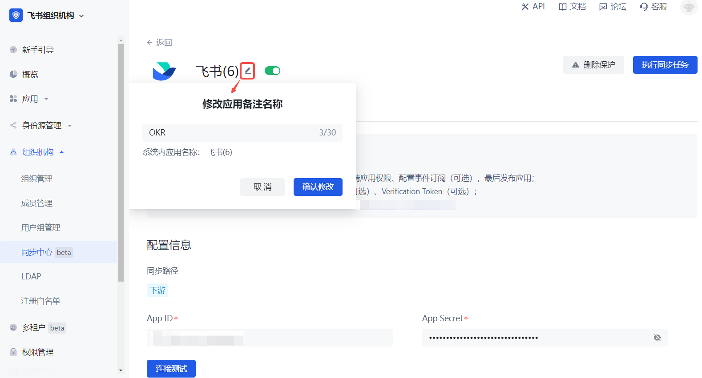
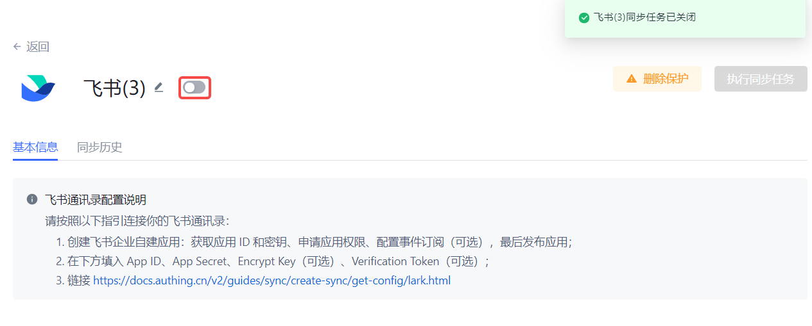
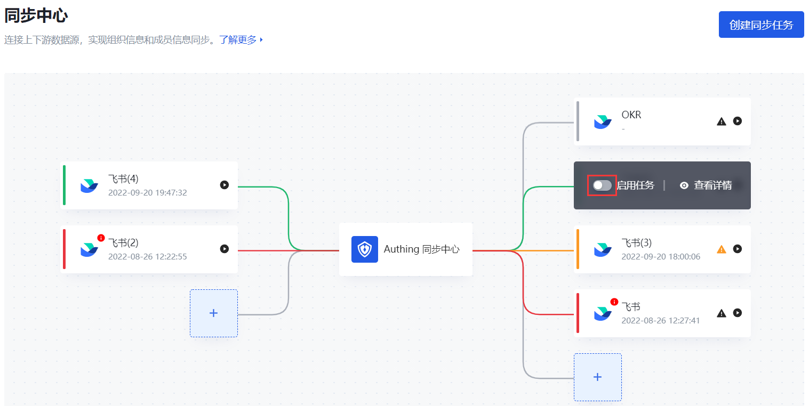
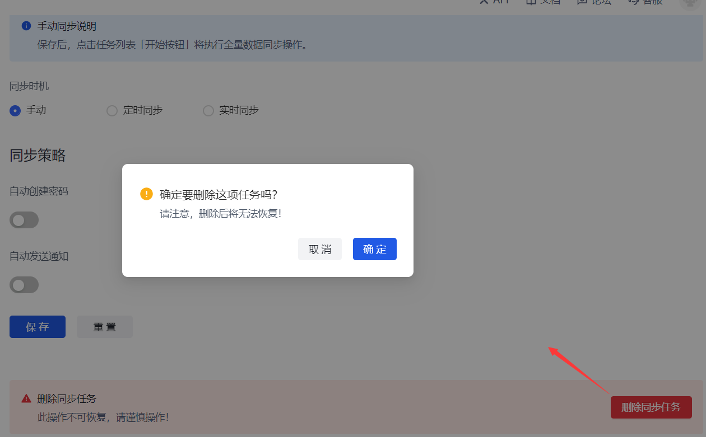

# 维护同步任务

<LastUpdated/>

路径：**同步中心**

同步中心画布展示所有已创建的同步任务。对于已创建的同步任务，管理员还可以 [查看各同步任务的执行状态](#查看同步任务执行状态)，[查看和修改同步任务信息](#修改同步任务信息)，[启用 / 禁用同步任务](#启用禁用同步任务)，[删除同步任务](#删除同步任务)等。

## 查看同步任务执行状态

同步中心画布集成了由 {{$localeConfig.brandName}} 同步中心连接的所有上游身份源和下游应用。{{$localeConfig.brandName}} 同步中心与上下游建立了同步任务，画布为不同的任务执行状态定义了不同的颜色：

* 蓝色：正在执行同步任务。
* 绿色：同步成功。
* 红色：同步失败。
* 橙色：存在删除部门 / 用户的操作，需要管理员手动确认是否执行同步。
* 灰色：当前同步任务尚未执行同步操作。

管理员可以更直观地查看同步任务的执行状态，从而采取相应措施：

* 对于尚未执行同步操作的任务，管理员可以点击执行按钮 [执行同步任务](../sync-new/perform-sync-new.md)。
* 对于执行失败的同步任务，{{$localeConfig.brandName}} 同步中心除了赋予红色标识，在相应任务卡片上还给出红色报错提示，点击即可打开报错弹窗。管理员可以点击按钮拷贝报错信息，便于查询。

* 对于存在删除操作的同步任务，管理员可以 [处理删除保护](../sync-new/risky-operation.md)。

## 修改同步任务信息

管理员可以点击画布中目标同步任务卡片，进入该同步任务详情页，根据需要修改任务配置信息。

除了可以修改 **配置信息**、**同步范围**、**用户同步字段映射**、**同步信息**，管理员还可以修改同步任务名字，赋予其具有实际业务意义的命名。从而，在同步任务画布包含诸多任务时，便于区分。

## 启用禁用同步任务

在一些业务场景中，虽然 {{$localeConfig.brandName}} 同步中心已经与某些应用建立了同步任务，但暂时不需要与这些应用同步数据。此时，可以将此类同步任务暂时禁用，根据需要再启用。

要禁用某个同步任务，可以进入该同步任务详情页，关闭该同步任务开关（同步任务创建后默认开启）。

要重新启用该同步任务，可以进入详情页开启此开关，也可以直接在画布进行开启。

## 删除同步任务

::: hint-info
删除后不可恢复，请谨慎操作！
:::

要删除某个同步任务，执行以下步骤：

1. 进入该同步任务详情页。
2. 在详情页底部点击 **删除同步任务** 按钮。
3. 在确认弹窗中点击 **确定** 按钮。

则系统提示成功删除当前同步任务。