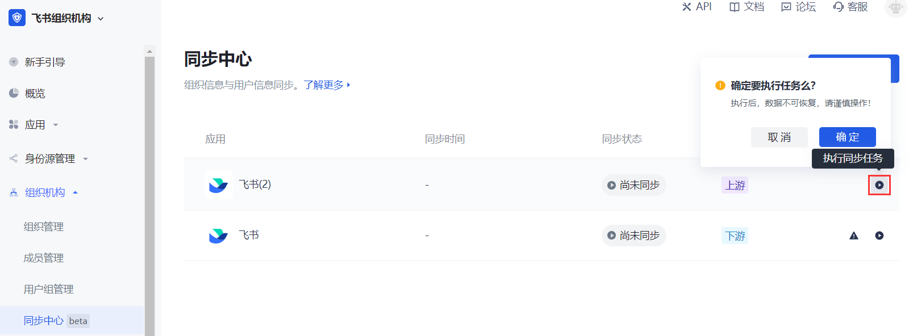
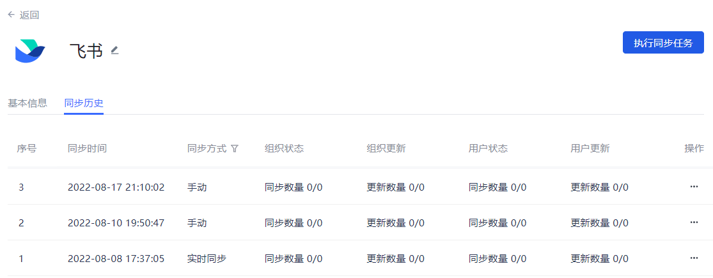

# 执行同步任务

<LastUpdated/>

路径：**同步中心**

进入 **同步中心** 页面，可以看到已创建的同步任务列表。

要执行选定的同步任务，执行以下步骤：

::: hint-info
* 执行同步任务，数据不可恢复，要谨慎操作！
* 同步数据会需要一些时间，这取决于你同步的数据量的大小。
:::

1. 点击目标同步任务所在行 **操作** 列 **执行同步任务** 按钮。 打开确认执行弹框。

::: hint-info
也可以在同步任务列表进入某个任务详情页，点击右上角 **执行同步任务** 按钮。
:::

2. 点击 **确定** 按钮开始执行同步。

 

3. 同步完成后，可以到控制台用户管理页面查看同步后结果，检验同步是否成功。 也可以进入应用的同步任务详情页，点击 **同步历史** 选项卡，看到历次同步数据。 你可以在同步历史标签页查看历次同步任务执行时间、同步方式（**实时同步** 还是 **手动**）、历次执行的组织和用户的变更状态及同步更新情况，可在查看当次同步任务的执行详情，并可导出此次同步执行日志。

<table>
<tr>
<th valign="center">序号</th>
<th>字段</th>
<th>说明</th>
</tr>

<tr>
<td>1</td>
<td>序号 </td>
<td>以倒序的方式统计应用同步任务当前执行的次数。
</td>
</tr>

<tr>
<td>2</td>
<td>同步时间</td>
<td>显示同步任务历次执行完成时间，最新的一次执行显示在首行。</td>
</tr>

<tr>
<td>3</td>
<td>同步方式</td>
<td>显示创建或修改同步任务时指定的 <b>同步时机</b> 的值。
对于手动同步，每次执行，都会生成一条记录。
对于定时同步和实时同步，只会生成一条记录，其同步时间以最后一次为准。
在 <b>风险策略配置</b> 开启了删除主体自动同步后，执行风险操作自动同步并不会影响 <b>同步方式</b> 的值。</td>
</tr>

<tr>
<td>4</td>
<td>组织状态</td>
<td>统计此次执行同步任务，共有几个组织同步成功：同步成功数量/同步总数。</td>
</tr>

<tr>
<td>5</td>
<td>组织更新</td>
<td>统计此次执行同步任务，共有几个组织更新成功：更新成功数量/更新总数
。</td>
</tr>

<tr>
<td>6</td>
<td>用户状态</td>
<td>统计此次执行同步任务，共有多少用户同步成功：同步成功数量/同步总数。</td>
</tr>

<tr>
<td>7</td>
<td>用户更新</td>
<td>统计此次执行同步任务，共有多少用户更新成功：更新成功数量/更新总数
。</td>
</tr>

<tr>
<td>8</td>
<td>操作</td>
<td>
<ul>
<li>点击 <b>操作</b> 列 <b>详情</b> 按钮，可以查看此次同步执行的主体、同步类型、同步完成时间以及是否成功同步。
也可在 <b>同步历史</b> 列表中单击待查看项进入此次同步执行的详情页。</li>
<li>点击 <b>操作</b> 列 <b>导出</b> 按钮，可以将此次同步日志导出为 Excel 文件。
也可在当前同步执行的详情页点击右上角 <b>导出</b> 按钮。</li>
</ul>
</td>
</tr>
</table>