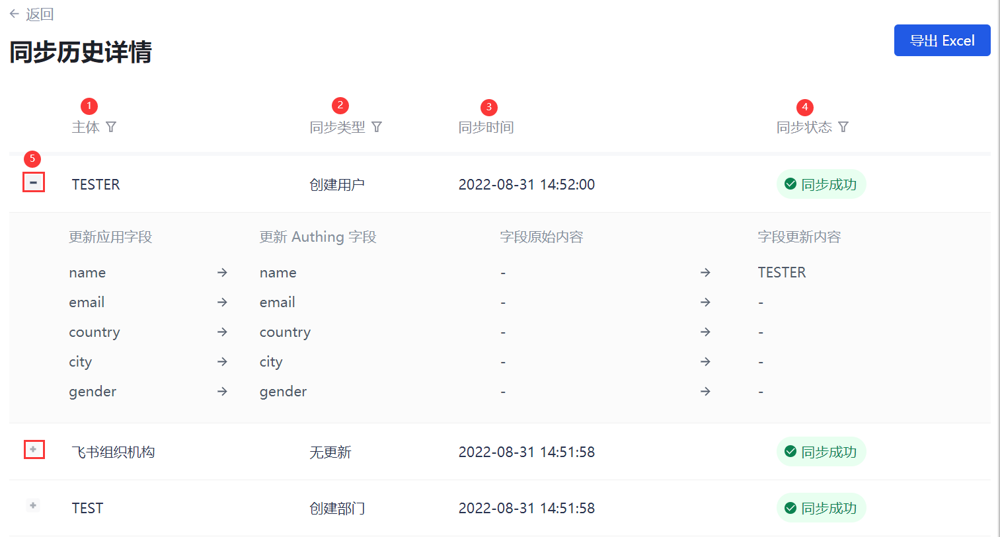
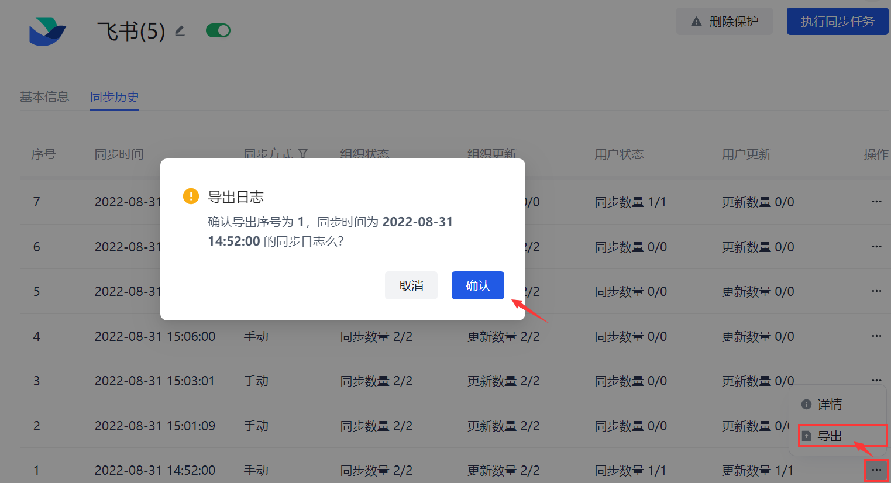
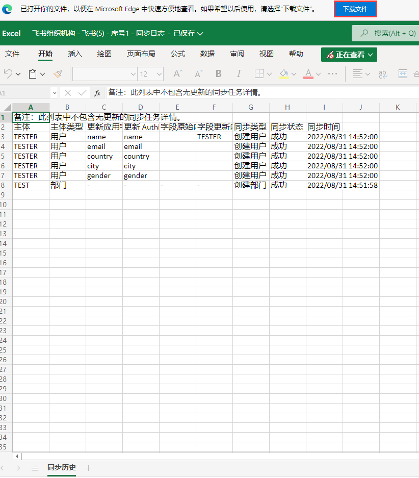

# 执行同步任务

<LastUpdated/>

<<<<<<< HEAD
<<<<<<< HEAD
路径：**用户管理->同步中心**

进入 **同步中心** 页面，可以看到已创建的同步任务列表。
=======
=======
>>>>>>> ba53c2dd0bf518dbfa90efa3ac5d7ac5dfcd8126
路径：**同步中心**

当 **同步时机** 为 **手动** 时，需要管理员手动执行同步任务，实现上下游数据的同步。

## 执行同步

进入 **同步中心** 页面，可以看到同步任务画布，展示所有已创建的同步任务。
<<<<<<< HEAD
>>>>>>> ba53c2dd0bf518dbfa90efa3ac5d7ac5dfcd8126
=======
>>>>>>> ba53c2dd0bf518dbfa90efa3ac5d7ac5dfcd8126

要执行选定的同步任务，执行以下步骤：

::: hint-info
* 执行同步任务，数据不可恢复，要谨慎操作！
<<<<<<< HEAD
<<<<<<< HEAD
* 同步数据会需要一些时间，这取决于您同步的数据量的大小。
:::

1. 点击目标同步任务所在行 **操作** 列 **执行同步任务** 按钮。 打开确认执行弹框。

2. 点击 **确定** 按钮开始执行同步。

 

3. 同步完成以后进入应用的同步任务详情页，点击 **同步历史** 页签，可以看到本次数据同步详情。

也可以到控制台用户管理页面查看同步后结果，检验同步是否成功。
=======
=======
>>>>>>> ba53c2dd0bf518dbfa90efa3ac5d7ac5dfcd8126
* 必须为用户配置正确的手机号等必要字段信息（因三方数据源而不同），否则同步失败。
:::

1. 在同步任务画布点击目标任务卡片上的 **执行同步任务** 按钮。 打开确认执行弹窗。

::: hint-info
也可以进入该同步任务详情页，点击右上角 **执行同步任务** 按钮。
:::

 

2. 点击 **确定** 按钮开始执行同步。

::: hint-info
同步数据会需要一段时间，这取决于待同步的数据量的大小。
:::

## 查看同步历史

同步完成后，可以到待同步的应用用户管理页面查看同步后结果，检验同步是否成功。也可以进入同步任务详情页，点击 **同步历史** 选项卡，看到历次同步数据。 你可以在 **同步历史** 标签页查看历次同步任务执行时间、同步方式（**实时同步** 还是 **手动**）、历次执行的组织和用户的变更状态及同步更新情况，可在 **操作** 列查看当次同步任务详情，并可导出此次同步执行日志。

<table>
<tr>
<th valign="center">序号</th>
<th>字段</th>
<th>说明</th>
</tr>

<tr>
<td>1</td>
<td>序号 </td>
<td>以倒序的方式统计应用同步任务当前执行的次数。
</td>
</tr>

<tr>
<td>2</td>
<td>同步时间</td>
<td>显示同步任务历次执行完成时间，最新的一次执行显示在首行。</td>
</tr>

<tr>
<td>3</td>
<td>同步方式</td>
<td>显示创建或修改同步任务时指定的 <b>同步时机</b> 的值。
对于手动同步，每次执行，都会生成一条记录。
对于定时同步和实时同步，只会生成一条记录，其同步时间以最后一次为准。</td>
</tr>

<tr>
<td>4</td>
<td>组织状态</td>
<td>统计此次执行同步任务，共有几个组织同步成功：同步成功数量/同步总数。</td>
</tr>

<tr>
<td>5</td>
<td>组织更新</td>
<td>统计此次执行同步任务，共有几个组织更新成功：更新成功数量/更新总数
。</td>
</tr>

<tr>
<td>6</td>
<td>用户状态</td>
<td>统计此次执行同步任务，共有多少用户同步成功：同步成功数量/同步总数。</td>
</tr>

<tr>
<td>7</td>
<td>用户更新</td>
<td>统计此次执行同步任务，共有多少用户更新成功：更新成功数量/更新总数
。</td>
</tr>

<tr>
<td>8</td>
<td>操作</td>
<td>
<ul>
<li>点击 <b>操作</b> 列 <b>详情</b> 按钮，可以查看此次同步执行的主体、同步类型、同步完成时间以及是否成功同步。
也可在 <b>同步历史</b> 列表中单击待查看项进入此次同步执行的详情页。
有关详细介绍，请参阅下文 <b>查看同步历史详情</b>。</li>
<li>点击 <b>操作</b> 列 <b>导出</b> 按钮，可以将此次同步日志导出为 Excel 文件。
也可在当前同步执行的详情页点击右上角 <b>导出 Excel</b> 按钮。</li>
</ul>
</td>
</tr>
</table>

### 查看同步历史详情

你可以在 **同步历史详情** 页查看当前同步任务某次执行结果详细信息。

 

<table>
<tr>
<th valign="center">序号</th>
<th>字段</th>
<th>说明</th>
</tr>

<tr>
<td>1</td>
<td>主体 </td>
<td>可按 <b>用户</b>、<b>部门</b> 进行筛选。
</td>
</tr>

<tr>
<td>2</td>
<td>同步类型</td>
<td><ul>
<li>创建用户</li>
<li>更新用户信息</li>
<li>删除用户</li>
<li>创建部门</li>
<li>修改部门信息</li>
<li>删除部门信息</li>
<li>同步部门成员</li>
<li>修改用户部门</li>
<li>移动部门</li>
<li>同步部门负责人</li>
<li>修改用户唯一标志</li>
<li>无更新</li></ul></td></tr>
<tr>
<td>3</td>
<td>同步时间</td>
<td>展示本条数据同步完成时间。</td>
</tr>

<tr>
<td>4</td>
<td>同步状态</td>
<td>可按 <b>同步成功</b>、<b>同步失败</b> 进行筛选。</td>
</tr>

<tr>
<td>5</td>
<td>展开 / 收起按钮</td>
<td>
如本条数据执行同步时，同步字段有更新，则可点击展开按钮查看字段更新详情。
</td>
</tr>
</table>

### 导出同步日志

管理员可以导出当次同步任务执行日志。

要导出同步任务执行日志，执行以下步骤：

1. 在 **同步历史** 标签页，点击执行列表中某次执行所在行 **操作** 列 **导出** 按钮。

::: hint-info
也可在 **同步历史详情** 页点击 **导出 Excel** 按钮。
:::

2. 在确认弹窗点击 **确认** 按钮。 打开 Excel 格式同步日志。

3. 点击 **下载文件** 将同步日志下载到本地。

<<<<<<< HEAD

>>>>>>> ba53c2dd0bf518dbfa90efa3ac5d7ac5dfcd8126
=======

>>>>>>> ba53c2dd0bf518dbfa90efa3ac5d7ac5dfcd8126
