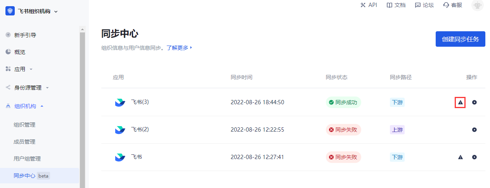
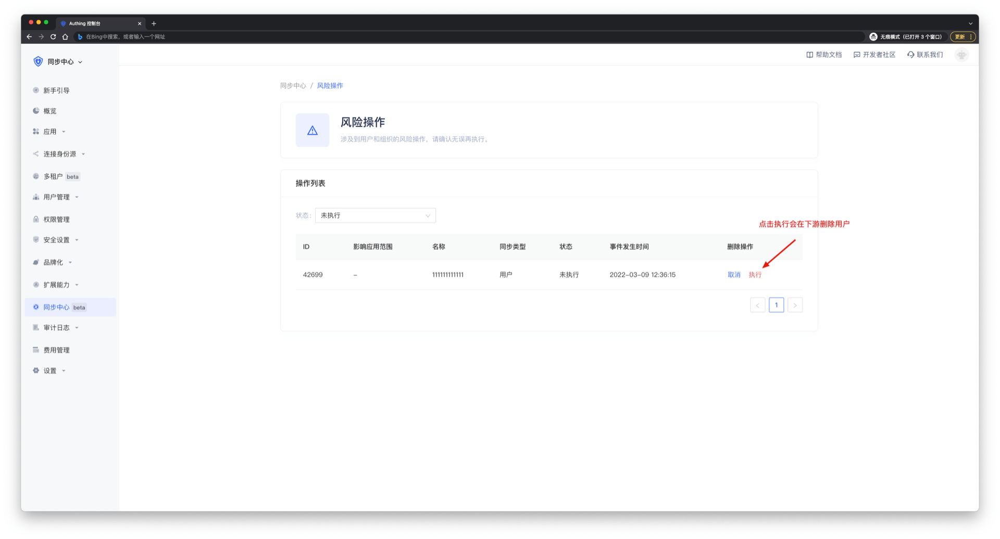
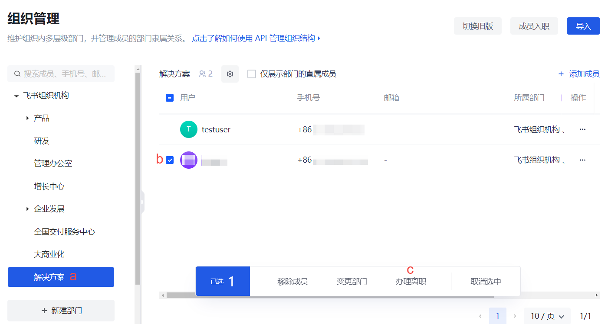
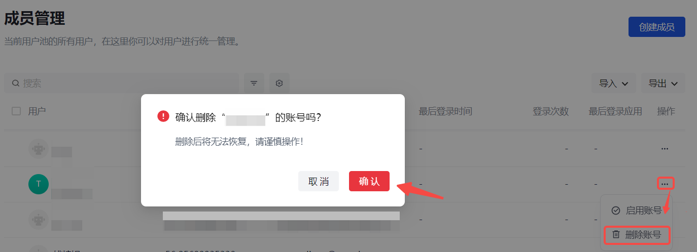
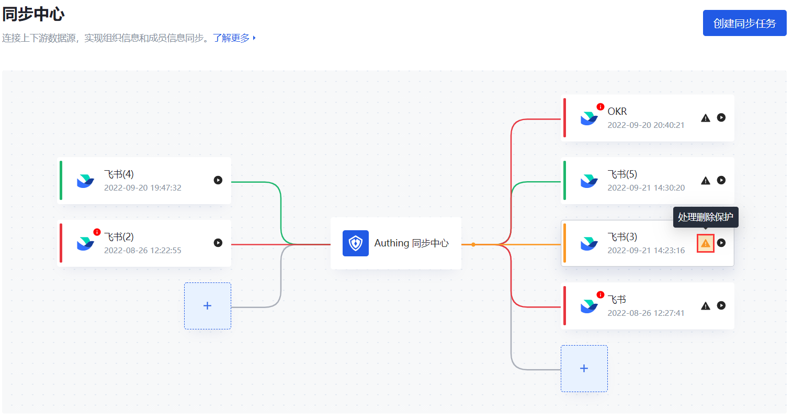
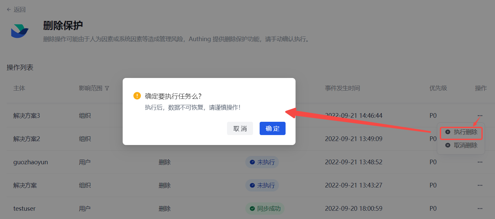
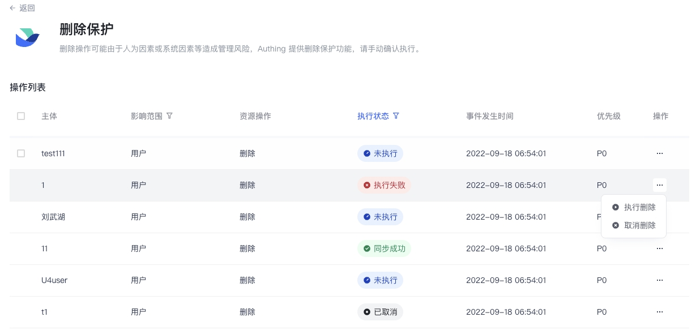
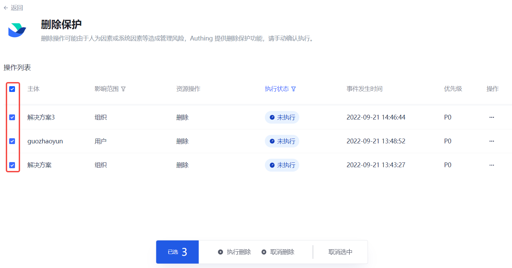

<<<<<<< HEAD
# 风险操作提示

<LastUpdated/>

Authing 认为，删除操作可能由于人为因素或系统因素等造成管理风险，因此将删除操作视为风险操作。
在进行下游同步过程中，在 Authing 控制台 **用户管理** 页面删除一个 **用户** 或 **部门** 时，需要在同步中心的 **风险操作** 页面进行二次确认。**手动同步**、**定时同步**、**实时同步** 都必须执行风险操作。

## 删除用户风险操作

### 第一步 删除用户

路径：**用户管理->用户列表**

1. 在 **用户列表** 页面选中一个用户。在 **操作** 列点击 **删除** 按钮。 打开确认删除提示框。

2. 点击 **删除**。

### 第二步 执行风险操作

路径：**用户管理->同步中心->应用同步任务配置详情页**

1. 在应用同步任务配置详情页点击右上角 **风险操作** 按钮。 打开 **风险操作** 页面。

2. 配置 **风险策略**。

3. 点击 **操作** 列 **执行** 按钮。

这样一个用户删除操作就完成了。

## 删除部门风险操作

删除部门操作同上。

::: hint-info
如果部门中存在用户，可能导致下游删除部门失败。
:::
=======
# 处理删除保护

<LastUpdated/>

路径：**同步中心->同步任务删除保护页**

{{$localeConfig.brandName}} 认为，删除操作可能由于人为因素或系统因素等造成管理风险。因此下游同步过程中，在 {{$localeConfig.brandName}} 控制台删除一个 **用户** 或 **部门** 时，需要在同步中心的 **删除保护** 页面进行二次确认。**手动同步**、**定时同步**、**实时同步** 都必须执行删除保护操作。

::: hint-info
删除保护仅适用于下游同步。
:::

## 步骤一：删除用户 / 部门

::: hint-info
* 待删除用户 / 部门必须属于当前下游同步任务中 **同步范围** 指定的组织树和部门。
* 删除用户 / 部门前确保已经执行了下游同步，且同步成功。
:::

### 删除用户

::: hint-info
办理离职的用户必须在 **成员管理** 中执行删除操作后，才能触发同步中心删除保护。
:::

1. 办理离职。 a. 在 **组织机构->组织管理**（ToE 场景）/ **用户管理->组织机构**（ToB / ToC 场景）组织树选中待删除成员所在部门。 b. 在右侧部门成员列表选中待删用户。 c. 在列表下方弹出的操作选项栏点击 **办理离职**。 d. 在弹框点击 **离职** 进行确认。

2. 删除账号。 a. 在 **组织机构->成员管理**（ToE 场景）/ **用户管理->用户列表**（ToB / ToC 场景）点击待删除用户所在行 **操作** 列 **删除账号** 按钮。 b. 在弹框点击 **确定** 确认删除。

### 删除部门

路径：**组织机构->组织管理**（ToE 场景）/ **用户管理->组织机构**（ToB / ToC 场景）

::: hint-info
在删除部门前需要移除部门内子部门及用户，否则无法删除。
:::

1. 移除部门下所有用户。

::: hint-info
在勾选部门下用户后，如果列表下方弹出的操作栏中 **移除成员** 按钮是激活状态（所选用户仅属于当前部门），则点击该按钮将所选用户从当前部门直接移除即可；否则，需要按照 [办理用户离职步骤 1 所述](#删除用户) 将所选用户通过办理离职方式从当前部门用户列表中移除。
:::

2. 删除部门下所有子部门。

3. 删除部门。 a. 在左侧组织树点击所选部门后的更多按钮（...），选择 **删除部门**。 b. 在弹框点击 **删除** 按钮确认删除。 系统提示成功删除部门。

## 步骤二：在删除保护页执行删除

::: hint-info
同步任务画布中，**处理删除保护** 按钮有两种状态：
* 默认状态（黑色）：当前同步任务无待处理的删除操作。
* 高亮状态（橙色）：当前同步任务有待处理的删除操作。
:::

1. 返回 **同步中心**，在同步任务画布找到待同步数据的下游应用，点击 **处理删除保护** 按钮，进入 **删除保护** 页。

::: hint-info
也可在下游应用的同步任务详情页点击右上角 **删除保护** 按钮进入 **删除保护** 页。
:::

2. 在 **操作列表** 点击待删除主体所在行 **操作** 列 **执行删除** 按钮，并在确认弹窗中点击 **确定**。 提示操作成功。

::: hint-info
* **删除列表** 默认显示所有 **未执行** 的删除操作。点击表头 **执行状态** 取消勾选 **未执行** 后，可查看到当前下游应用的所有删除操作执行记录，了解其执行状态。
* 点击 **操作** 列 **执行删除** 按钮可执行删除操作，即在下游同步删除该用户 / 部门。
* 点击 **操作** 列 **取消删除** 按钮不执行删除操作，即下游不会同步删除该用户 / 部门，当前删除操作 **执行状态** 变为 **已取消**。**取消删除** 后，不可再重新执行同步任务，会导致上下游数据不一致，请谨慎操作！
:::

::: hint-info
对于 **未执行** 和/或 **执行失败** 状态，可以选择多个条目进行批量操作。
:::

>>>>>>> ba53c2dd0bf518dbfa90efa3ac5d7ac5dfcd8126
