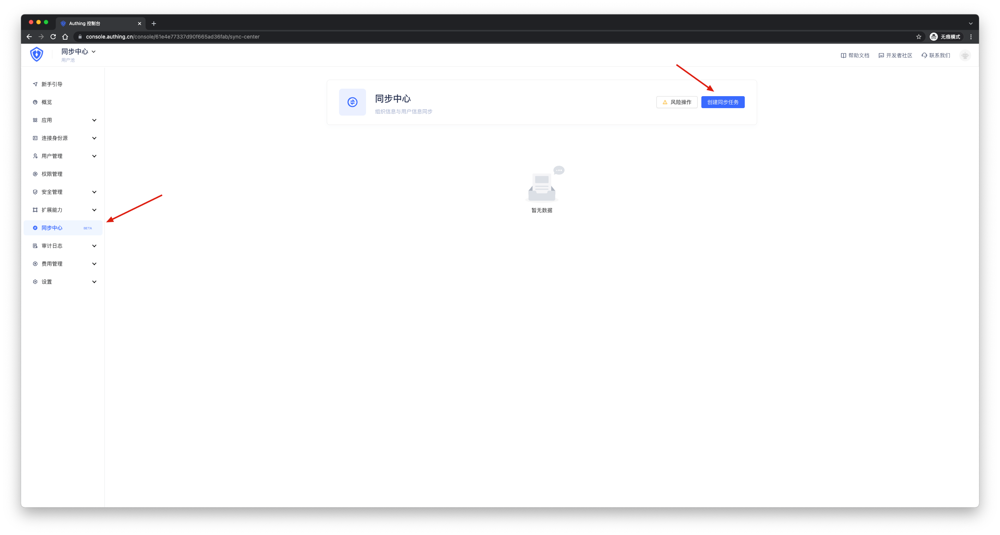
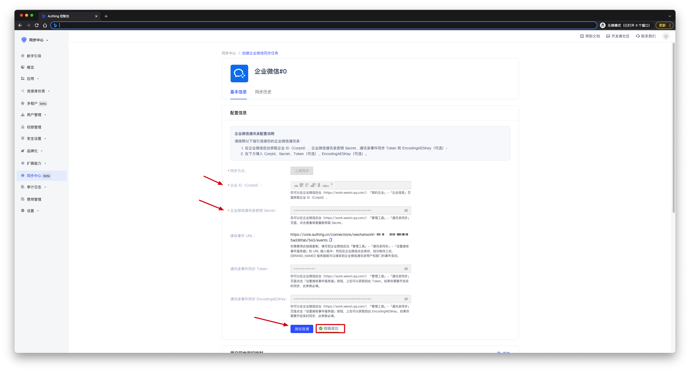
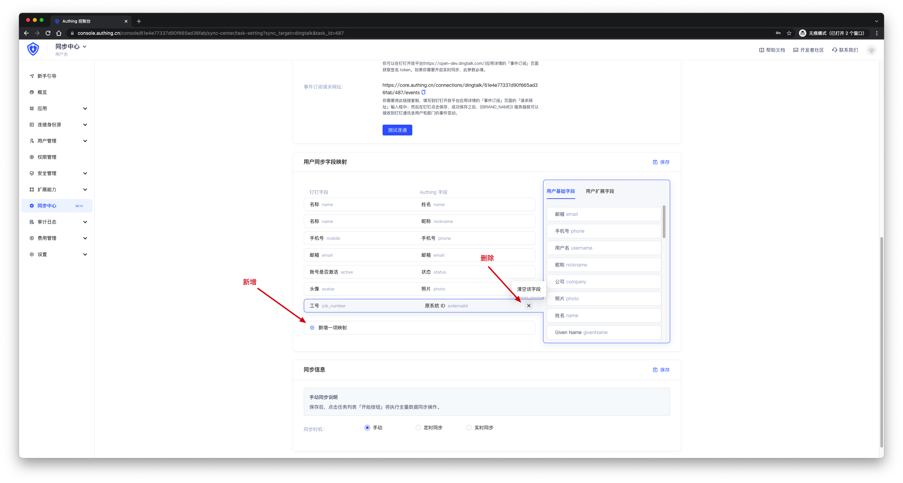
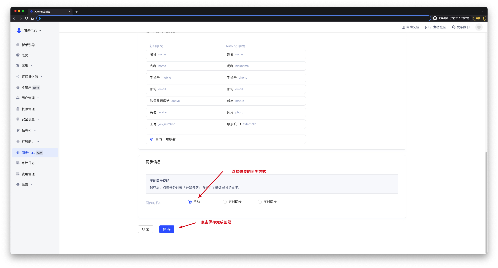

# 创建同步任务

<LastUpdated/>

在[控制台](https://console.authing.cn/)点击**同步中心**即可进入同步中心管理页面 ，在这里您可以看到所有您已经创建的同步任务，也可以创建新的同步任务。
点击右上角的**创建同步任务**，选择您要创建的上游或下游，然后根据提示填写配置信息。点击[这里](./get-config-new)获取配置信息。

 

 

配置自定义字段，点击[这里](./field-mapping-new.md)获取自定义字段配置方法。

 

您可以选择想要的同步方式。提供**手动同步**、**实时同步**、**定时同步**三种同步方式。点击[这里](./sync-type-new.md)获取同步方式详情。

 

点击**保存**，完成创建工作。

