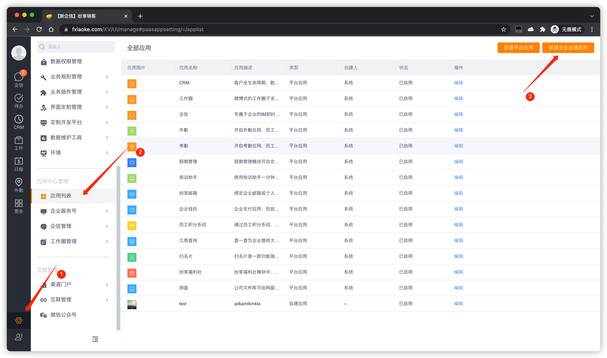
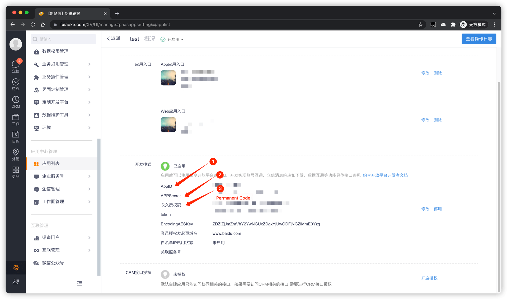

# 获取纷享销客配置项和权限

<LastUpdated/>

1. 进入[纷享销客后台管理页面](https://www.fxiaoke.com/XV/UI/manage)。

2. 创建一个自建应用

 

3. 进入应用详情页面获取 AppId、AppSecret 和 PermanentCode。

 

4. [进入](http://open.fxiaoke.com/wiki.html#artiId=1122)纷享销客开放平台，通过**手机号查询员工**接口获取管理员 ID，然后将管理员 ID 填入 Current Open User Id。
