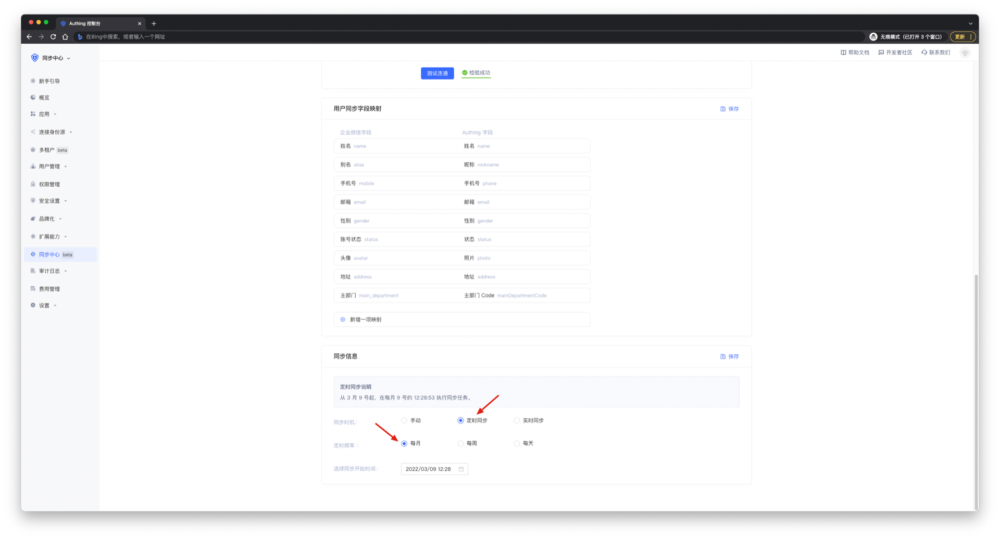
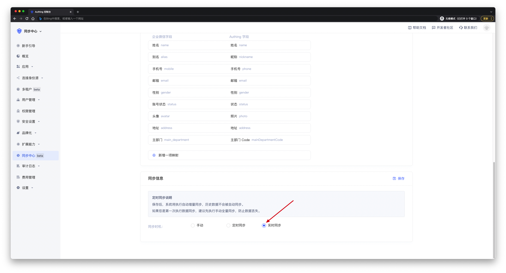

# 选择同步方式

<LastUpdated/>

Authing 为用户提供三种同步方式可供选择，包括 **手动同步**、**定时同步** 和 **实时同步**。

## 手动同步

通过手动点击执行同步任务按钮的方式执行同步任务，手动同步的特点是全量、点击即执行。

### 手动上游同步

当上游数据发生变更，需要在 Authing 控制台手动 **点击** 执行同步，变更数据才会同步到 Authing。

### 手动下游同步

当 Authing 数据发生变更，需要在 Authing 控制台手动 **点击** 执行同步，变更数据才会同步到下游。**删除** 操作需要在 **删除保护** 手动确认，详情见 [处理删除保护](../risky-operation.md)页面。

 

## 定时同步

通过设定具体执行周期实现定时触发同步任务，定时同步执行效果和手动同步一致，特点是按时触发，不需要手动点击，定时同步支持每天、每周、每月执行。

### 定时上游同步

当上游数据发生变更，变更数据会定时同步到 Authing。

### 定时下游同步

当 Authing 数据发生变更，变更数据会定时同步到下游。**删除** 操作需要在 **删除保护** 手动确认，详情见 [处理删除保护](../risky-operation.md)页面。

 

## 实时同步

实时同步时一种细粒度的同步方式，实时同步会根据组织机构或者人员实时变化的信息，进行差量同步，实时同步的特点是同步速度快、响应及时、无需排队等待。目前只有 **钉钉、企业微信、飞书** 支持实时同步。

### 实时上游同步

当上游数据发生变更，变更数据会实时同步到 Authing。

### 实时下游同步
当 Authing 数据发生变更，变更数据会实时同步到下游。**删除** 操作需要在 **删除保护** 手动确认，详情见 [处理删除保护](../risky-operation.md)页面。

 

