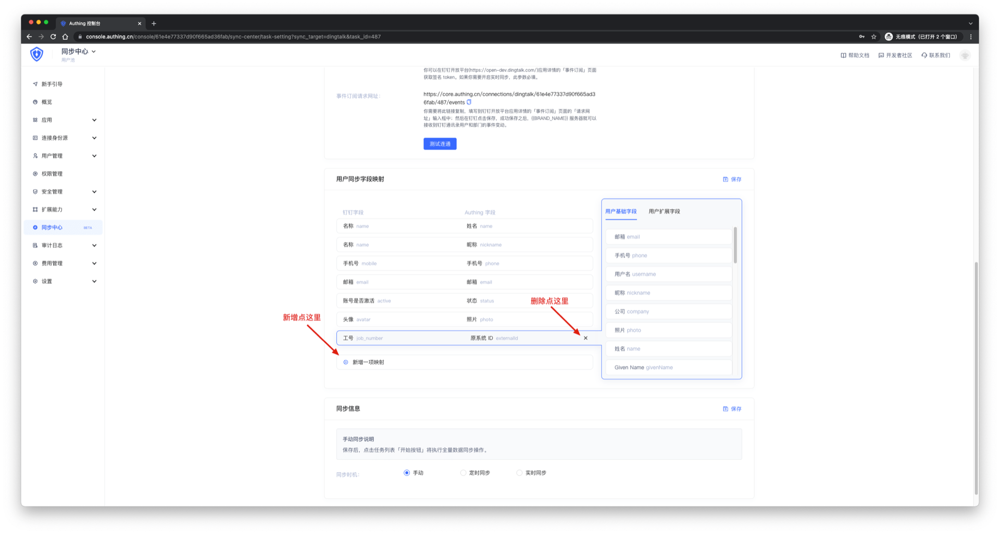
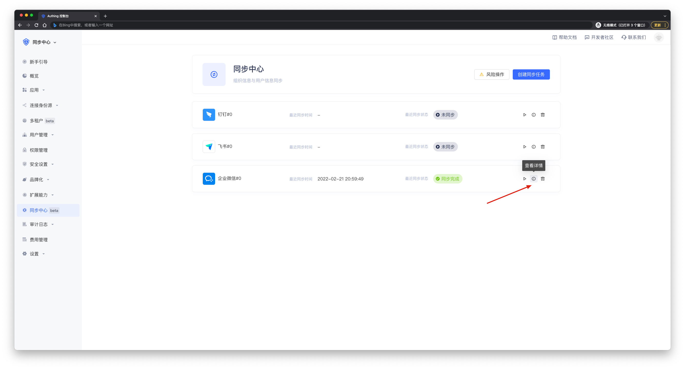
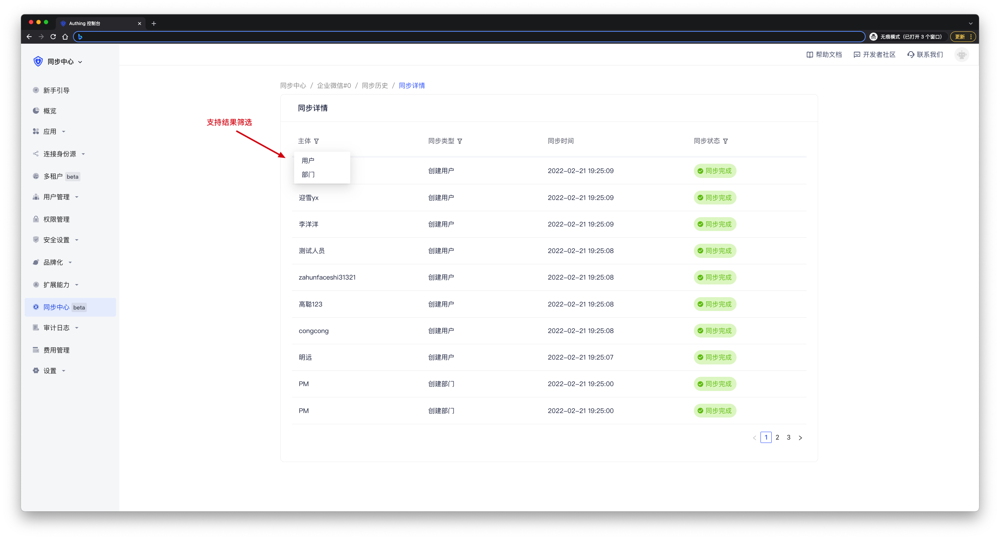
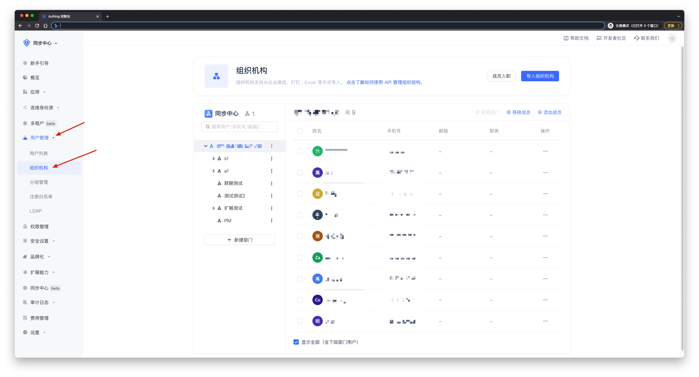

# 快速开始

<LastUpdated/>

通过以下两步快速体验 Authing 的同步中心功能。

## STEP 1：创建同步任务

在 Authing 控制台-同步中心**创建同步任务**，创建一个同步任务。同一个用户池仅支持同一个身份源创建一个上游同步任务或者一个下游同步任务。比如在一个用户池中存在钉钉上游同步任务，就无法再创建钉钉下游同步任务，但是可以创建飞书下游同步任务。因为钉钉上游和钉钉下游属于同一个身份源，而飞书和钉钉是不同身份源。

 

选中一个身份源，这里使用企业微信作为演示。

 

按照配置说明填写**配置信息**，然后点击**测试连通**。如果出现**检验成功**字样，说明连接成功。如果出现**检验失败**字样，则说明配置信息有误，请检查配置信息。如果要进行实时同步，点击[这里](./create-sync/get-config/README.md)获取配置信息和权限。

 

完成测试连通之后，开始配置自定义字段映射。系统会先默认配置一些字段映射，如果您想要同步更多信息，可以点击下方**新增一项映射**添加新的映射。如果您不想同步某些信息，可以选择删除该映射。点击[这里](./create-sync/field-mapping.md)获取字段映射配置方法。

 

您可以选择想要的同步方式。

**手动同步**需要您手动将上游数据同步至 Authing，灵活多变，适用于全量同步场景。 
**定时同步**支持按**天、周、月**为粒度将上游数据自动同步到 Authing，准时省心，适用于全量同步场景。 
**实时同步**可以将上游数据变动实时同步至 Authing，实时更新，适用于增量同步场景。目前只有**钉钉、企业微信、飞书**支持实时同步。 

点击[这里](./create-sync/sync-type.md)获取同步方式详情。

 

最后点击**保存**按钮，就可以在同步中心列表页看到新建的同步任务。

## STEP 2：执行同步任务

创建完上游同步任务后，点击**执行按钮**，就可以将上游数据同步至 Authing。同步数据会需要一些时间，这取决于您同步的数据量的大小。

 

同步完成以后进入详情页打开同步历史，可以看到本次数据同步详情。

 

 

也可以到控制台用户管理页面查看。

 

