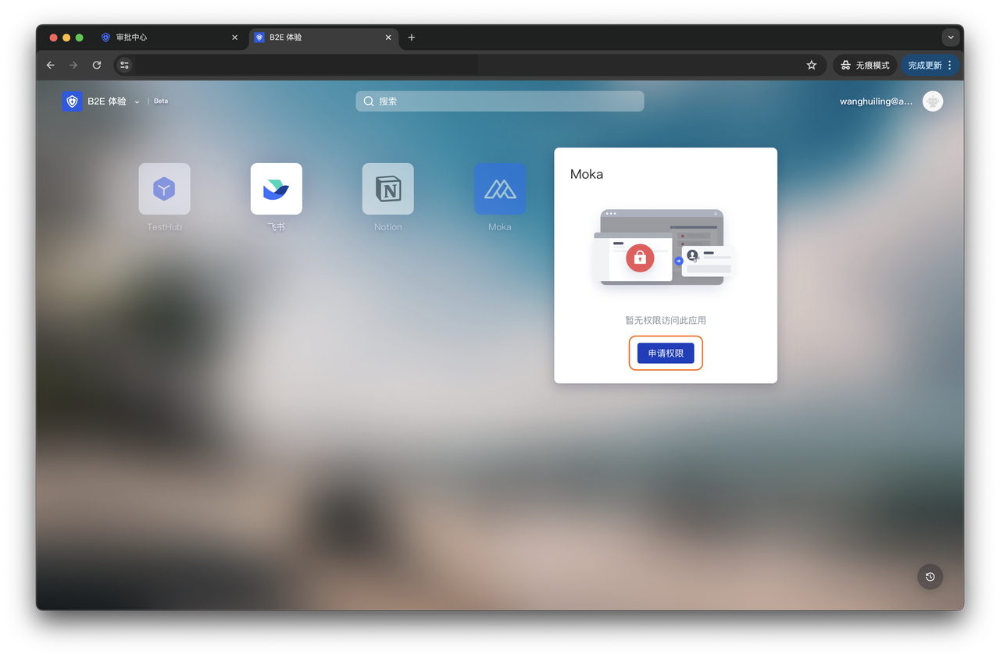
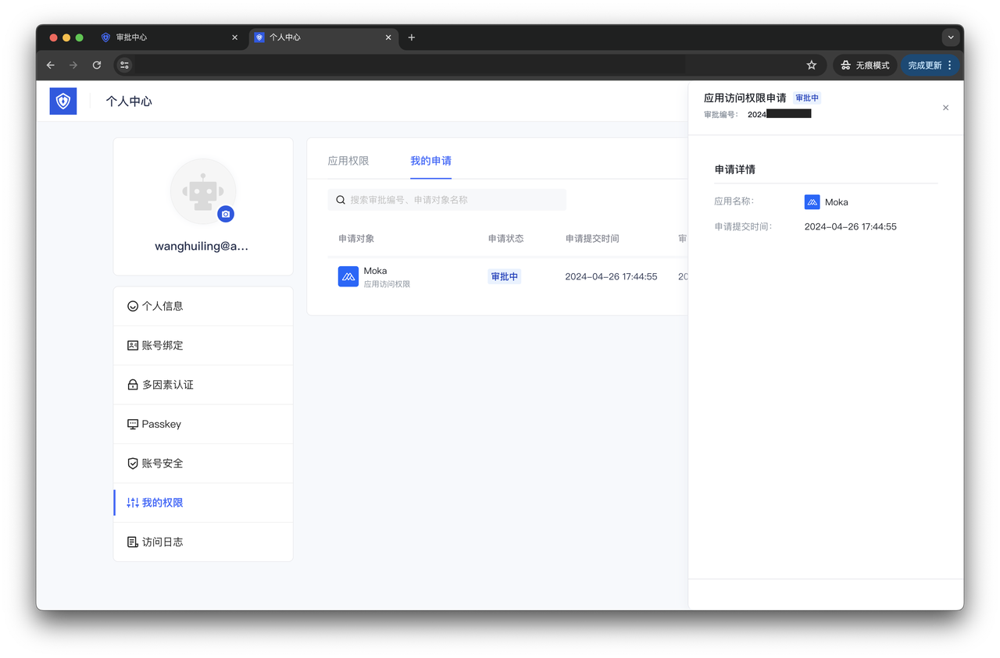
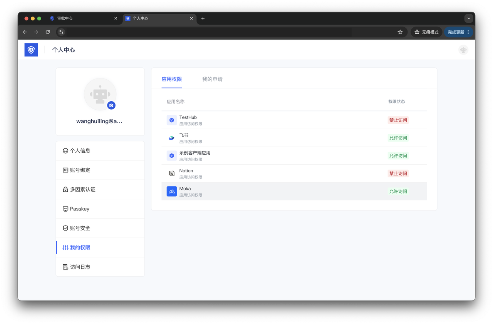
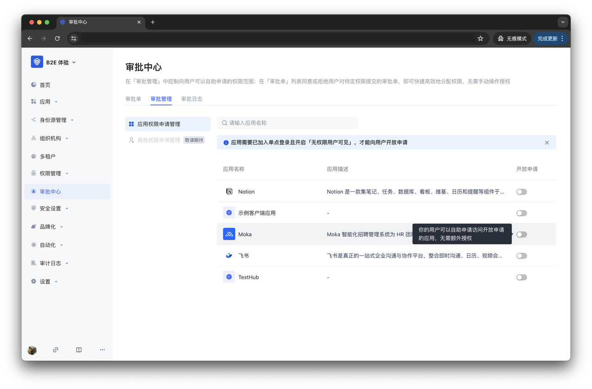
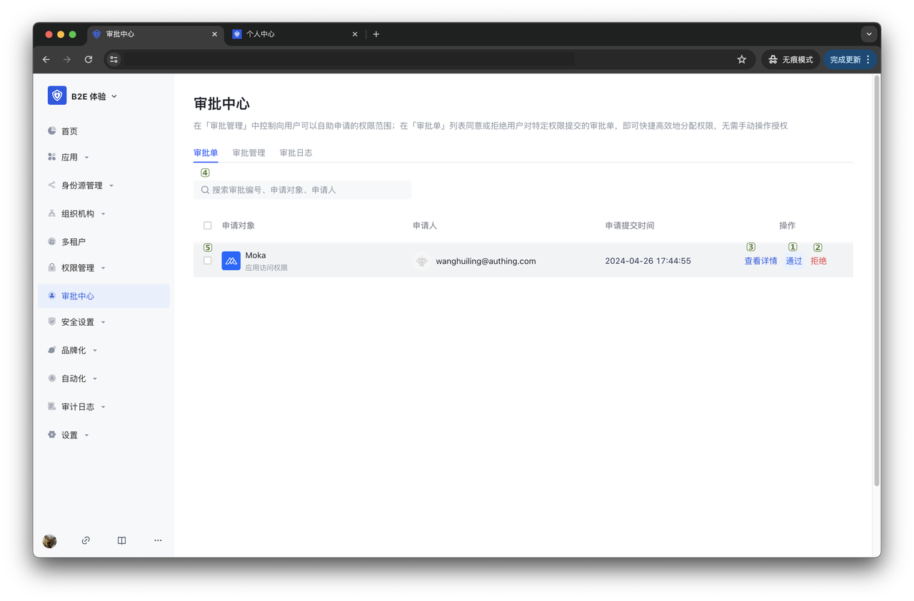
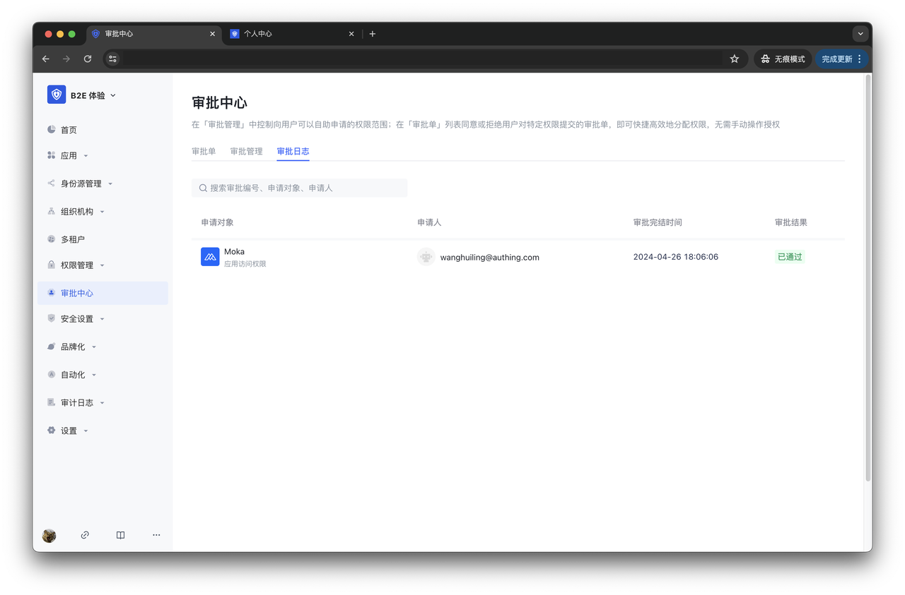

# 应用访问权限申请与审批

基于应用访问授权，我们已经能够对不同主体用户进行应用访问权限管控与查询。此外，对于开通了 **[身份自动化](https://docs.authing.cn/v2/workflow/#%E8%BA%AB%E4%BB%BD%E8%87%AA%E5%8A%A8%E5%8C%96%E6%A6%82%E8%A7%88)** 功能的用户池，你还可以在 **审批中心** 菜单下对用户开放部分应用访问权限自助申请、通过处理用户提交的应用访问权限申请配置用户权限。作为 IGA（身份治理与管理）的一环，应用访问权限申请与审批将**简化用户权限的配置流程、降低 IT 管理成本。**

应用访问权限申请与审批由管理员配置应用访问权限开放申请范围、处理审批单、查看审批单日志记录，以及用户申请应用访问权限、查看应用访问权限、查看申请记录组成。管理员可以在 **审批中心** 菜单，从配置开放申请范围开始，向用户分配可自助申请的应用访问权限；对于开放自助申请的应用，用户可以在应用面板中申请权限、在 **个人中心 -> 我的权限** 查看审批状态，待管理员通过审批即可访问应用。

应用访问权限申请与审批使得应用访问权限的管控、查询不再必须由管理员手动操作，在维持系统权限安全性的同时给予用户更多自主性，对于中大型组织来说，可以显著减少 IT 部门的工作量，加快组织事务的操作流转，实现更高效、低成本的应用访问权限管控。

## 终端用户的操作说明

### 申请应用访问权限

对于管理员未授权允许访问、但开放申请访问权限的应用，终端用户可[登录至应用面板](https://docs.authing.cn/v2/guides/dashboard/#%E7%99%BB%E5%BD%95%E5%BA%94%E7%94%A8%E9%9D%A2%E6%9D%BF)，点击 **申请权限** 按钮申请。

### 查看申请记录和应用访问权限状态

申请权限后，终端用户可以在其个人中心 **我的权限 -> 我的申请** 菜单中查看记录与审批状态。在管理员处理审批单前，同一用户不可以重复对同一应用的访问权限发起申请。

此外，可以在其 **个人中心 -> 我的权限 -> 应用权限** 菜单查看应用的访问权限状态，待所申请应用的权限状态变更为 **允许访问**，即可从应用面板正常访问。

## 管理员的操作说明

### 管理开放申请权限范围

在 **审批中心 -> 审批管理** 中，管理员可以开放给用户申请的权限范围。在管理应用访问权限开放申请范围前，你需要做如下准备工作：

1. [创建一个自建应用](https://docs.authing.cn/v2/guides/app-new/create-app/create-app.html#%E5%88%9B%E5%BB%BA%E8%87%AA%E5%BB%BA%E5%BA%94%E7%94%A8)

2. [将应用添加到单点登录](https://docs.authing.cn/v2/guides/app-new/create-app/application-access-control.html#%E5%8D%95%E7%82%B9%E7%99%BB%E5%BD%95)并开启“无权限用户可见”，以向用户开放查看应用名称、访问权限的只读权限。

3. 开通[身份自动化](https://docs.authing.cn/v2/workflow/overview/#%E8%BA%AB%E4%BB%BD%E8%87%AA%E5%8A%A8%E5%8C%96%E6%A6%82%E8%A7%88)功能

完成如上准备工作后，即可管理应用访问权限开放申请范围。理员可在 **审批中心 -> 审批管理 -> 应用权限申请管理** 中开启 / 关闭 **开放申请** 列开关，开放 / 禁用应用访问权限申请：

- 开启：允许无权限访问的终端用户在应用面板对该应用发起申请；

- 关闭：无权限访问的终端用户需要联系管理员手动授权。

### 处理审批单

用户申请应用访问权限后，新增的审批单在 **审批中心 -> 审批单** 展示。管理员可以在此查看申请对象、申请人、提交时间信息，处理审批单。

| 序号  | 名称    | 功能说明                        |
| :-- | :---- | :-------------------------- |
| 1   | 通过    | 点击触发自动化工作流，自动授权用户所申请对象的相关权限 |
| 2   | 拒绝    | 点击完结审批，用户相关权限不发生变化          |
| 3   | 查看详情  | 点击查看审批单详情信息                 |
| 4   | 搜索审批单 | 输入审批编号或申请对象名称、申请人名称搜索审批单    |
| 5   | 批量操作  | 选中多个审批单，批量通过或拒绝             |

### 查看审批日志

管理员对审批单进行的操作记录在 **审批中心 -> 审批日志** 中。

审批日志记录了审批单的申请对象、申请人、完结时间、审批状态等相关信息，可通过输入审批编号 / 申请对象名称 / 申请人名称搜索。