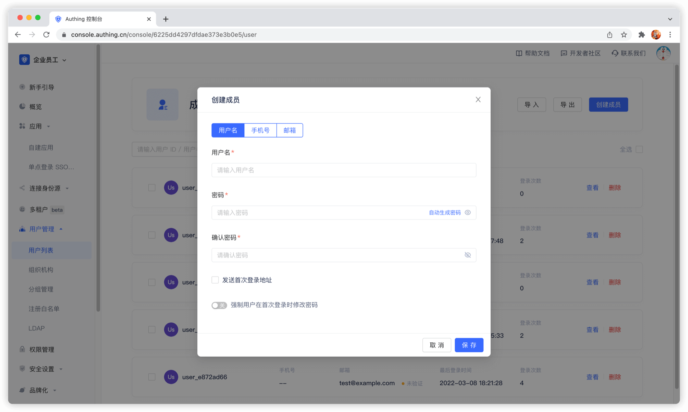

---
meta:
  - name: description
    content: 管理员创建账号
---

# 管理员创建账号

<LastUpdated/>

管理员创建账号与用户自己注册账号的异同：
- 管理员创建账号不受「禁止注册」配置限制；
- 管理员创建账号不受「注册白名单」限制；
- 管理员创建手机号账号不需要验证码，而用户自己注册需要；
- 管理员创建的手机号账号 `phoneVerified` 字段为 `false`，用户自己注册的为 `true`；
- 管理员创建账号和用户自己注册都不能创建重复的邮箱、手机号、username。

管理员可以通过[控制台](#使用控制台创建用户)或者 [SDK](#使用-sdk-创建用户) 创建用户。

## 使用控制台创建用户

你可以在控制台的 **用户管理** - **用户列表** 手动创建账号：

> 可以通过邮箱和手机号创建账号。

## 使用 SDK 创建用户

<StackSelector snippet="create-user" selectLabel="选择语言" :order="['java', 'javascript', 'python', 'csharp']"/>
