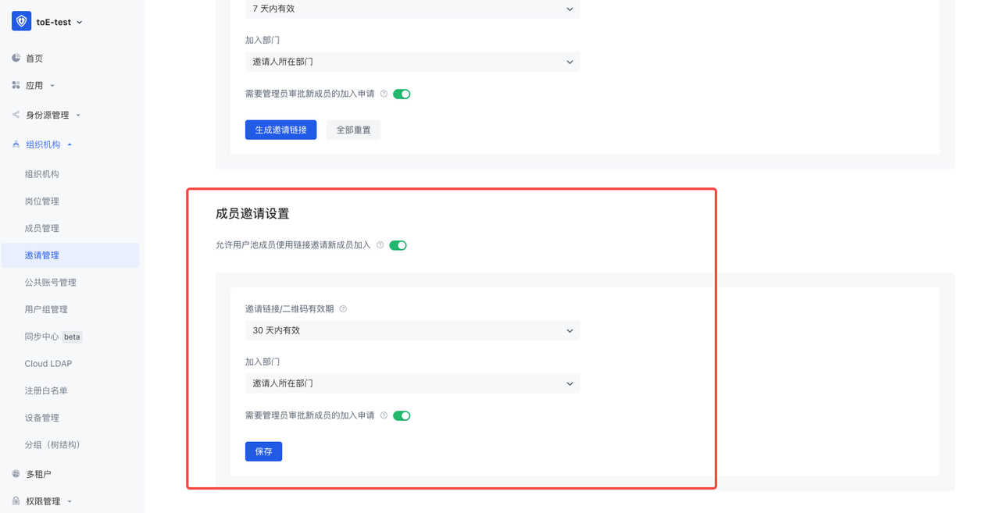

# 邀请管理

1. Authing 提供的邀请用户功能支持多种场景，既能满足国内外多数 SaaS 场景下的通用邀请能力：
  - 线下分发邀请链接/二维码，用户自助申请加入；

2. 亦能满足 to B / to E 场景下更具备定制化的需求。例如：分批次发送邀请邮件给受邀人，且受邀人加入后，管理员无需再次手动配置权限/部门等：
  - **可使用「名单」分批次、批量发送邀请邮件，管理员可以通过「策略」自定义不同批次受邀人的邀请注册流程、加入后默认所属部门/角色/用户组等；**
  - 未来迭代版本将支持区分租户来管理邀请名单的能力，满足更多 to B 特殊场景；

## 概述

1. 本次更新将支持管理员通过多种方式邀请新用户：
  - **通用邀请**：当管理员未知新用户的联系方式（邮箱）时，可以在「通用邀请」页面生成并复制邀请链接，发送给新用户，详情见下文。且用户池中的普通用户也可以生成并复制邀请链接，邀请新用户；
  - **策略邀请**：当管理员拥有新用户的联系方式（邮箱）时，可使用「策略邀请」功能，将批量导入新用户邮箱、关联自定义的邀请策略后，对名单中的的受邀人批量发送邀请邮件，详情见下文；

2. 支持在「快捷查询」页面，通过受邀人名称快速查询状态、定位所属名单等；
基于 Authing 既有的个人用户账号体系，Authing 推出了公共账号功能。 该功能主要帮助企业在复杂的业务及系统体系下，通过将公共账号关联到个人用户、部门、岗位、用户组及角色下，实现个人账号授权登录后，可以访问多个公共账号资源的能力。

## 功能详情

### 通用邀请

#### 1. 设置通用邀请链接

- 支持设置邀请链接有效期；
- 支持设置新用户加入用户池后所属部门；
- 支持开启管理员审批功能，开启后，新用户提交加入申请后需要管理员在「申请列表」中同意后方可成功加入。若关闭，则视为系统同意申请，可直接加入；

***

- 点击「生成邀请链接」，将根据上方的设置生成链接和二维码：

***

- 「全部重置」后，当前管理员生成的邀请链接将全部失效：

#### 2. 设置普通用户邀请链接

- 开启后，即可在业务系统页面添加按钮等交互模式，供用户生成邀请链接使用；

#### 3. 邀请页面

- 点击通用邀请链接，将跳转上方页面，需要填写姓名和邮箱申请加入；
- 「申请加入」提交后，通过审批后将收到欢迎邮件，包含：登录地址、登录账号、初始密码等信息；

#### 4. 申请列表

- 管理员可前往「邀请管理-通用邀请-申请列表」审批新成员的加入申请；
- 列表可查看申请人的名称、邮箱和邀请人、审批人、审批结果等；

### 策略邀请

#### 1. 名单管理

- 在名单管理页面，支持创建名单；

- 名单的受邀人列表中，支持手动添加/文件导入受邀人及邮箱；
- 关联策略后即可批量发起邀请，详情见下文；

#### 2. 策略管理

- 策略管理列表，支持管理员创建、编辑、删除策略；
- 支持创建副本，方便进行策略版本管理等；
- 策略配置详情：

  
  
（邀请配置）

  
  
（流程配置）

  
  
（用户归属配置）

- 策略配置完成后，可以与名单关联，支持查看关联名单列表、解除关联等；

#### 3. 关联名单与策略

- 在「名单-关联策略」页面操作：

- 在「策略-关联名单」页面操作：

#### 4. 发起邀请

- 在名单详情页，可对当前整个名单内的受邀人发起邀请，受邀人将收到邀请邮件；

#### 5. 邀请页面

  
  
（身份验证）

  
  
补全信息（需要补全的信息由管理员定义）

  
  
（成功加入）

### 快捷查询

- 支持通过受邀人名称、邮箱等，快速查询并定位受邀人所在名单、状态等；

