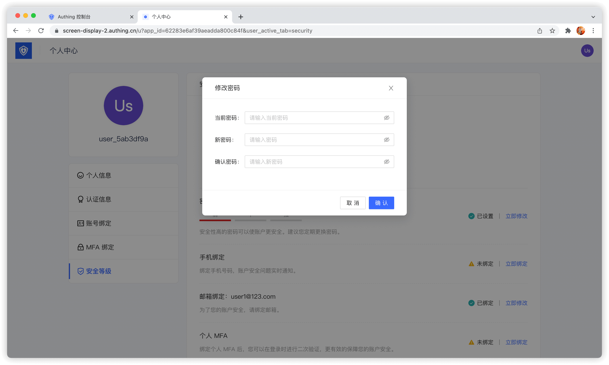
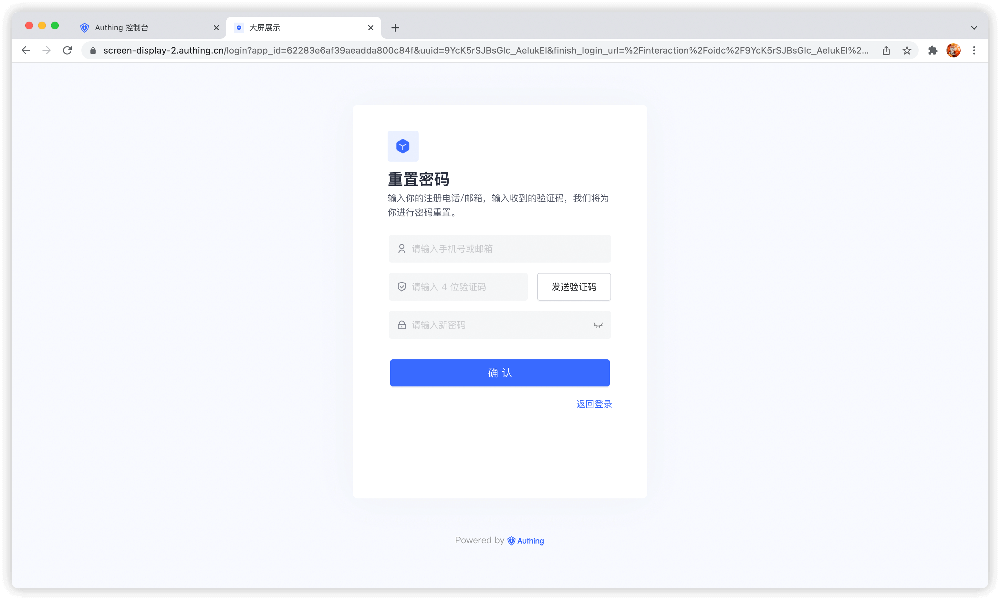
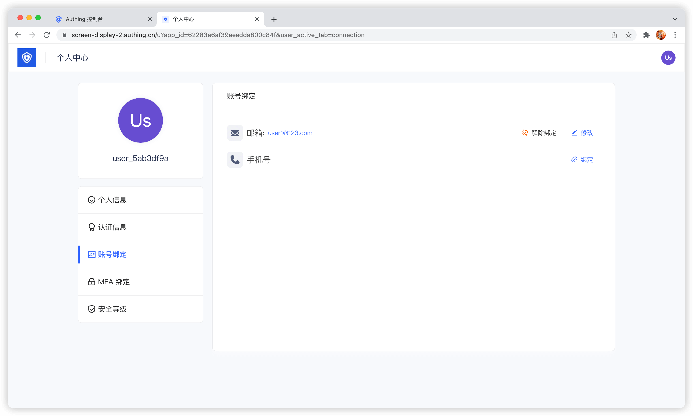

---
meta:
  - name: description
    content: 管理用户账号
---

# 管理用户账号

管理用户账号包括忘记密码、验证邮箱、修改绑定手机号邮箱、多因素认证，以及禁用用户账号、绑定社会化登录、账号合并等完整流程。如果你使用 {{$localeConfig.brandName}} 的话，恭喜你，这些功能 {{$localeConfig.brandName}} 全部内置了，你只需要花极少的时候就能快速完成。

## 使用托管登录页和个人中心

{{$localeConfig.brandName}} 为开发者提供了一个内置的一应俱全、美观、高度配置化的登录表单，你可以[在此体验](https://sample-sso.authing.cn/) （以下我们简称此登录表单为 `Guard`），地址为 `https://<YOUR_DOMAIN>.authing.cn/`：

可以进行登录注册、忘记密码、重置邮箱、发送短信验证码、扫码登录等功能。

以及一个用户个人中心，你可以[在此体验](https://sample-sso.authing.cn/u)，地址为 `https://<YOUR_DOMAIN>.authing.cn/u`：

借助托管登录页和个人中心，用户可以完成自助的个人资料管理。

### 修改账号资料

{{$localeConfig.brandName}} 提供了一个内置的用户个人中心页（地址为 `https://<YOUR_DOMAIN>.authing.cn/u`），可以完成用户基本信息的修改：

### 修改密码

当用户记得当前密码时，可以通过检验当前密码修改密码:

### 忘记密码

当用户忘记当前密码时，可以通过以下流程重置密码:

点击忘记密码

可以选择使用邮箱或者手机号进行验证：

### 绑定邮箱和手机号

终端用户可以在个人中心的 **账号绑定** Tab 中绑定和解绑邮箱或手机号:

### 绑定 MFA

终端用户可以在个人中心的 **MFA 绑定** Tab 中绑定 MFA:

## 使用控制台

管理员可以借助控制台可视化地管理用户账号。

### 编辑用户资料

### 禁用账号

管理员可以在用户详情页禁用账号，被禁用的账号将无法再次登录:

### 查看原始用户信息

## 使用 SDK/API

{{$localeConfig.brandName}} 提供了 Authentication SDK/API 和 Management SDK/API，你可以使用 Authentication API 和完成用户自助的个人账号信息管理，使用 Management SDK/API 以管理员的身份管理用户资料，以管理员身份进行的操作不需要进行手机号验证码、邮箱验证码、MFA 等验证手段。

!!!include(common/sdk-list.md)!!!
