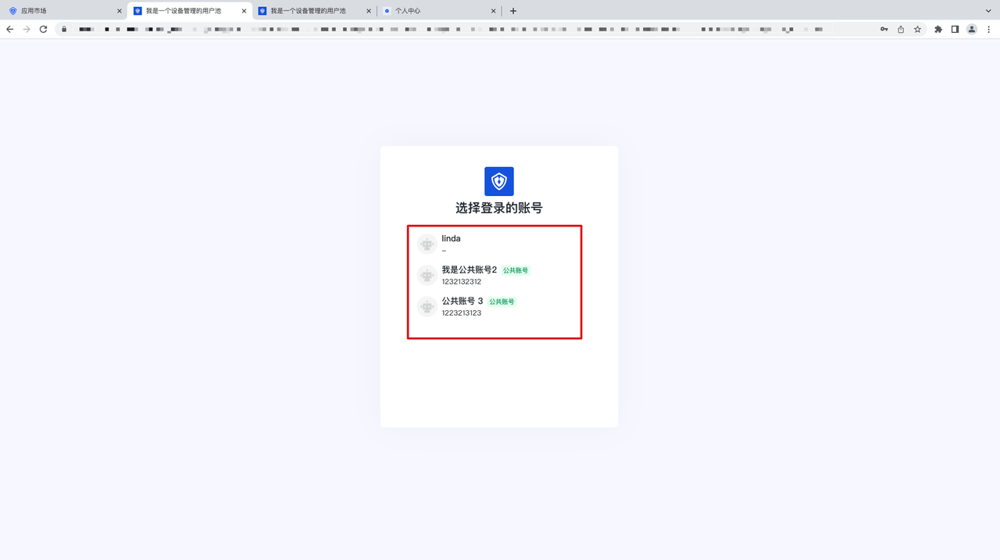

# 公共账号

基于 Authing 既有的个人用户账号体系，Authing 推出了公共账号功能。 该功能主要帮助企业在复杂的业务及系统体系下，通过将公共账号关联到个人用户、部门、岗位、用户组及角色下，实现个人账号授权登录后，可以访问多个公共账号资源的能力。

## 管理员侧操作

### 创建公共账号

1. 你可以通过点击「成员管理」-「创建成员」，调起创建弹窗，开启「是否为公共账号」功能，点击确定，进入该公共账号详情页面：

2. 你也可以通过点击「公共账号管理」-「创建公共账号」，调起创建弹窗，完成相应的创建并进入到公共账号详情页面：

### 禁用/启用/删除/强制下线公共账号

1. 你可以在公共账号的用户详情页面，点击「更多」，调起公共账号的操作 Button, 进行相应的操作：

2. 你也可以在公共账号列表，点击「...」，对公共账号进行禁用/启用及删除的操作：

### 将个人账号转变为公共账号

目前控制台支持将个人账号转变为公共账号，点击「成员管理」-「成员详情页面」-「更多」-「公共账号」，调起切换公共账号的弹窗，点击「确定」即可完成公共账号的变更：

### 将公共账号与个人账号进行关联

1. 将某个「个人用户」添加到「所属用户」列表，默认该用户拥有该公共账号的访问权限：

2. 将某个「部门」添加到「所属部门」列表，默认该部门下的所有个人用户拥有该公共账号的访问权限：

3. 将某个「用户组」添加到「所属用户组」列表，默认该用户组下的所有个人用户拥有该公共账号的访问权限：

4. 将某个「岗位」添加到「所属岗位」列表，默认该岗位下的所有个人用户拥有该公共账号的访问权限：

5. 将某个「角色」添加到「所属角色」列表，默认该角色下的所有个人用户拥有该公共账号的访问权限：

### 查看公共账号的审计日志

进入公共账号详情页面，点击「访问记录」，即可查看所有使用该公共账号的个人账号信息及登录的其他信息，用于记录该公共账号的活跃情况：

### 开启/关闭登录框公共账号选择

在「全局登录框」-「功能配置」Tab ，开启支持选择公共账号进行登录后，用户即可在登录框、个人中心、单点登录面板进行账号的选择及切换；

## 用户侧操作

### 自建应用/单点登录面板登录框选择登录账号

当管理员开启了登录框允许选择账号登录后，当用户下面有关联公共账号的情况，在个人账号认证通过后，即会来到选择账号登录界面：

### 自建应用个人中心/单点登录面板切换登录账号

当用户成功登录了某个应用或者单点登录面板，点击「头像」- 「切换公共账号」，选择要登录的账号即可完成相应的切换操作：

## 关于 OPEN API 地址

管理员可通过访问以下 API 文档地址，进行接口侧的相关操作：
[管理公共账号](https://console.authing.cn/openapi/v3/management/#tag/%E7%AE%A1%E7%90%86%E5%85%AC%E5%85%B1%E8%B4%A6%E5%8F%B7/API%20%E5%88%97%E8%A1%A8)
