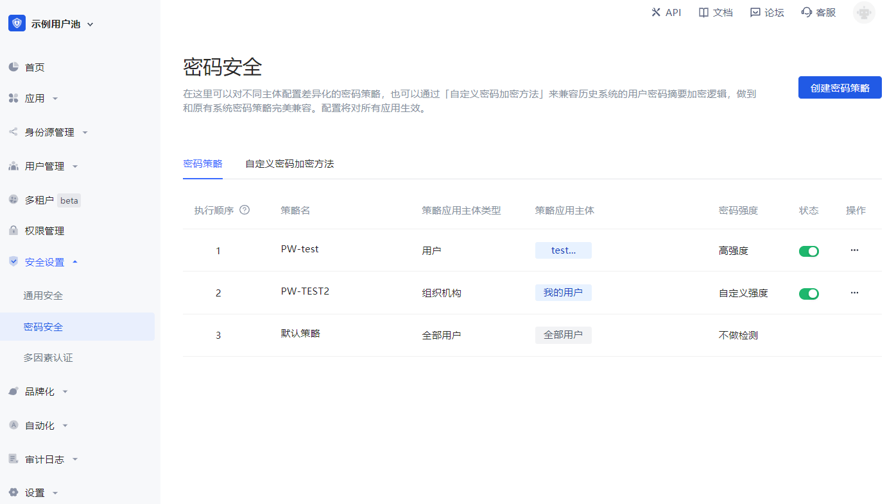

# 增强账号安全性

<LastUpdated/>

用户账号的安全性至关重要，你可以通过以下方式增强用户账号的安全性。

## 配置更强的密码强度

你可以在 **安全设置->密码安全** 页面中配置密码强度，开启强度后系统会要求所有用户注册时、修改密码时，密码必须满足一定的复杂度。

安全性高的密码可以使账户更安全。并且建议用户定期更换密码。

## 绑定手机号

绑定手机号之后可以使用手机号验证码登录，无需再输入密码，更加安全方便。终端用户可以在应用个人中心（地址为 `https://<YOUR_APP_DOMAIN>.authing.cn/u`）绑定手机号，你也可以使用 [SDK](/reference/sdk-for-node/authentication/AuthenticationClient.md#绑定手机号) 来操作。

## 绑定个人 MFA

绑定个人 MFA 后，用户在登录时需要进行二次验证，更有效的保障用户的账户安全。终端用户可以在应用个人中心（地址为 `https://<YOUR_APP_DOMAIN>.authing.cn/u`）绑定 MFA，你也可以使用 [SDK](/reference/sdk-for-node/authentication/mfaAuthenticationClient.md) 来操作。

