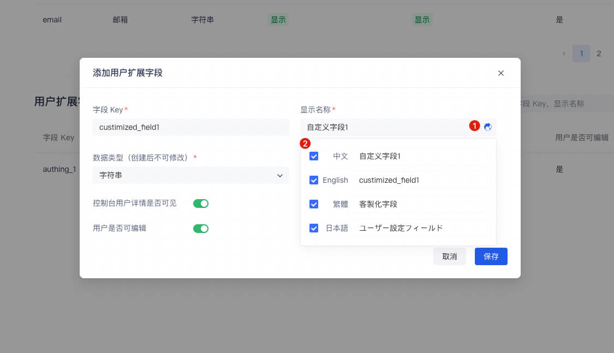

# 管理用户的自定义数据

<LastUpdated/>

路径：**设置->字段管理->用户字段管理->用户扩展字段** 

用户自定义字段是除了 [基础用户字段](/guides/user/user-profile.md) 之外，可以给用户对象添加的额外字段。开发者可以通过设置自定义字段，存储**少量**业务相关的数据。

## 配置自定义用户字段

可以定义以下几种类型的自定义字段：

- 字符串；
- 数值；
- 日期；
- 布尔值；
- 枚举值；

1. 创建自定义拓展字段

    你可以在 **添加用户扩展字段** 窗口配置自定义用户字段：

    

    在给新创建的自定义字段命名时，你可以编辑该字段在多种语言环境下的显示名称：

    - 直接在「显示名称」下的输入框中编辑，得到默认展示的字段名称
    - 勾选「中文」，并编辑中文环境下的字段显示名称
    - 勾选「English」，并编辑英文环境下的字段显示名称
    - 勾选「繁體」，并编辑繁体中文环境下的字段显示名称
    - 勾选「日本語」，并编辑日语环境下的字段显示名称

    特别的，如果该字段的显示环境未包含在上述四种语言环境的范围内，将会采用你配置的「默认展示的字段名称」进行显示。
   

2. 配置自定义字段之后，你可以开启应用的注册信息补全页面，让用户补全这些自定义字段的信息。

    a. 在 **应用->自建应用->应用详情页->高级配置** 标签页开启 **自定义本应用的登录框** 开关。

    

    b. 然后切换到 **品牌化**，在 **登录注册信息补全** 模块勾选 **注册时信息补全** 开关。

    

    c. 添加自定义字段：

    

    d. 点击 **保存**。

3. 访问应用的登录页面。 用户点击注册之后将跳转到下面这个注册信息补全页面：

    

用户成功注册之后，你可以在用户详情页面看到用户刚刚输入的自定义字段值：

## 使用 API & SDK 管理用户自定义数据

!!!include(common/sdk-list.md)!!!

<StackSelector snippet="udf" selectLabel="选择语言" :order="['java', 'javascript', 'python', 'csharp', 'swift']"/>