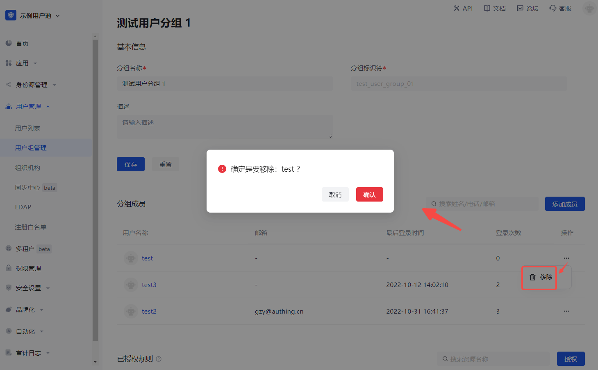
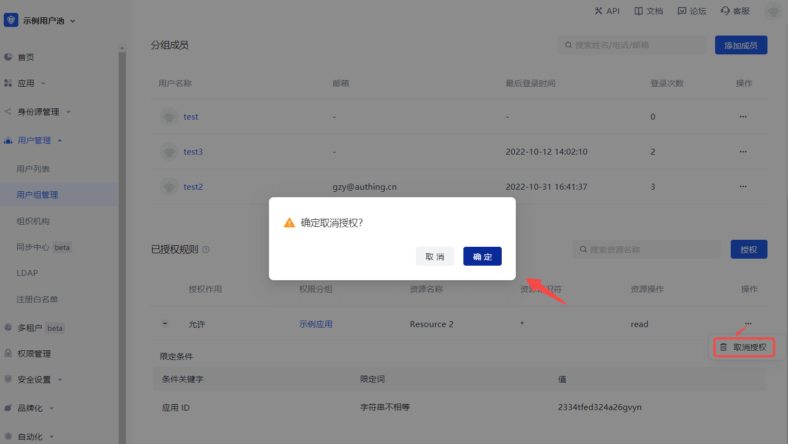

# 用户组管理

<LastUpdated/>

路径：**用户管理->用户组管理**

进行一组用户的增删改查、分配授权等操作。

## 创建分组

导航栏中找到用户管理点击对应菜单进入到用户分组页面

## 填写分组信息

## 分组列表

## 分组详情

1. 点击添加成员。

2. 从弹窗组件中选择成员或搜索成员。

3. 点击确认后添加成功。

## 分配权限

要对用户分组分配权限，执行以下步骤：

1. 点击添加授权规则。

2. 在授权组件中选择 **权限分组**，指定 **权限作用** 和 **资源**。

3. 指定操作。

4. 添加限制条件。

::: hint-info
要对当前用户分组添加多个授权规则（指定其他 **权限分组** / **授权作用** / **资源** / **操作** / **限制条件**），可点击弹窗下方 **添加授权规则**。
:::

5. 点击 **确定**。 授权成功。

::: hint-info
点击 **+** 可展开当前授权规则，展示规则详情。
:::

要取消授权，点击当前授权规则行 **操作** 列 **取消授权** 按钮：

