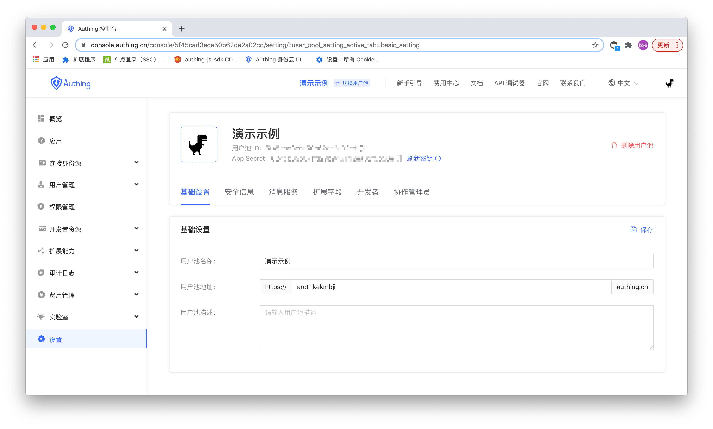
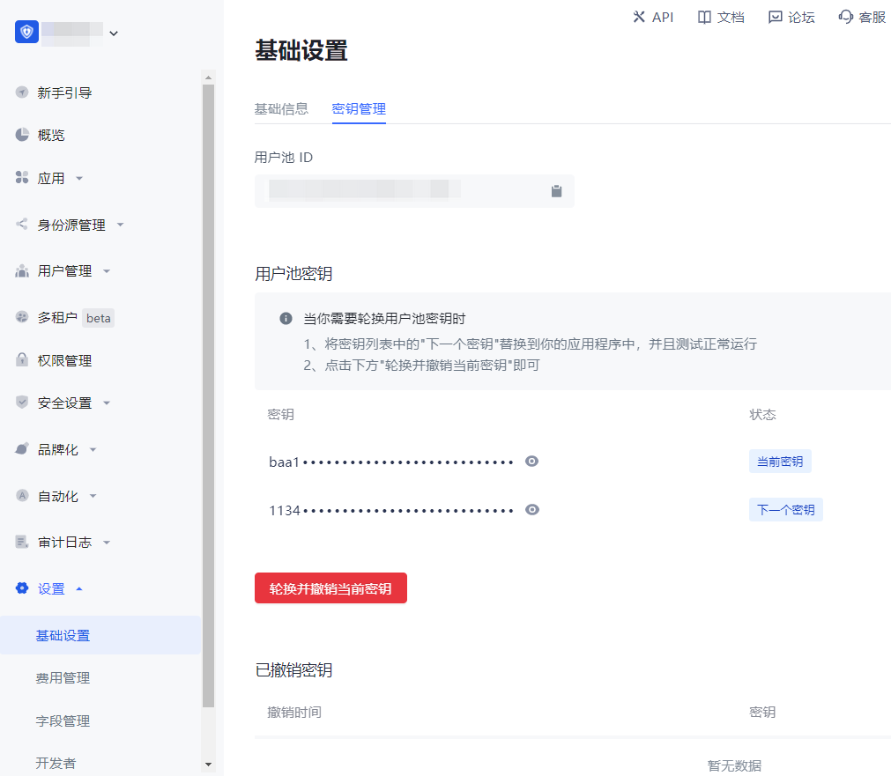
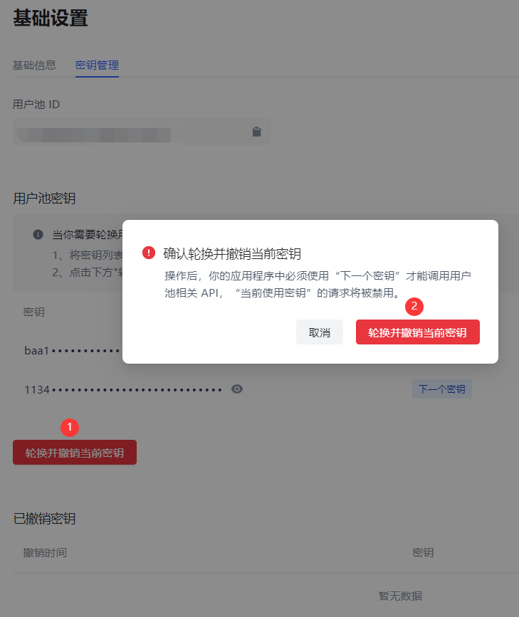
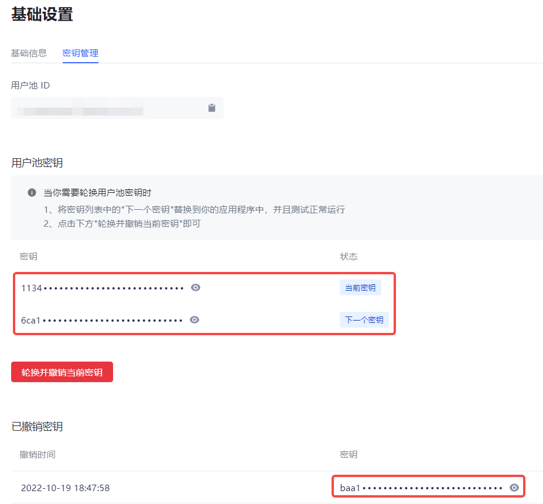

# 基础设置

<LastUpdated/>

## 基础信息

路径：**设置->基础设置->基础信息**

管理员可以在 **基础信息** 标签页执行修改用户池基本信息、配置用户池认证地址、删除用户池等操作。

​

|序号|字段|说明|
|----|----|----|
|1|用户池名称|可在此字段修改用户池名称。|
|2|用户池 ID|创建用户池时系统自动生成，可点击输入框后的复制按钮复制 ID，用于配置单点登录等场景。|
|3|认证地址|Authing 默认的用户池不使用统一的三级域名，如需修改你的用户池中某些应用的三级域名，可以前往该应用的 **应用配置** 页面进行修改。 **注意**：如果你使用的是 [统一域名的用户池](/guides/faqs/union-domain.md)，那么你可以在此一次性修改该用户池中所有应用（自建应用、集成应用、应用面板）的三级域名。|
|4|用户池描述|可在此输入简短的用户池描述。用户池描述应能准确描述用户池业务信息、使用目的，用以区别于其他用户池。|
|5|用户池 Logo|管理员可点击用户池 Logo 从本地上传并替换当前系统默认 Logo 图片。|
|6|删除用户池|可以在此删除用户池。 **注意**：「删除用户池」属于高风险操作，用户池一经删除不可找回。{{$localeConfig.brandName}} 在你做出「删除用户池」操作后从数据库实时删除此用户池中的所有用户信息以及配置信息。|

## 密钥管理

路径：**设置->基础设置->密钥管理**

用户池密钥可用于 ticket 换取用户信息等多个场景。你可以在控制台的 **密钥管理** 页面获取到用户池 ID（`UserPoolId`）和用户池密钥（`UserPool Secret`）。

​

一个用户池 ID 自动生成对应两个用户池密钥：

* **当前密钥**：是提供给客户线上使用请求的密钥​。

* **下一个密钥**:是提供给客户准备进行更换密钥时提前自动创建的备用密钥。

目前 {{$localeConfig.brandName}} 的用户池密钥支持进行刷新轮换。要刷新轮换用户池密钥，执行以下步骤：

1. 点击 **轮换并撤销当前密钥** 按钮。

2. 查看弹出窗口的提示信息，并点击 **轮换并撤销当前密钥** 进行确认。

​

3. 提示 “轮换密钥成功”，**当前密钥** 会被禁用并进入 **已撤销密钥** 列表，**下一个密钥** 的状态变更为 **当前密钥**，并自动创建新的 **下一个密钥**。

​