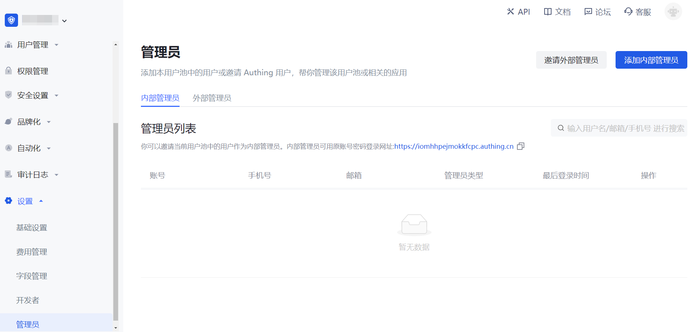
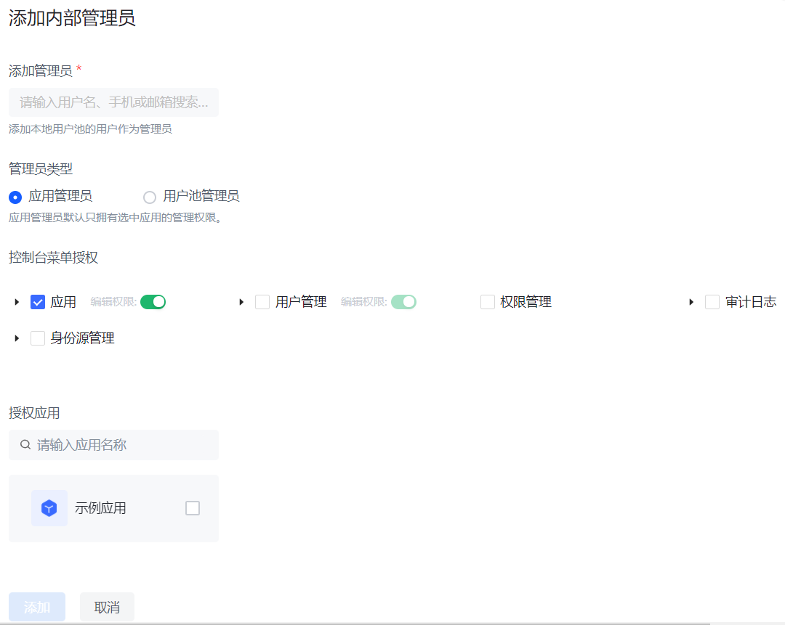
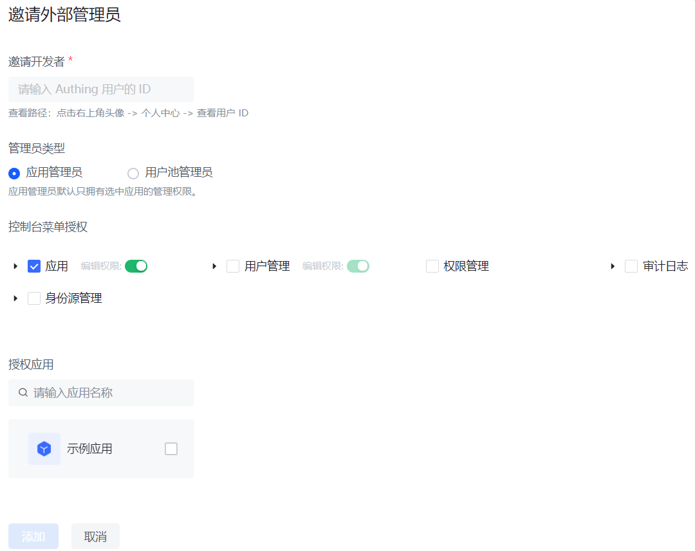

# 管理员

<LastUpdated/>

路径：**设置->管理员**

## 管理员来源

有两种管理员来源：外部管理员（包括用户池的所有者及其协作管理员）和内部管理员。

所有外部管理员作为各自用户池的所有者集中于 {{$localeConfig.brandName}} 官方用户池。某个外部管理员 A 可以将自己负责的用户池资源授权给 {{$localeConfig.brandName}} 官方用户池中另一个用户池的所有者 B，协助 A 管理其用户池。被授权的所有者 B 将会在 {{$localeConfig.brandName}} 官方用户池的用户池列表中看到 A 负责的用户池。

外部管理员 A 也可以指定其用户池中的某个用户为内部管理员，为其指定权限。

## 管理员级别

按照权限级别，管理员可以分为用户池级别管理员和应用级别管理员。所有的内外部管理员既可以是用户池级别管理员，也可以是应用级别管理员。

::: img-description 管理员列表
:::

::: img-description 添加内部管理员
:::

::: img-description 邀请外部管理员
:::

