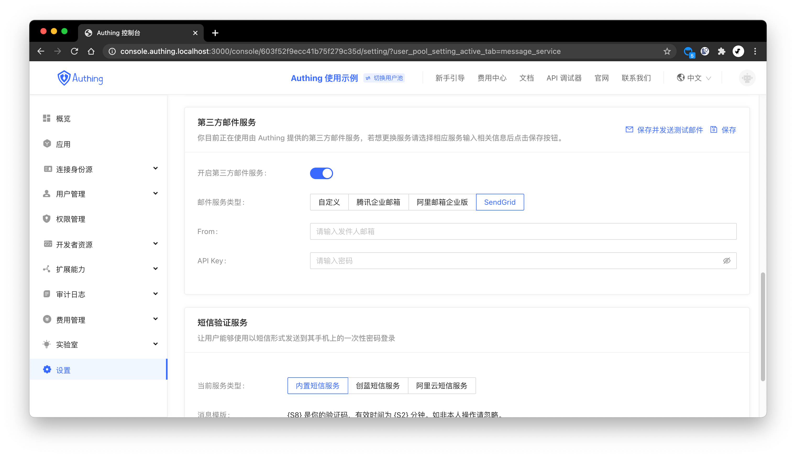

你可以在控制台的**设置**-**消息服务**配置[SendGrid 邮件服务](https://sendgrid.com/)：

你需要填入以下信息：

- From: 你需要先进行 [Single Sender Verification](https://sendgrid.com/docs/ui/sending-email/sender-verification/) 或者 [Domain Authentication](https://sendgrid.com/docs/ui/account-and-settings/how-to-set-up-domain-authentication/) 验证；
- API Key: 你可以在 [SendGrid 控制台](https://app.sendgrid.com/settings/api_keys) 的 **Settings** - **API Keys** 创建或获取 API Key。

