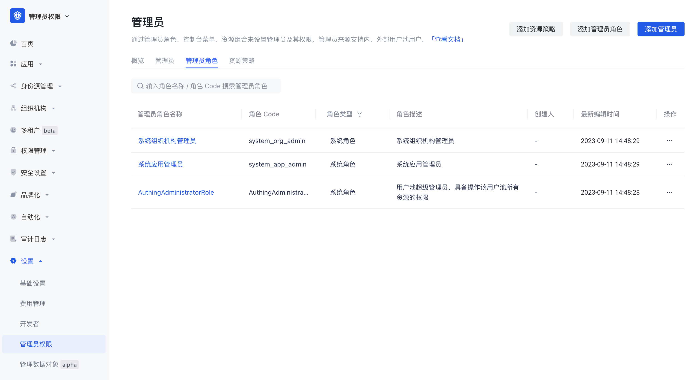

#   管理员权限 使用文档

​     Authing 新版管理员权限 能够为管理员提供灵活且更细粒度的权限管控能力，支持开箱即用的管理员角色与策略。

##   概念解释

| 概念       | 解释                                                         |
| ---------- | :----------------------------------------------------------- |
| 管理员     | 管理员：是一类具有管理员角色的主体的总称。 用户、用户组作为主体被授予管理员角色后，就成为了用户池中的管理员，因此将这一类主体统称为管理员。 |
| 管理员角色 | 管理员角色：管理员角色是连接用户与资源的桥梁。将资源关联到管理员角色，再给用户、组织部门等主体赋予管理员角色，即可实现基于角色的权限管控。企业可以根据管理员角色分配权限，有助于管理员各司其职，大大降低权限管理、管理企业的成本。 1. 系统管理员角色 Authing 的系统管理员角色内置了三种，分别是：**超级管理员**（通常指用户池创建人，主体唯一）、**应用管理员**、以及系统组织机构管理员。 - 超级管理员拥有 Authing 控制台的全部权限，其他系统管理员角色拥有部分权限。 - 超级管理员可以创建**自定义管理员角色**，比如“组织结构管理员”、“审计日志管理员”等等。同一个角色中的管理员，拥有的权限相同。 - 超级管理员角色为系统预设，无需自行创建，可直接添加成员为超级管理员。  2. 自定义管理员角色 超级管理员可创建自定义管理员角色，为每个角色赋予部分管理后台权限，并为每个角色添加管理员主体。 |
| 内部管理员 | 当前用户池中的用户被授予管理员角色后即为内部管理员。         |
| 外部管理员 | 注册了 Authing 的用户，且非当前用户池中的用户，被授予了管理员角色后即为外部管理员。 |
| 资源策略   | 将控制台菜单资源或 API/SDK 资源打包组合一定的条件后成为资源策略。 |

## 典型使用场景

### 场景一

超级管理员可以根据用户的角色或职能来分配资源与权限，确保只有经过授权的人员才有权限操作，以实现管理员各司其职，维护不同的资源。

1. 组织架构管理员有权限管理用户池中的用户及组织架构。通过组织架构管理员角色，可以实现包括创建新组织、编辑部门信息、删除部门等权限管理能力，以实现组织架构调整、部门设置与管理；可以实现设置成员入职、用户归属、移除用户等权限管理能力。
2. 应用管理员有权限管理用户池中的应用及应用访问控制。应用管理员能够控制用户的访问级别和功能，确保只有授权的人员能够访问系统。
3. 负责安全相关的管理员可以设置密码安全策略、登录与注册安全规则、应用访问控制措施等，以保护系统免受恶意攻击和未经授权的访问。管理员账号可以监测和检测潜在的安全威胁，并采取必要的措施应对和应急响应。

### 场景二

除了场景一中可以实现分菜单模块权限管理之外，还可以对具体的数据资源范围进行更细粒度的分权管理。

1. 超级管理员可以为组织机构管理员分配不同的组织部门，实现一个部门一个管理员的管理模式。
2. 超级管理员可以为应用管理员分配不同的应用，实现一个应用一个管理员的管理模式。

### 场景三

新版管理员不仅局限于超级管理员的权限分配与管理，还支持协作管理员将自己拥有的权限继续授权，达到层层下放的授权效果，实现灵活又严谨的权限管理能力。用户旅程如图:

## 超级管理员配置流程

### 步骤一：选择/创建合适的管理员角色

1. 区分场景

​	场景一：

​	系统管理员角色能满足需求，则跳转至步骤四。

​	场景二：

​	系统角色不能满足需求时，则需要创建自定义管理员角色。

2. 创建自定义管理员角色

3. 编辑自定义管理员角色

接下来可以为自定义管理员角色添加 主体 以及 关联策略。

### 步骤二：创建资源策略

1. 区分场景

   场景一：

   系统内置策略能满足需求，或此前已创建过策略，那接下来需要将已有策略与管理员角色进行关联，跳转步骤三。

   场景二：

   系统内置策略不能满足需求，或此前未创建过策略，则继续下一步。

2. 创建策略

   

   创建策略时，必填资源策略名称和资源类型。

   资源类型：控制台菜单资源 或 API/SDK 资源。可以根据实际管理员权限管理需求场景对应选择合适的资源类型，不同的资源类型体现不同的资源权限管理方式。

   

3. 编辑策略

   在策略详情页，不同资源类型对应的策略配置页也有区别。

   3.1 资源类型为**控制台菜单**

   ​	权限策略配置中有六行配置项：

  - 权限作用
  - 菜单
  - 针对资源表的操作
  - 资源范围
  - 针对资源范围的操作
  - 请求条件

   3.2 资源类型为 **API/SDK**

   ​	权限策略配置中也有五行配置项：权限作用、API/SDK 操作范围、请求条件，配置流程与菜单类型的策略一致。

   

### 步骤三：将策略授权给管理员角色

​	有两种将策略授权给管理员角色的方式，详见下述：

1. 在策略详情页中点击【授权管理员角色】

   

​	支持多选管理员角色，在策略详情页-授权管理员角色列表中可以查看、编辑、移除策略授权的管理员角色。

2. 在管理员角色详情页中，添加资源策略

   

   

​	支持多选策略，在管理员角色详情页-关联策略列表中可以查看、编辑、移除关联策略。

### 步骤四：将角色赋予给用户等主体

​	有两种将角色赋予给管理员主体的方式，详见下述：

1. 通过管理员右上角公共按钮添加管理员，并可给有联系方式的用户发送通知。

   

   

   

2. 在管理员角色详情页中，点击添加主体，支持多选用户或用户组批量添加。

   

## 协作管理员用户旅程

1. 收到被添加为协作管理员的通知；
2. 登录用户池控制台，进入被授权的菜单进行配置与管理；
3. 若协管被授权了管理员权限菜单，则协作管理员可以继续将自己拥有的权限进一步分配给其他协作管理员。