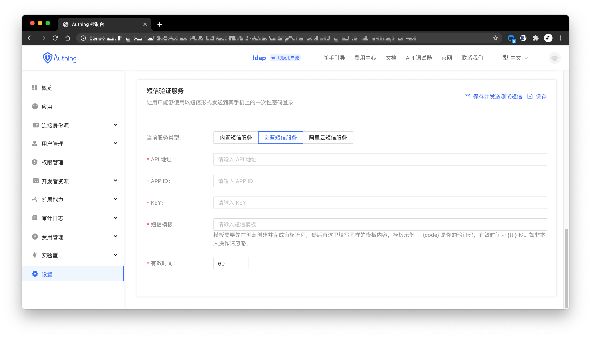

你可以在控制台的 **设置->消息服务** 配置 [创蓝 253 短信服务](https://253.com)：

> 创蓝短信服务官方文档请见 [创蓝短信服务：国内短信 - 相同内容群发接口](https://zz.253.com/api_doc/guo-nei-duan-xin/dan-fa-qun-fa-jie-kou.html)。

- **API 地址**: 创蓝 253 短信服务的 API 地址，格式为「http://xxx/msg/send/json」，你需要登录创蓝控制台获取完整域名。
- **APP ID**: API 接口信息账号，需要在管理后台获取。
- **KEY**: API 接口信息密码，需要在管理后台获取。
- **短信模板**: 模板需要先在创蓝创建并完成审核流程，然后再这里填写同样的模板内容，模板示例："{code} 是你的验证码，有效时间为 {ttl} 秒。如非本人操作请忽略"。
- **有效时间**: 短信验证码有效时间，会替换短信模版中的 `ttl`。

配置好之后，你可以点击左上角的 **保存并发送测试短信** 进行测试。