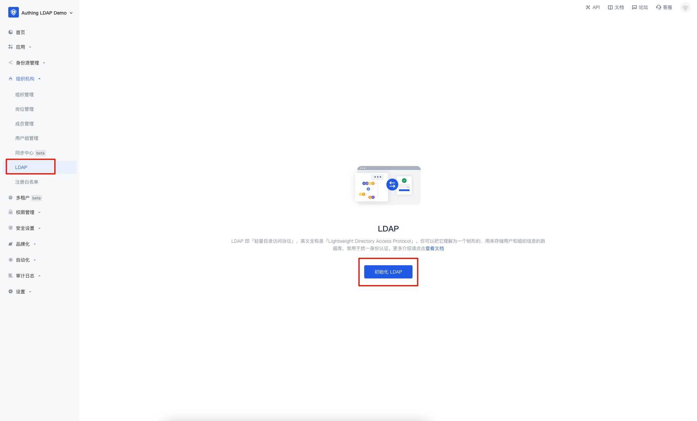
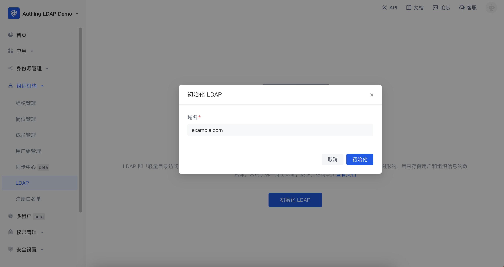
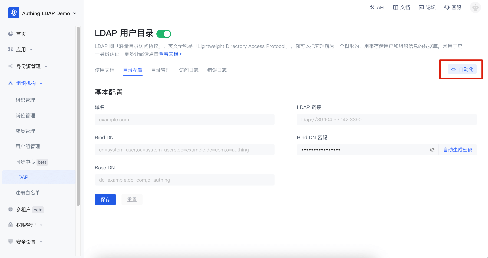
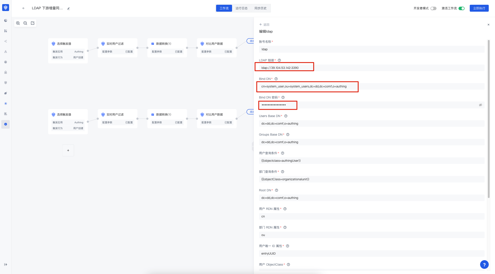
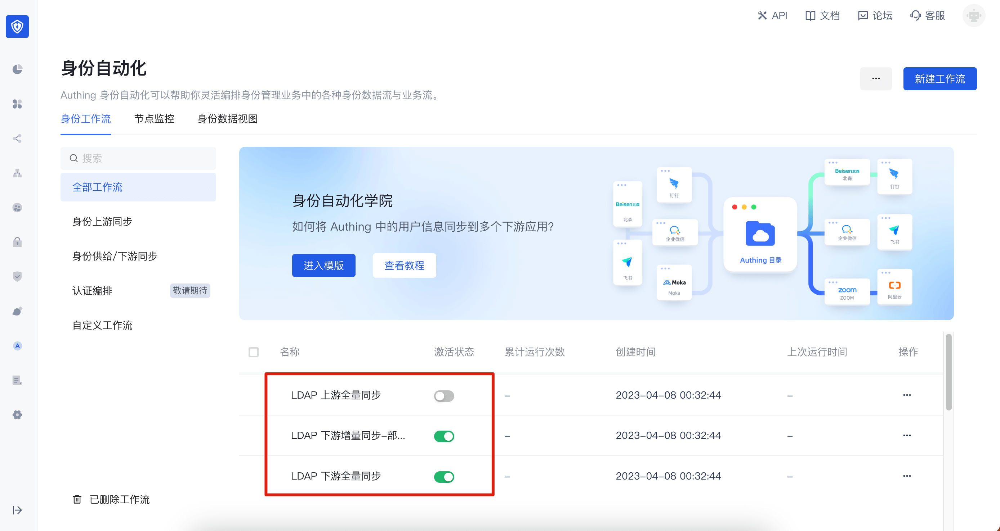
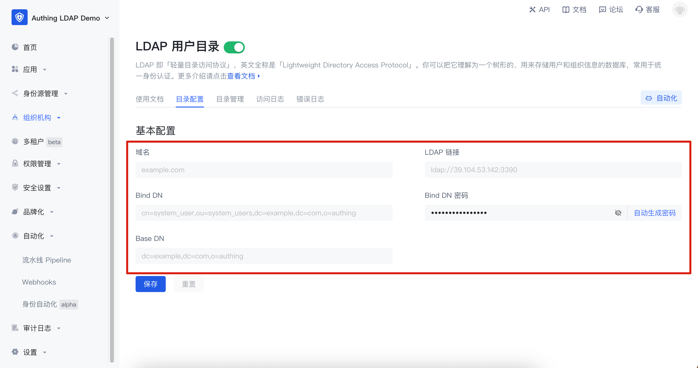
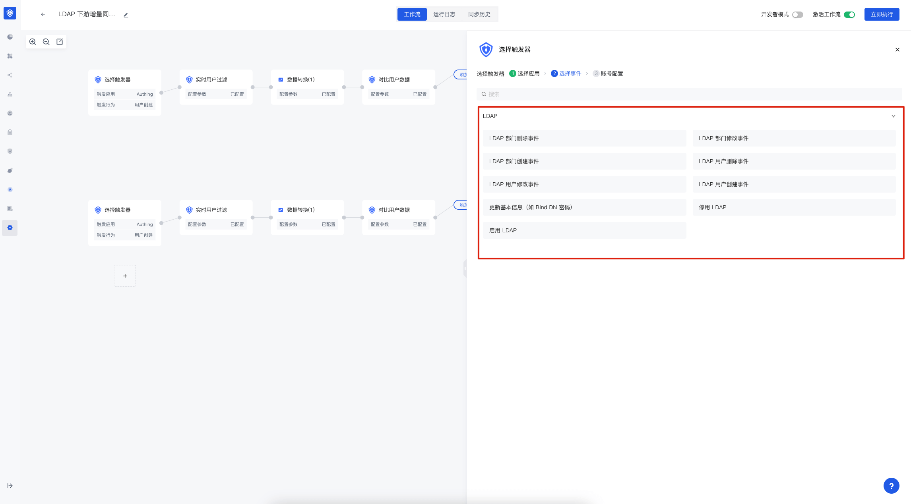

---
meta:
  - name: description
    content: LDAP 用户目录
---

# 使用 {{$localeConfig.brandName}} 的 LDAP 用户目录

<LastUpdated/>

{{$localeConfig.brandName}} 支持使用 LDAP 协议查看、修改、增加和删除用户信息。本页面包含了一些基础信息和使用教程。如果你还不了解 LDAP 协议是什么，可以先阅读概念 - [什么是 LDAP](/concepts/ldap.md)。{{$localeConfig.brandName}} LDAP 2.0 需要使用身份自动化相关能力。如果你还不了解，可以先阅读[身份自动化](/workflow/overview/)相关概念。

## 版本说明

基于 [OpenLDAP](https://www.openldap.org/) 实现的 {{$localeConfig.brandName}} LDAP 2.0 于 2023 年 4 月 12 日发布，推荐使用 {{$localeConfig.brandName}} LDAP 2.0 版本；使用 LDAP 2.0，你需要先启用[身份自动化](/workflow/overview/)；如果你还需要使用旧版 LDAP，仍可以参考 [LDAP 1.0](/guides/users/ldap-user-directory-v1)。要了解 LDAP 1.0 与 2.0 的区别，可以查看(LDAP 1.0 和 LDAP 2.0 的差异)[#ldap-1-0-和-ldap-2-0-的差异]

## 迁移至 LDAP 2.0

### LDAP 1.0 和 LDAP 2.0 的差异

#### DN 的区别

{{$localeConfig.brandName}} LDAP 1.0 在目录结构上与 LDAP 2.0 存在一些差异，以下是 LDAP 1.0 的 DN 基本结构：

```txt
# 用户 DN
uid=USER_ID,ou=DEPARTMENT_NAME,o=ORG_NAME,ou=users,o=USER_POOL_ID,dc=authing,dc=cn

# 部门 DN
ou=DEPARTMENT_NAME,o=ORG_NAME,ou=users,o=USER_POOL_ID,dc=authing,dc=cn
```

LDAP 2.0 的 DN 基本结构如下：

```txt
# 用户 DN
cn=xxx,ou=DEPARTMENT_NAME,ou=DEPARTMENT_NAME,dc=DOMAIN1,dc=DOMAIN2,o=authing

# 部门 DN
ou=DEPARTMENT_NAME,ou=DEPARTMENT_NAME,dc=DOMAIN1,dc=DOMAIN2,o=authing
```

从上述两种 DN 可以看到以下区别：

- Base DN 会有所区别，LDAP 1.0 的 Base DN 由 `ou=users,o=USER_POOL_ID,dc=authing,dc=cn` 组成，LDAP 2.0 的 Base DN 由 `dc=DOMAIN1,dc=DOMAIN2,o=authing` 组成，`DOMAIN1` 和 `DOMAIN2` 是由你初始化 LDAP 时输入的域名拆分得来的。

- LDAP 1.0 的用户 DN 的 RDN 是 `uid=USER_ID`，LDAP 2.0 的用户 DN 的 RDN 是 `cn=xxx`，`xxx` 的值由你在身份自动化的字段映射决定。

#### 用户属性的区别

在 LDAP 1.0 中搜索用户会返回 {{$localeConfig.brandName}} 用户的所有基础属性和拓展字段，而 LDAP 2.0 中返回的用户属性完全由你在身份自动化的**数据转换节点**配置决定。

### 潜在风险

- 由于目录结构不一致，会导致你之前对接的 LDAP 下游应用在对接 LDAP2.0 之后，应用内的组织机构等信息也会相应改变。
- 登录字段可能会变动，比如你之前使用 `email` 字段进行 LDAP 登录，但是若你在 LDAP 2.0 中未将 {{$localeConfig.brandName}} 的用户邮箱映射到 LDAP 服务中的 `email` 字段，会导致使用 `email` 字段无法进行 LDAP 认证。

### 处理方案

若需要迁移，你需要先将所有的用户基础属性映射至 LDAP，如果之前有用到拓展字段的，也需要映射到 `AuthingExtendedAttr1~AuthingExtendedAttr20` 字段。下游同步工作流执行完成后，需要将之前对接的应用中的 `Base DN`, `Bind DN`, `Bind DN Password` 进行修改，同时测试是否可正常使用。

## 配置 LDAP

进入 **组织机构** -> **LDAP** 菜单，点击「初始化 LDAP」。


在弹窗中输入你想设置的 LDAP 域名，并点击「初始化」，此域名最终会被用于生成你的 [LDAP Base DN](https://ldap.com/basic-ldap-concepts/)，如输入的是 `example.com`，则最终生成的是 `dc=example,dc=com,o=authing`。


初始化完成后，LDAP 服务中还没有用户数据，{{$localeConfig.brandName}} 会自动为你的 LDAP 服务创建工作流，用于将 {{$localeConfig.brandName}} 的用户数据同步至 LDAP 服务中，你需要点击右上角的「自动化」按钮进入身份自动化界面进行配置。


目前 {{$localeConfig.brandName}} 为你自动创建的工作流有三个：

- LDAP 上游全量同步：用于将 LDAP 服务中的数据全量同步回 {{$localeConfig.brandName}} 组织架构，若你不需要通过 LDAP 协议修改用户数据，建议关闭。
- LDAP 下游全量同步：用于将 {{$localeConfig.brandName}} 组织架构数据全量同步至 LDAP 服务，建议将其**触发器**设置为**定时任务**，首次初始化 LDAP 后，可以手动执行一次此工作流，以便将用户同步至 LDAP 服务。
- LDAP 下游增量同步：用于将 {{$localeConfig.brandName}} 组织架构数据增量同步至 LDAP 服务。
- 假如你想使用第三方的 LDAP 服务，可以修改 LDAP 配置节点中的**账号连接**。
  
  如何选事件

如果你还需要修改工作流的更多配置，可以参考[身份自动化](/workflow/overview/)。


## 使用 LDAP

以下会介绍 LDAP 的简单使用，所有涉及到 LDAP 搜索相关命令都使用 `ldapsearch` 工具进行演示。

### 基本信息

#### 连接信息

{{$localeConfig.brandName}} LDAP 的基本连接信息可以在 LDAP 的**目录配置**界面获取，配置信息如下：

- 域名：即你输入的 LDAP 域名
- LDAP 链接：LDAP 服务的域名、端口等信息
- Bind DN：用于连接至 LDAP 服务的账号
- Bind DN 密码：用于连接至 LDAP 服务的密码，无法手动修改，若需要修改，可点击「自动生成密码」，并保存
- Base DN：搜索 LDAP 的基本 DN



#### LDAP 用户属性

{{$localeConfig.brandName}} 公有云在 LDAP 服务中定义了 `authingUser` objectClass，其包含如下属性：
| 属性名 | 备注 | 是否必填|
|-------|-----|--------|
| id |用户 ID|是|
| cn |用户名|是|
| externalId |外部 ID|否|
| email |邮箱|否|
| emailVerified |emailVerified|否|
| phone |手机号|否|
| phoneVerified |phoneVerified|否|
| username |用户名|否|
| nickname |昵称|否|
| company |公司|否|
| authingPhoto |头像 url|否|
| name |姓名|否|
| givenName |名|否|
| familyName |姓|否|
| middleName |middleName|否|
| preferredUsername |首选用户名|否|
| website |个人网址|否|
| gender |性别|否|
| birthdate |生日|否|
| zoneinfo |时区|否|
| address |地址|否|
| formatted |formatted|否|
| authingStreetAddress |街道信息|否|
| locality |Locality|否|
| region |地域|否|
| postalCode |邮编|否|
| city |城市|否|
| province |省|否|
| country |国家|否|
| AuthingExtendedAttr1 |拓展字段 1|否|
| AuthingExtendedAttr2 |拓展字段 2|否|
| AuthingExtendedAttr3 |拓展字段 3|否|
| ... |...|否|
| AuthingExtendedAttr20 |拓展字段 20|否|

如上表所述，LDAP 服务中包含了几乎用户所有基础字段，同时还有 AuthingExtendedAttr1~AuthingExtendedAttr20 共 20 个拓展字段，用于将用户的拓展字段映射到 LDAP 服务中。具体的字段映射，你可以在身份自动化的**数据转换节点**进行。

### Search

基于 Base DN 进行查找，返回结果包含用户数据，以及组织机构数据。-LLL 表示禁止输出与过滤条件不匹配的信息，如果不带此项，你将得到获取结果的条目数以及请求部分信息.

```bash
$ ldapsearch -H LDAP_SERVER_URL -x -D "LDAP_BASE_DN" -w "LDAP_BIND_DN_PASSWORD" -LLL -b "LDAP_BIND_DN"
```

#### 查询过滤(Search Filter)

基于 Base DN 进行查找并过滤，返回结果包含用户数据，以及组织机构数据。

> 有关过滤的所有功能，可以参考 [RFC-2254](https://www.ietf.org/rfc/rfc2254.txt)

##### 相等

此项查找根据 cn 进行查找，因为组织机构不具有该属性，只有用户具有该属性，结果将会返回用户 cn 为 `小白` 的用户信息。

```bash
$ ldapsearch -H LDAP_SERVER_URL -x -D "LDAP_BASE_DN" -w "LDAP_BIND_DN_PASSWORD" -LLL -b "LDAP_BIND_DN" -s sub '(cn=小白)'
```

##### 不等

与不等类似，此项查找 LDAP 中具有 cn (用户名)属性，且属性值不为 U 的所有信息，因为组织机构不具有该属性，只有用户具有该属性，结果将会返回用户姓名不为 `hahhaha` 的条目信息（其实只有用户具有 cn 属性，所以结果全是用户信息）。

```bash
$ ldapsearch -H LDAP_SERVER_URL -x -D "LDAP_BASE_DN" -w "BIND_DN_PASSWORD" -LLL -b "$LDAP_BIND_DN" -s sub '(!(cn=hahhaha))'
```

#### 查找模式

##### base 模式(只查找 baseDN 信息)

base 模式只会查找并返回 BaseDN 的信息

```
dn: LDAP_BASE_DN
...属性相关信息...
```

```bash
$ ldapsearch -H LDAP_SERVER_URL -x -D "LDAP_BASE_DN" -w "LDAP_BIND_DN_PASSWORD" -b "LDAP_BIND_DN" -s base
```

##### one 模式(只查找 baseDN 信息下的子节点)

以上图为例，one 模式会查找`BaseDN` 及 `BaseDN 子节点` 并返回相关信息。

```jsx
dn: LDAP_BASE_DN
...属性相关信息...

dn: cn=xxx,LDAP_BASE_DN
...属性相关信息...

dn: ou=xxx,LDAP_BASE_DN
...属性相关信息...
```

```bash
$ ldapsearch -H LDAP_SERVER_URL -x -D "LDAP_BASE_DN" -w "LDAP_BIND_DN_PASSWORD" -b "LDAP_BIND_DN" -s one
```

##### sub 模式(查找 baseDN 信息下的所有节点)

以上图为例，sub 模式会查找`BaseDN` 和 `BaseDN 下的所有节点` 并返回相关信息。

```jsx
dn: LDAP_BASE_DN
...属性相关信息...

dn: cn=xxx1,LDAP_BASE_DN
...属性相关信息...

dn: ou=xxx,LDAP_BASE_DN
...属性相关信息...

dn: cn=xxx2,o=develop,LDAP_BASE_DN
...属性相关信息...
```

```bash
$ ldapsearch -H LDAP_SERVER_URL -x -D "LDAP_BASE_DN" -w "LDAP_BIND_DN_PASSWORD" -b "LDAP_BIND_DN" -s sub
```

#### 返回结果过滤(只返回指定属性)

如果你使用过 SQL，此功能与 `select` 类似。不增加过滤结果可能是这样的：

```js
dn: LDAP_BASE_DN
cn: testcn
sn: testsn
...其他属性...
```

如图增加相关过滤条件，则结果是这样的

```js
dn: LDAP_BASE_DN;
cn: testcn;
```

```bash
$ ldapsearch -H LDAP_SERVER_URL -x -D "LDAP_BASE_DN" -w "BIND_DN_PASSWORD" -b "$LDAP_BIND_DN" -s sub dn cn
```

---

### Add

创建一个名为 user.ldif 的文件然后复制以下内容进去：

```js
dn: (cn = username), LDAP_BASE_DN;
objectClass: authingUser;
cn: username;
```

然后执行以下命令：

该操作会在 `LDAP 服务` 中新增一个 `用户`

```bash
$ ldapadd -H LDAP_SERVER_URL -x -D "LDAP_BASE_DN" -w "BIND_DN_PASSWORD" -f ./user.ldif
```

若你在工作流中开启了 LDAP 上游同步，则会将此数据同步回 {{$localeConfig.brandName}} 用户池。

---

### Modify

创建一个名为 modify.ldif 的文件然后复制以下内容进去：

```js
dn: cn=username, ou=xxx, LDAP_BASE_DN
changetype: modify
replace: mail
mail: test@example.com
```

然后执行以下命令：

该操作会在 `LDAP 服务` 中根据 modify 中的 `DN` 查找相关用户信息，查找成功，则根据 `changetype` 选择操作 `用户信息` ，`信息` 来自于 `changetype` 下面的信息

```bash
$ ldapmodify -H LDAP_SERVER_URL -x -D "LDAP_BASE_DN" -w "BIND_DN_PASSWORD" -f ./modify.ldif
```

若你在工作流中开启了 LDAP 上游同步，则会将此数据同步回 {{$localeConfig.brandName}} 用户池。

---

### Delete

该操作会在 `LDAP 服务` 中根据 `DN` 查找相关用户信息，查找成功，则进行删除，这是一个敏感操作

```bash
$ ldapdelete -H LDAP_SERVER_URL -x -D "LDAP_BASE_DN" -w "BIND_DN_PASSWORD" "cn=username, ou=xxx, LDAP_BASE_DN"
```

若你在工作流中开启了 LDAP 上游同步，则也会在 {{$localeConfig.brandName}} 用户池中将此数据删除。

---

### Other

#### compare

该操作用于判断 `LDAP Server` 目录树中 `DN` 值和 `指定条目值` 是否属于同一个条目，是则返回 `true`，否则返回 `false`

```bash
$ ldapcompare -H LDAP_SERVER_URL -x -D "LDAP_BASE_DN" -w "BIND_DN_PASSWORD" "uid=uid,o=oid,LDAP_BASE_DN" "cn:xxx"
```

#### modifyDN

用于对 `LDAP Server` 中的 `RDN` 条目的修改， 可以从标准的条目信息输入， `RDN` 指 `DN` 的首项， 例如 `"cn=oldUserName, o=Org_ID, LDAP_BASE_DN" "cn=newUserName"` 中的 `cn=oldUserName`， 由于不管是 `用户的 DN` 还是 `组织结构的 DN` 相关信息多数都是 `id` 相关的值， 所以当你修改 `cn=oldUserName` 其实 `等同于` 修改用户名

```bash
$ ldapmodrdn -H LDAP_SERVER_URL -x -D "LDAP_BASE_DN" -w "BIND_DN_PASSWORD" "cn=oldUserName,o=Org_ID,LDAP_BASE_DN" "cn=newUserName"
```

#### whoami

用于验证 `LDAP 服务器` 的身份，输入正确绑定 DN 以及密码，会返回指定的信息，否则会提示 `ldap_bind: invalid credentials(49)` 错误，这一般由于 `密码错误` 造成的，请检查 `对应的密码` 及 `绑定 DN 信息` 即可。 返回信息 `test@example.com`

```bash
$ ldapwhoami -H LDAP_SERVER_URL -x -D "LDAP_BASE_DN" -w "BIND_DN_PASSWORD"
```

## LDAP 事件

如果你想在身份自动化中使用 LDAP 相关事件，可以在**触发器**中选择 LDAP 应用，之后即可选择事件。

