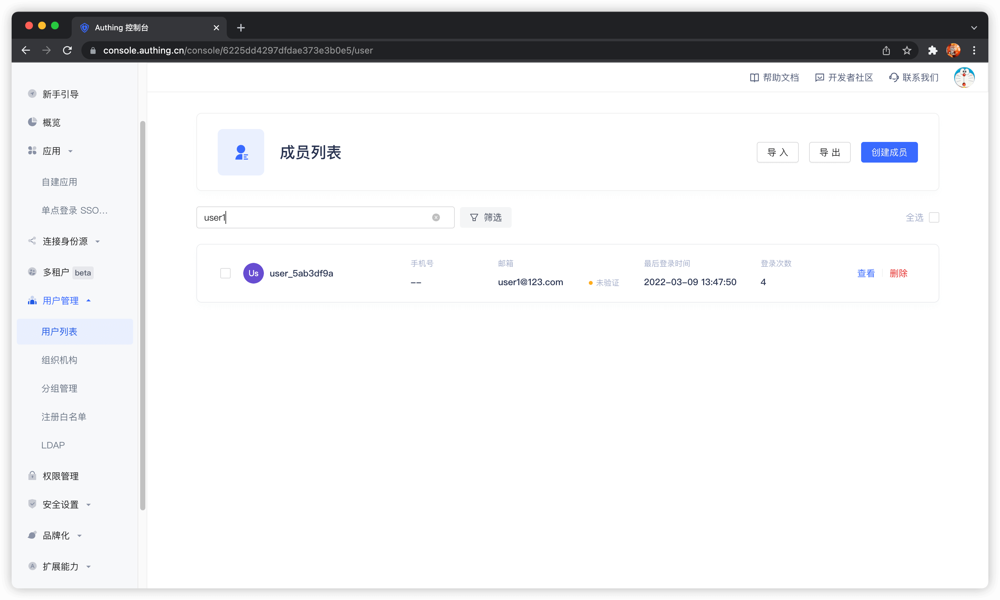

---
meta:
  - name: description
    content: 搜索用户
---

# 搜索用户

<LastUpdated/>

{{$localeConfig.brandName}} 支持通过邮箱、用户名、手机号、昵称等字段对用户进行模糊搜索，且同时支持[控制台](#使用控制台搜索)和 [SDK](#使用-sdk-搜索) 两种模式：

## 使用控制台搜索

你可以在 **用户管理** - **用户列表** 页面通过关键词搜索用户：

支持搜索的字段有邮箱、用户名、手机号、昵称等。

## 使用 SDK 搜索

!!!include(common/sdk-list.md)!!!

你可以使用各语言的**用户管理模块（UsersManagementClient）**的**搜索用户**方法。