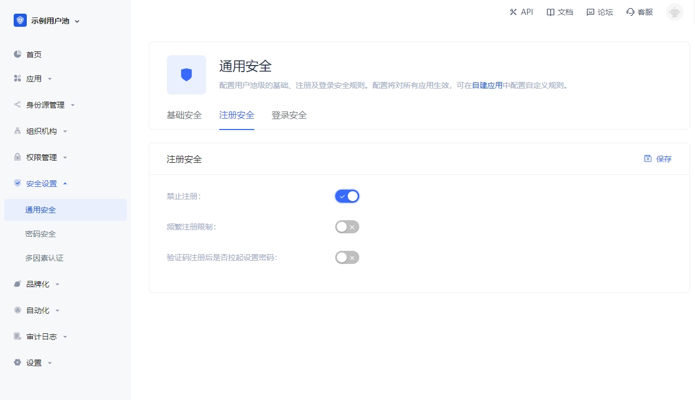
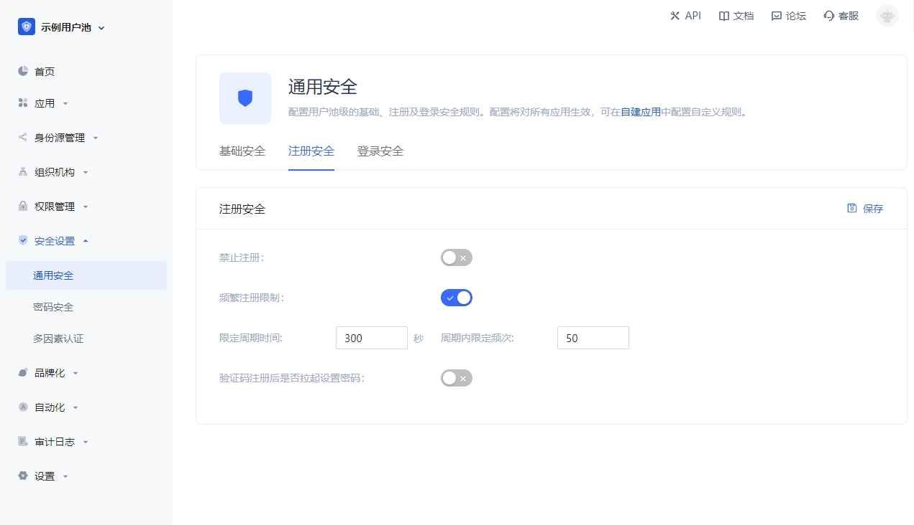
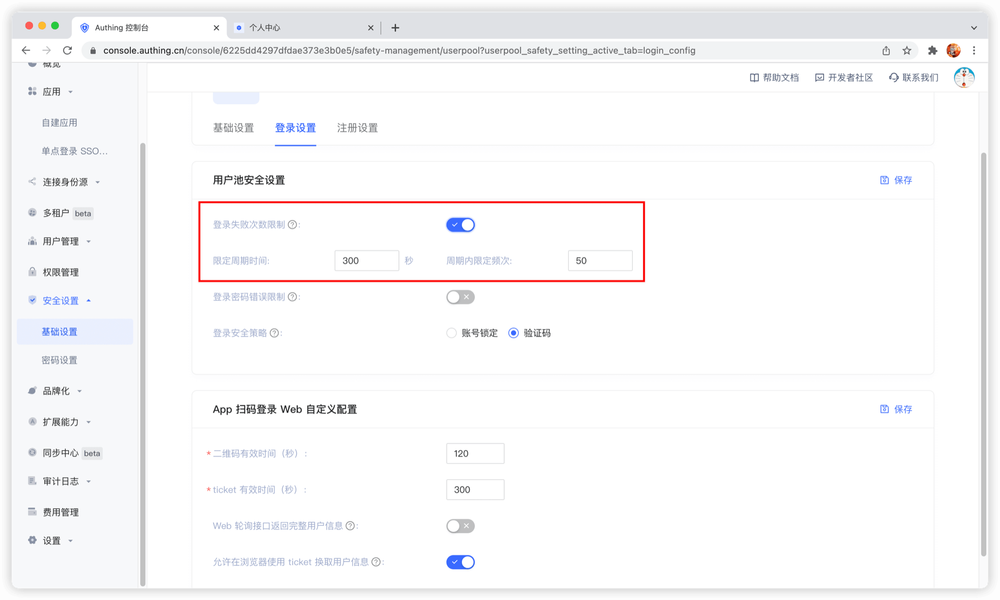
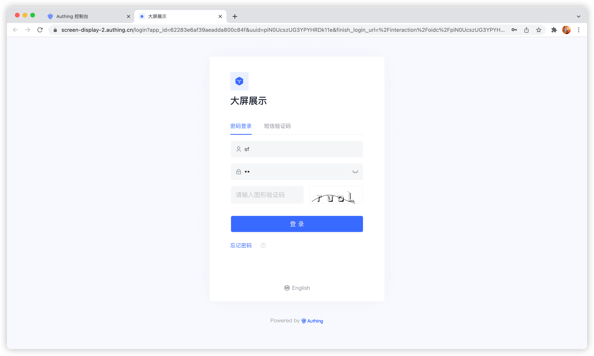
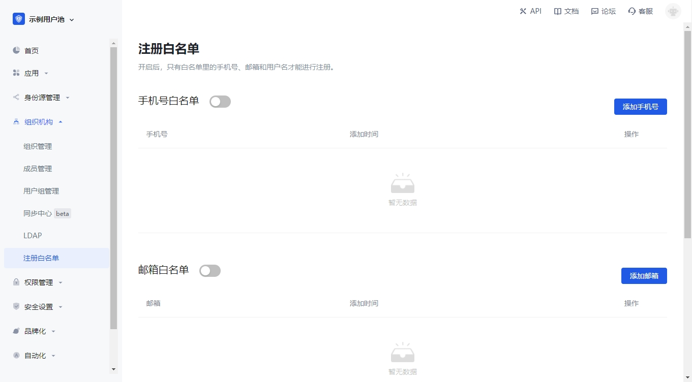
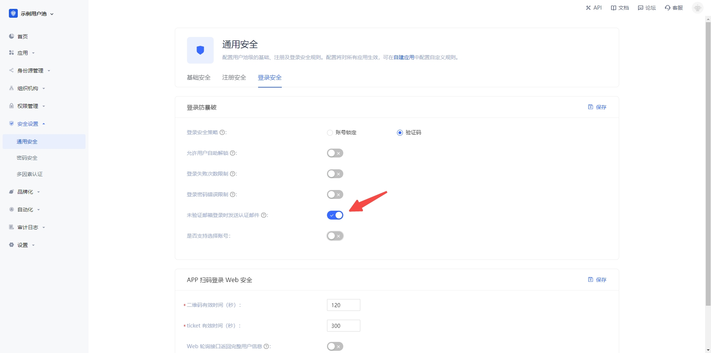
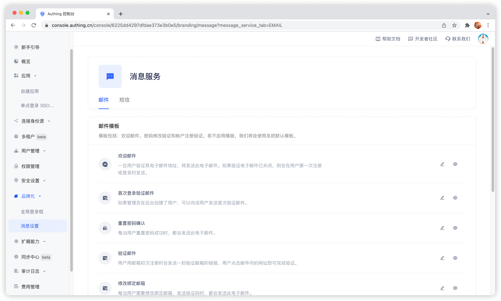

---
meta:
  - name: description
    content: 用户目录配置项
---

# 用户目录配置项

<LastUpdated/>

本文介绍用户目录相关的一些配置项，如禁止注册、频繁注册限制、登录失败次数限制、注册白名单等。

## 禁止注册

你可以在控制台的 **安全设置** - **通用安全** - **注册安全** 中开启 **禁止注册** 开关：

开启「禁止注册」之后，普通用户将无法通过登录表单或者 API 注册，只有管理员可以手动创建账号。

## 频繁注册限制

你可以在控制台的 **安全设置** - **通用安全** - **注册安全** 中开启 **频繁注册限制** 开关，限制在多少秒内不能超过多少次注册：

## 登录失败次数限制

你可以在控制台的 **设置** - **安全信息** 中开启 **登录失败次数限制** 开关，限制 **同一账号** 在多少秒内不能超过多少次失败登录：

若在规定时间内超过次数后，该用户再次登录需要输入图形验证码：

## 配置注册白名单

你可以在在控制台的 **组织机构** - **注册白名单** 中开启邮箱、手机号、用户名白名单，开启之后只有在白名单内的手机号、邮箱、用户名才能注册（管理员手动创建账号不受限制）。

## 禁止邮箱未验证的用户登录

默认情况下，未验证邮箱的账号可以进行登录，你也可以在 **安全设置** - **通用安全** - **登陆安全** 中修改此配置：

## 注册时发送欢迎邮件

关闭之后将不会发送欢迎邮件。

> 你可以自定义欢迎邮件模版。

