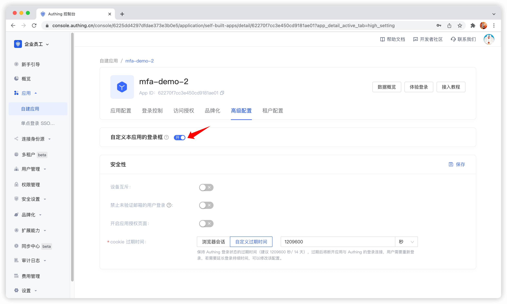
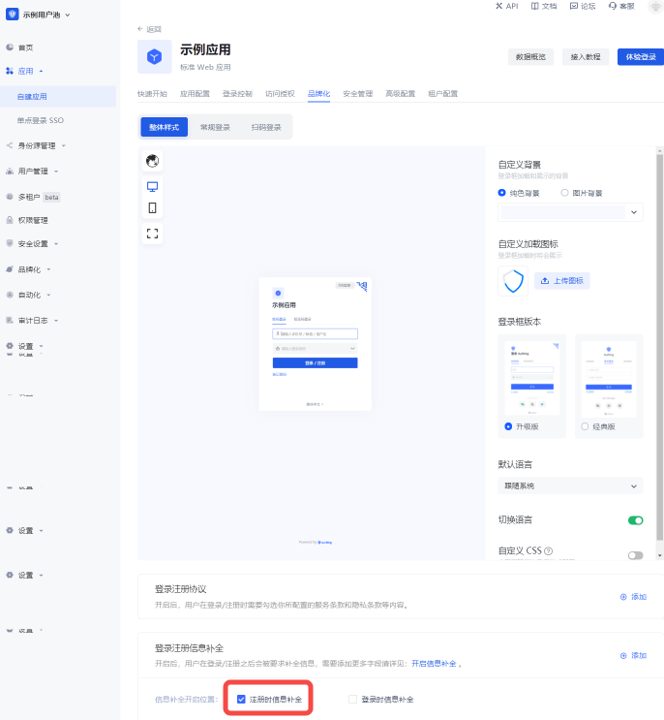
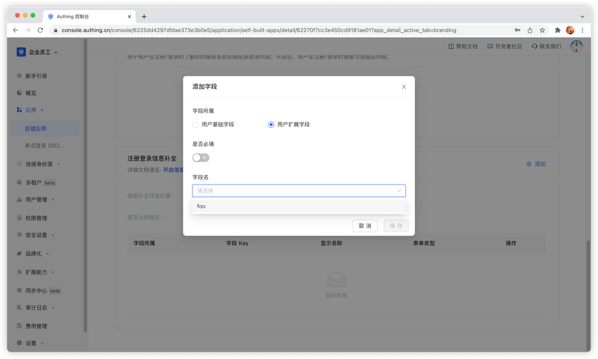
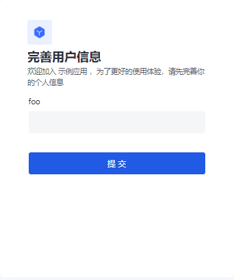
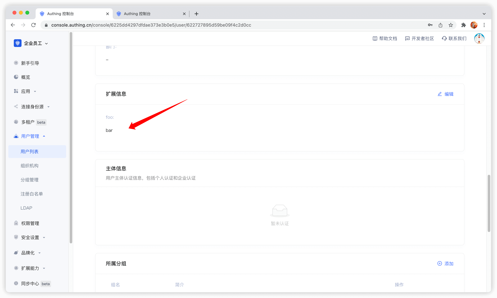

# 添加自定义用户字段

<LastUpdated/>

用户自定义字段是除了[基础用户字段](/guides/user/user-profile.md)之外，可以给用户对象添加的额外字段。开发者可以通过设置自定义字段，存储**少量**业务相关的数据。

## 配置自定义用户字段

可以定义以下几种类型的自定义字段：

- 字符串；
- 数值；
- 日期；
- 布尔值；
- 枚举值；

你可以在**设置** - **字段管理** - **用户扩展字段** 页面配置自定义用户字段：

配置自定义字段之后，你可以开启应用的注册信息补全页面，让用户补全这些自定义字段的信息。

在 **应用详情** - **高级配置** 页，开启 **自定义本应用的登录框**

然后切换到 **品牌化**，勾上 **开启注册信息补全** 开关，然后选择刚刚添加的自定义字段：

**数据类型** 可以选择字符串、数字、布尔值、枚举值、日期，这会决定页面最终的展示样式。

点击保存，之后访问应用的登录页面。

用户点击注册之后将跳转到下面这个注册信息补全页面：

用户成功注册之后，你可以在用户详情页面看到用户刚刚输入的自定义字段值：

## 使用 API & SDK 管理用户自定义数据

!!!include(common/sdk-list.md)!!!

<StackSelector snippet="udf" selectLabel="选择语言" :order="['java', 'javascript',  'python', 'csharp', 'swift']"/>
