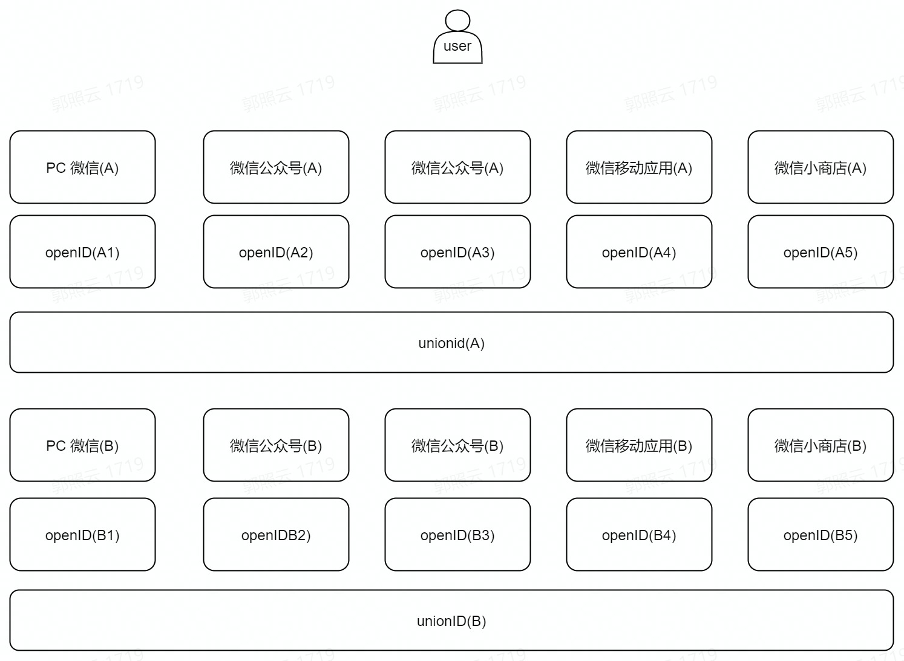
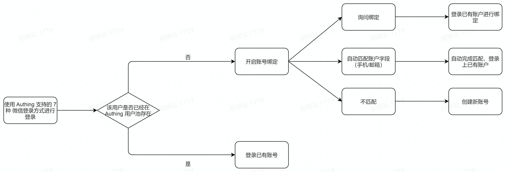
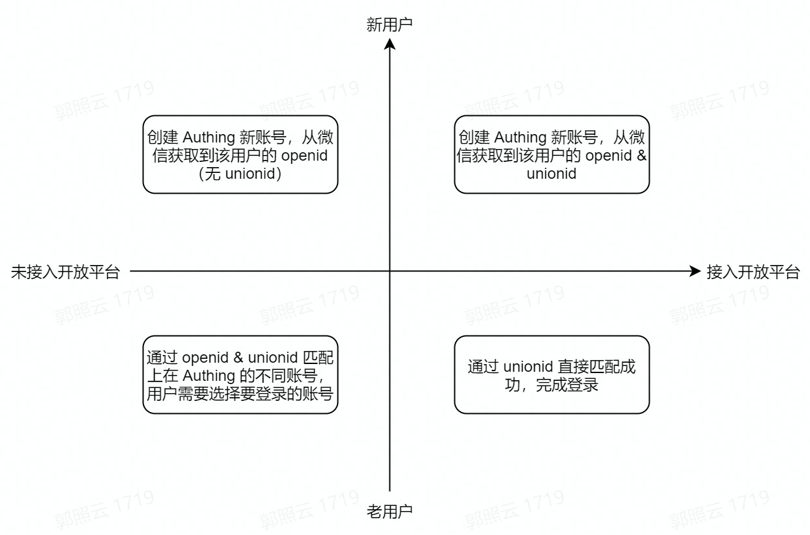

# 微信生态全场景能力

<LastUpdated/>

> 通过 {{$localeConfig.brandName}}，更便捷地纵享微信生态能力!

作为一名微信生态的开发者，在为你的应用实现微信登录能力时，你可能会面临重重困惑：​

* 不同类型应用在微信的创建和配置流程是什么？​

* 作为不同类型应用的开发者，在实现微信登录能力时，有哪些方式可供选择？​

* 各种类型的微信登录方式，要怎么完成配置，怎么实现登录？​

* 微信用户在登录你新开发的应用后，你要如何管理微信生态中的用户身份？

## {{$localeConfig.brandName}} 微信生态功能全景

如果你有上述困惑不知如何下手，{{$localeConfig.brandName}} 微信生态全场景能力可以助力你实现各个场景的微信登录流程。下表是 {{$localeConfig.brandName}} 支持的全场景的微信生态操作流程以及对应场景下可供选择的微信登录能力类型。你可以直接点击前往了解所需功能：

<table>
  <thead>
    <tr>
      <th style="text-align:left">场景</th>
      <th style="text-align:left">微信生态操作流程</th>
       <th style="text-align:left">微信登录能力类型</th>    
    </tr>
  </thead>
  <tbody>
    <tr>
      <td style="text-align:left"><a href="https://open.weixin.qq.com/cgi-bin/frame?t=home/app_tmpl&lang=zh_CN">移动应用开发</a></td>
      <td style="text-align:left"><ul>
          <li>创建应用。</li>
          <li>提交审核。</li>
          <li>审核通过上线。</li>
        </ul></td>
      <td style="text-align:left"><ul>
          <li><a href="https://docs.authing.cn/v2/guides/connections/social/wechat-mobile/">移动 APP 拉起微信 APP</a></li>
          <li><a href="https://docs.authing.cn/v2/guides/connections/social/wechat-miniprogram-applaunch/">APP 拉起小程序登录</a></li>
        </ul></td>
    </tr>
        <tr>
      <td style="text-align:left"><a href="https://open.weixin.qq.com/cgi-bin/frame?t=home/web_tmpl&lang=zh_CN">网站应用开发</a></td>
      <td style="text-align:left"><ul>
          <li>常见应用。</li>
          <li>提交审核。</li>
          <li>审核通过上线。</li>
        </ul></td>
      <td style="text-align:left"><ul>
          <li><a href="https://docs.authing.cn/v2/guides/connections/social/wechat-pc/">PC 微信扫码</a></li>
          <li><a href="https://docs.authing.cn/v2/guides/connections/social/wechat-miniprogram-qrconnect/">PC 小程序扫码</a></li>
        </ul></td>
    </tr>
    <tr>
      <td style="text-align:left">微信公众号开发</td>
      <td style="text-align:left"><ol>
          <li><a href="https://mp.weixin.qq.com/">在微信公众平台完成注册和认证。</a>
          <ul>
          <li>注册公众账号。</li>
          <li>成为开发者。</li>
          <li>申请微信认证。</li>
        </ul></li>
          <li><a href="https://open.weixin.qq.com/">在微信开放平台绑定微信公众号。</a><ul>
          <li>输入基本信息。</li>
          <li>安全验证。</li>
          <li>绑定成功。</li>
        </ul></li>
        </ol></td>
      <td style="text-align:left"><ul>
          <li><a href="https://docs.authing.cn/v2/guides/connections/social/wechatmp-qrcode/">微信公众号扫码登录</a></li>
          <li><a href="https://docs.authing.cn/v2/reference/sdk-for-weixin-official-account.html">微信浏览器拉起微信 APP 登录</a></li>
        </ul></td>
    </tr>
        <tr>
      <td style="text-align:left">小程序开发</td>
      <td style="text-align:left"><ol>
          <li><a href="https://mp.weixin.qq.com/cgi-bin/wx?token=&lang=zh_CN">注册微信小程序并完成开发。</a>
          <ul>
          <li>注册小程序。</li>
          <li>开发起步。</li>
          <li>代码实现。</li>
          <li>提交审核并发布。</li>
        </ul></li>
          <li>在微信开放平台绑定微信小程序。<ul>
          <li>输入基本信息。</li>
          <li>安全验证。</li>
          <li>绑定成功。</li>
        </ul></li>
        </ol></td>
      <td style="text-align:left"><a href="https://docs.authing.cn/v2/reference/sdk-for-weixin-miniapp.html">小程序一键登录</a></td>
    </tr>
  </tbody>
</table>

## {{$localeConfig.brandName}} 微信生态账号体系

### 微信用户账号体系的基本概念

微信提供 `OpenID` 和 `UnionID` 作为用户标识。两者区别如下：

<table>
  <thead>
    <tr>
      <th style="text-align:left">ID 名称</th>
      <th style="text-align:left">说明</th>   
    </tr>
  </thead>
  <tbody>
    <tr>
      <td style="text-align:left">OpenID</td>
      <td style="text-align:left"><ul>
          <li>OpenID 是微信用户在不同类型产品的身份 ID。​</li>
          <li>微信用户访问公众号、小程序、移动应用、网站应用、小商店等都会有唯一的 OpenID 。​</li>
          <li>同一个微信用户访问不同的产品生成的 OpenID 也是不一样的。例如，对于不同公众号，同一用户的 OpenID 不同；同理，对于不同的小程序，同一用户的 OpenID 也是不同的。</li>
        </ul></td>
    </tr>
      <tr>
      <td style="text-align:left">UnionID</td>
      <td style="text-align:left"><ul>
          <li>UnionID 是微信用户在同一个开放平台下的产品的身份 ID。​​</li>
          <li>如果开发者拥有多个移动应用、网站应用和公众帐号（即公众号和小程序），可通过 UnionID  来区分用户的唯一性。因为只要是同一个微信开放平台帐号下的移动应用、网站应用和公众帐号，用户的 UnionID 是唯一的，即同一用户对于同一个微信开放平台下的不同应用，UnionID 是相同的。​</li>
        </ul></td>
    </tr>  
  </tbody>
</table>

形象来说，一个独立的微信用户，在微信的不同登录场景下的唯一标识可以用下图展示：

### 微信用户在 {{$localeConfig.brandName}} 的登录流程

在了解了微信用户的账号体系之后，接着你就更易于理解一名微信用户在 {{$localeConfig.brandName}} 的登录旅程：

* 首先，你的用户使用 {{$localeConfig.brandName}} 支持的七种登录方式之一进行登录。登录时 {{$localeConfig.brandName}} 会判断该用户在你的用户池中是否已经存在。如果已经存在，你的用户将直接通过这种身份源登录到已有账号。​

* 如果不存在，并且你的 {{$localeConfig.brandName}} 控制台已经对这种身份源开启了「账号绑定」，会根据具体生效的功能逻辑进行判断：​

  * 用户成功绑定已有账号，并成功登录​。

  * 自动匹配上已有账号（手机 / 邮箱），并完成登录​。

  * 未匹配成功 / 绑定不成功，用户不能登录。

### {{$localeConfig.brandName}} 基于微信生态的账号解决方案

根据「用户在 {{$localeConfig.brandName}} 用户池是否存在」以及「你的微信应用是否已经接入微信开放平台」，针对你的账号处理，有四种场景：

当微信生态的用户通过微信登录方式进入到 {{$localeConfig.brandName}} 用户池，有四种可能的场景，通过两个维度进行考量：

- 该用户在微信开放平台是否拥有 `UnionID`？

- 该用户在 {{$localeConfig.brandName}} 用户池是否是新用户？

由此分为四种场景：

* 用户在微信开放平台有 `UnionID`，是 {{$localeConfig.brandName}} 用户池中的新用户（第一象限）。 在这种情况下，用户首次通过微信登录已经集成在 {{$localeConfig.brandName}} 的应用时，将会在你的 {{$localeConfig.brandName}} 用户池中创建新账号，该用户账号信息中会包含从微信开放平台上获取到的该用户的 `OpneID` 和 `UnionID`。

* 用户在微信开放平台无 `UnionID`，是 {{$localeConfig.brandName}} 用户池中的新用户（第二象限）。 在这种情况下，用户首次通过微信登录已经集成在 {{$localeConfig.brandName}} 的应用时，将会在你的 {{$localeConfig.brandName}} 用户池中创建新账号，该用户账号信息会同时包含从微信接口获得的 `OpneID`，但由于该微信应用并未加入微信开放平台，因此这个账号信息并不包含 `UnionID`。

* 用户在微信开放平台无 `UnionID`，是 {{$localeConfig.brandName}} 用户池中的老用户（第三象限）。 在这种情况下，用户通过微信登录已经集成在 {{$localeConfig.brandName}} 的应用时，由于该账号已存在，因此登录时会通过 `OpneID` 和 `UnionID` 进行匹配。当同一个微信账号由于其 `OpneID` 和 `UnionID` 的具备情况不一、而能够在你的用户池中对应多个账号时，将会支持账号选择，选择完成后会完成登录。

* 用户在微信开放平台有 `UnionID`，是 {{$localeConfig.brandName}} 用户池中的老用户（第四象限）。 在这种情况下，用户通过微信登录已经集成在 {{$localeConfig.brandName}} 的应用时，由于该账号已经存在，并且并不会出现不存在 `UnionID` 的情况，因此会通过 `UnionID` 直接匹配成功并完成登录。

## 在什么场景下，{{$localeConfig.brandName}} 微信生态能够帮到你？

### 更便捷地使用微信全场景的登录能力

  * [当你使用移动端微信应用进行开发](/guides/wechat-ecosystem/wechat-mobile-app.md)

  * [当你使用网页端微信应用进行开发](/guides/wechat-ecosystem/wechat-web-app.md)

  * [当你使用微信公众号进行开发](/guides/wechat-ecosystem/wechat-public-account-app.md)

  * [当你使用微信小程序进行开发](/guides/wechat-ecosystem/wechat-miniprogram-app.md)

### 更灵活地管理来自微信的用户账号

出于安全以及用户的使用便捷性的考虑，你可能并不希望你的用户使用微信账号在 {{$localeConfig.brandName}} 登录时每次都重新创建一个账号。{{$localeConfig.brandName}} 支持通过「字段匹配」和「询问绑定」两种方式，保障你的用户在 {{$localeConfig.brandName}} 的唯一身份，确保用户账号信息统一。

有关「账号绑定」功能和使用详情，请参阅 [账号绑定](/guides/connections/account-binding.md)。