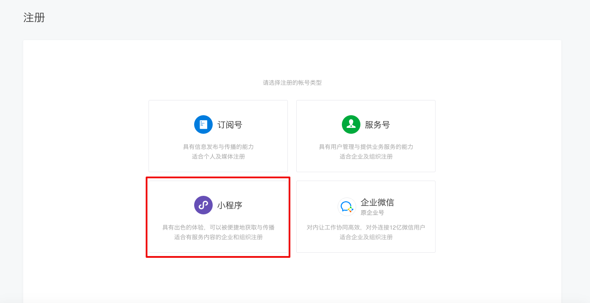
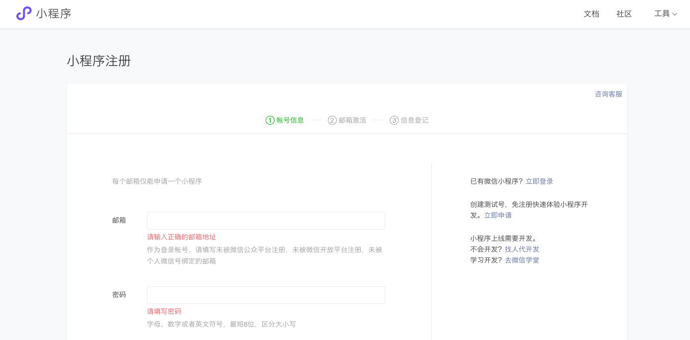
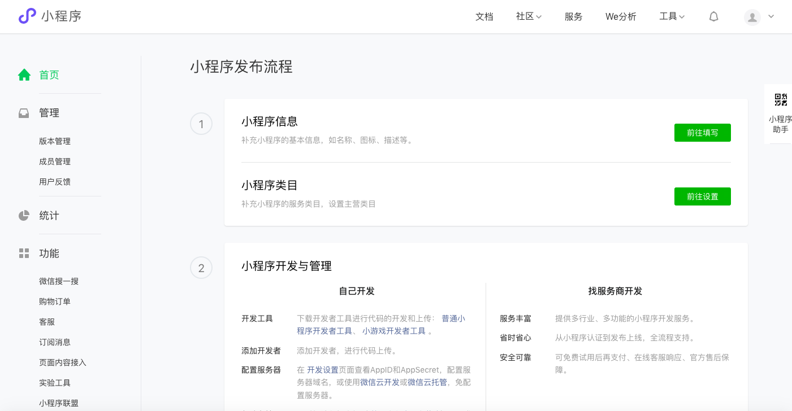
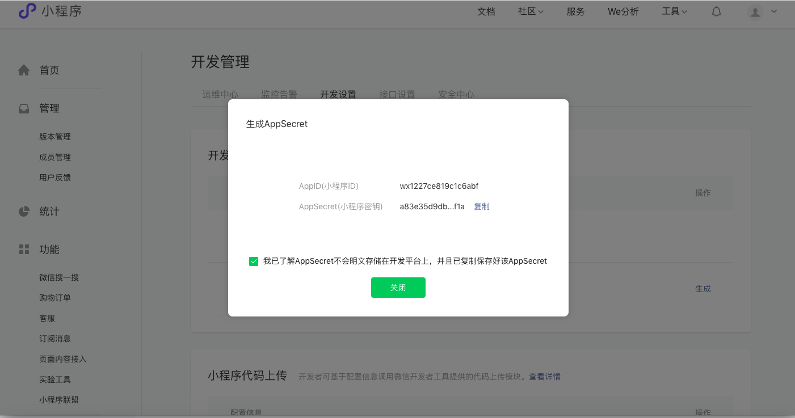
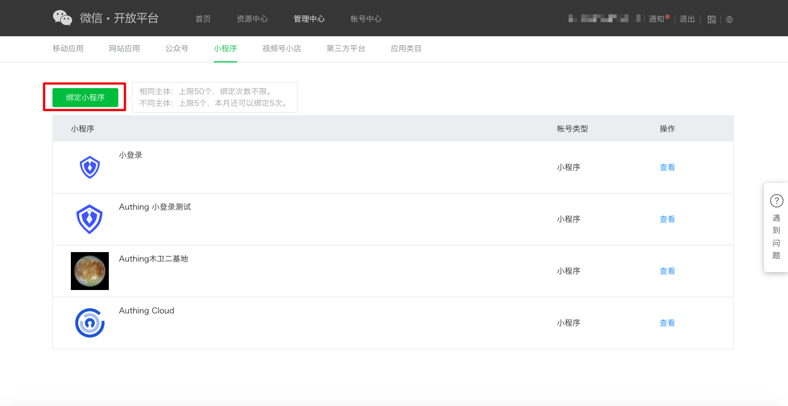
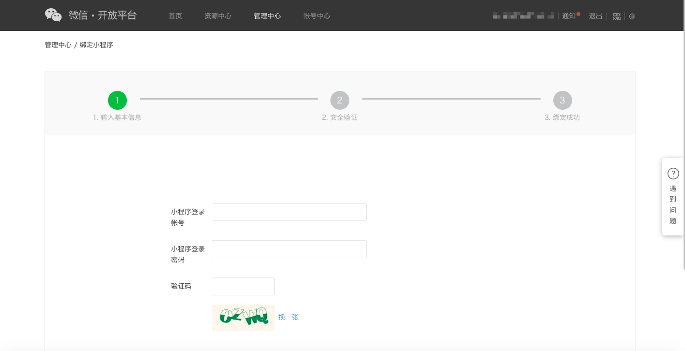
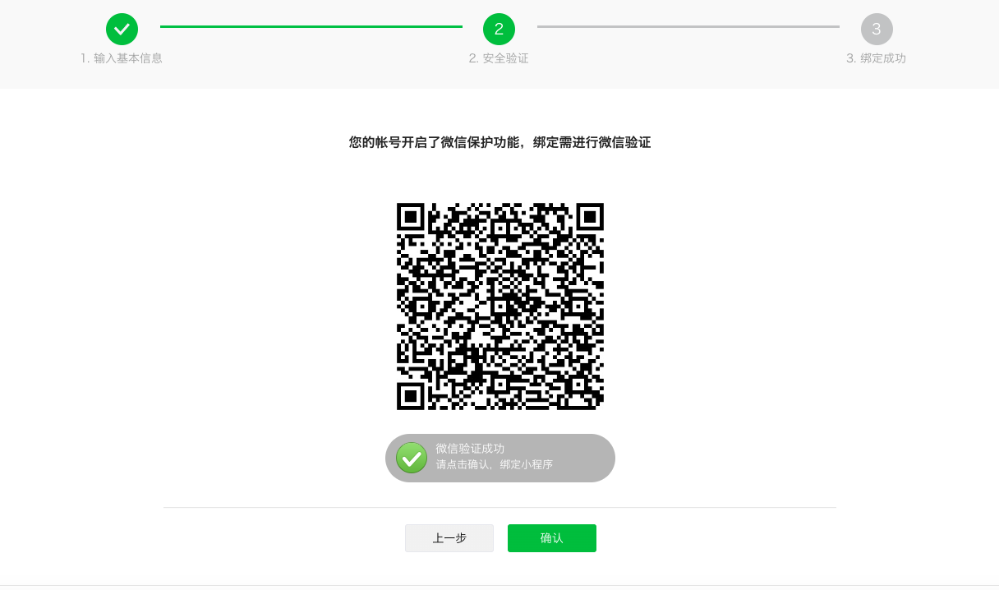
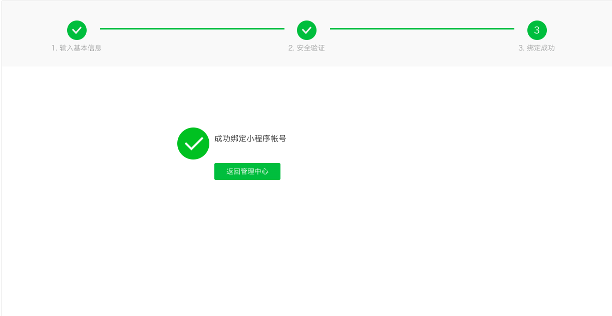
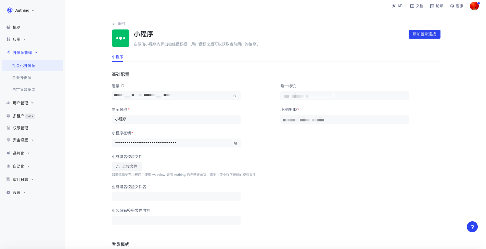
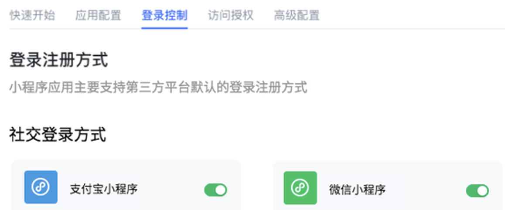

# 当你使用微信小程序进行开发

<LastUpdated/>

## 微信开放平台准备工作

### 注册微信开放平台账号​

在开发微信生态应用前，你首先要注册为微信开放平台的一名开发者。如果你还没有微信开放平台的账号，请先 [前往注册](https://open.weixin.qq.com/wxaopen/regist/index)。

### 申请开发者资质认证

完成微信开放平台的账号注册后，你需要在 **账号中心** 填写开发者资质认证申请，并等待认证通过。

### 上线你的小程序
  
#### 第一步：创建小程序

1. 创建小程序前需要 [在微信公众平台注册一个账号](https://mp.weixin.qq.com/cgi-bin/registermidpage?action=index&lang=zh_CN&token=) ，选择类型为 **小程序**。

2. 依次填写「账号信息」、「邮箱激活」和「信息登记」完成注册。

3. 注册成功后，小程序账号就创建成功了，可以在微信公众平台配置小程序信息，完成发布。

::: hint-info
可以在 **开发管理->开发设置** 页面看到 **AppID** 和 **AppSecret**，用于后续在 {{$localeConfig.brandName}} 配置小程序身份源。​
:::

#### 第二步：绑定小程序

在创建小程序后，你需要在微信开放平台绑定小程序，才可以保证在同一个微信开放平台账号下登录的不同应用有唯一的 `UnionID`。

1. 登录你的 [微信开放平台](https://open.weixin.qq.com/) 后，在 **管理中心->小程序** 下点击 **绑定小程序**。

2. 依次完成「输入基本信息」、「安全验证」，并「绑定成功」。

::: hint-info
在「安全验证」时，需要保证小程序账号：

- 通过了微信资质认证。
- 当前未被绑定。
- 该账号对应的小程序设置了管理员信息。

满足以上条件才可以验证成功。
:::

::: img-description
小程序验证成功
:::

::: img-description
小程序绑定成功
:::

## 在 {{$localeConfig.brandName}} 实现微信登录能力

### 使用微信登录的开发者场景

你希望通过创建微信应用的方式实现网页端微信登录的能力。根据上述步骤，你已经完成微信应用的创建。接下来，你不必再去阅读海量繁杂的微信文档，而是可以直接通过 {{$localeConfig.brandName}}「零代码」的方式，为你的应用实现微信登录。

### 选择合适的微信登录方式

在「小程序」的开发场景，{{$localeConfig.brandName}} 支持 [微信小程序](/reference/sdk-for-weixin-miniapp.md) 登录能力。

### 配置流程

要配置微信小程序登录方式，执行以下流程：

#### 第一步：将需要配置微信登录的小程序集成在 {{$localeConfig.brandName}}

目前 {{$localeConfig.brandName}} 暂时不支持小程序类型的应用创建，目前无法将微信小程序应用集成在 {{$localeConfig.brandName}}，敬请期待。

#### 第二步：在你的 {{$localeConfig.brandName}} 用户池中创建微信登录方式

{{$localeConfig.brandName}} 支持 20+ 种第三方账号登录方式。你可以在 [连接外部身份源（Identity Provider）](/guides/connections/README.md)查看 {{$localeConfig.brandName}} 支持的全部身份源。

配置小程序登录：

小程序登录可以让你的用户使用微信身份安全登录小程序。在 {{$localeConfig.brandName}} 中开启小程序登录之后，用户在微信中使用小程序登录可以调起授权弹窗获取微信的用户信息。配置流程详见 [微信小程序 SDK](/reference/sdk-for-weixin-miniapp.md)。

#### 第三步：为完成集成的 {{$localeConfig.brandName}} 应用开启你配置的微信登录方式

完成第三方登录配置后，在你已经完成集成的应用中（**自建应用->应用详情页->登录控制->社交登录方式**）开启对应的登录方式。

::: hint-info
**注意**：小程序类应用的社交登录方式仅展示小程序类的身份源。该页面同样需在支持小程序应用后才可以配置。​
:::

以下是示意图：

恭喜！你已经完成了微信登录的配置。现在可以在应用的「体验登录」中感受你实现的微信登录啦！

## 微信应用日常账号管理

微信平台上的用户账号使用 `OpenID` 和 `UnionID` 作为唯一标识。由于微信早年间并未要求所有应用必须加入微信开放平台，因此存在部分账号不具备 `Unionid` 的情况。后期微信规范要求所有应用必须依托微信开放平台存在。这些借由微信开放平台创建的应用登录的用户同时具备 `OpenID` 和 `UnionID` 两个唯一标识。关于两者的区别，请参阅 [微信生态账号体系介绍](/guides/wechat-ecosystem/#localeconfig-brandname-微信生态账号体系)。

基于微信的账号体系，你的用户通过微信进行登录时，存在两种场景：

* 新用户通过微信登录

* 老用户通过微信登录

对于新老用户登录的不同场景，{{$localeConfig.brandName}} 支持通过「账号绑定」功能保障你的用户在 {{$localeConfig.brandName}} 的账号唯一性。

有关「账号绑定」功能介绍和使用详情，请参阅 [账号绑定](/guides/connections/account-binding.md)。

## 其他注意事项

当你在微信开放平台的应用已经下线或停用，那么你在 {{$localeConfig.brandName}} 集成的应用将不能再使用微信登录。