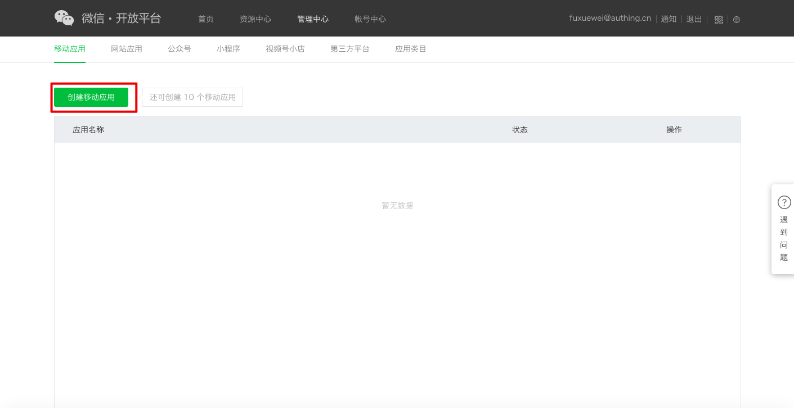
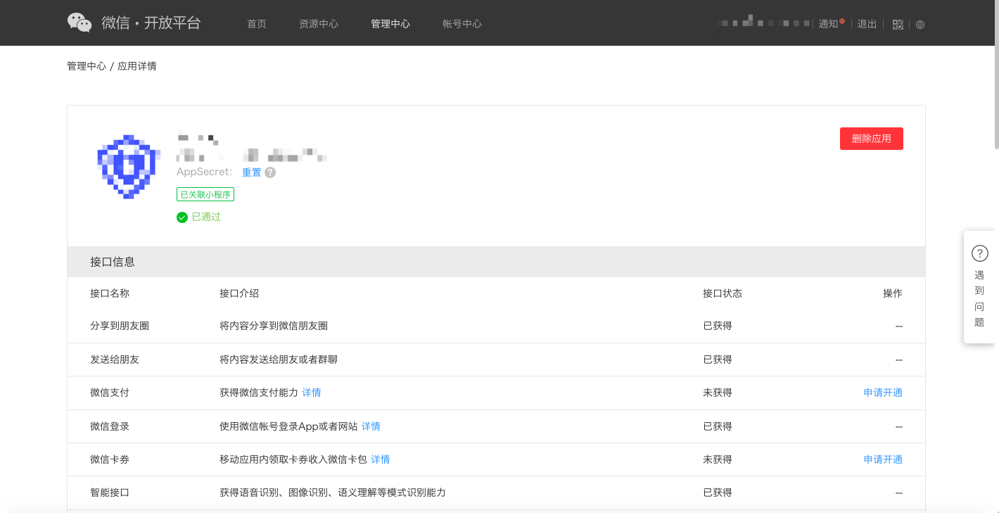
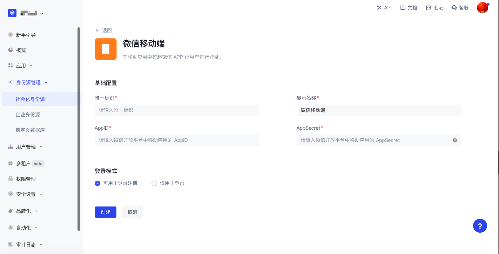
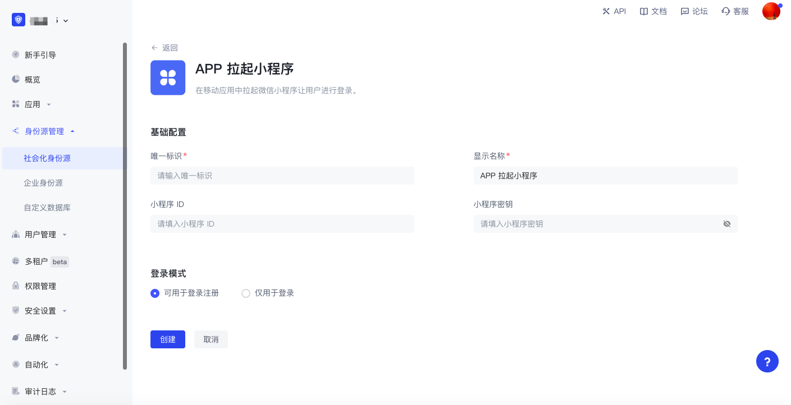
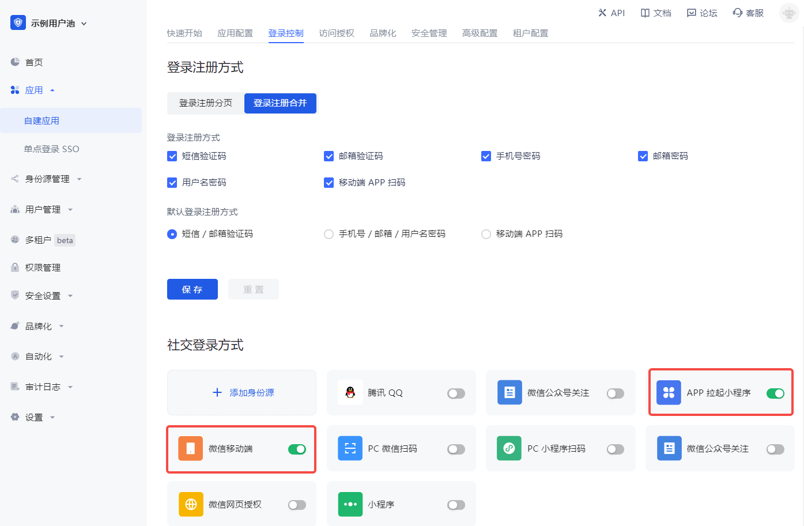

# 当你使用移动端微信应用进行开发

<LastUpdated/>

## 微信开放平台准备工作

### 注册微信开放平台账号​

在开发微信生态应用前，你首先要注册为微信开放平台的一名开发者。如果你还没有微信开放平台的账号，请先 [前往注册](https://open.weixin.qq.com/wxaopen/regist/index)。

### 申请开发者资质认证

完成微信开放平台的账号注册后，你需要在 **账号中心** 填写开发者资质认证申请，并等待认证通过。

### 上线你的移动应用
  
#### 第一步：创建移动应用

1. 登录你的 [微信开放平台](https://open.weixin.qq.com/) 后，在 **管理中心->移动应用** 下点击 **创建移动应用**。

2. 依次填写「填写基本信息」、「填写平台信息」，并「成功提交」。

#### 第二步：将你的移动应用提交审核

完成应用的创建后，你需要将应用提交至微信官方进行审核。为了确保更容易通过审核，请提前阅读并遵守微信的 [应用审核规范](https://developers.weixin.qq.com/doc/oplatform/Website_App/operation.html)。

#### 第三步：待微信官方审核通过后上线

等待微信官方审核通过后，打开你的微信移动应用时，你将看到状态为「已审核」的应用。

## 在 {{$localeConfig.brandName}} 实现微信登录能力

### 使用微信登录的开发者场景

你希望通过创建微信应用的方式实现移动端微信登录的能力。根据上述步骤，你已经完成微信应用的创建。接下来，你不必再去阅读海量繁杂的微信文档，而是可以直接通过 {{$localeConfig.brandName}}「零代码」的方式，为你的应用实现微信登录。

### 选择合适的微信登录方式

在「移动端应用」的开发场景，{{$localeConfig.brandName}} 支持微信生态全部两种微信登录能力：

* 微信移动端

* APP 拉起小程序

### 配置流程

要配置移动端微信登录方式，执行以下流程：

#### 第一步：将需要配置微信登录的应用集成在 {{$localeConfig.brandName}}

将你的应用集成在 {{$localeConfig.brandName}} 的方式，请参考 [将你的应用接入到 {{$localeConfig.brandName}}](/guides/app-new/create-app/README.md)。

#### 第二步：在你的 {{$localeConfig.brandName}} 用户池中创建微信登录方式

{{$localeConfig.brandName}} 支持 20+ 种第三方账号登录方式。你可以在 [连接外部身份源（Identity Provider）](/guides/connections/README.md)查看 {{$localeConfig.brandName}} 支持的全部身份源。

* 配置微信移动端登录： 微信移动端登录可以让你的用户使用微信身份安全登录第三方应用。在 {{$localeConfig.brandName}} 中开启微信移动端登录之后，用户使用 APP 登录可以调起微信获取微信用户身份信息。配置流程详见 [微信移动端](/guides/connections/social/wechat-mobile/README.md)。

* 配置 APP 拉起小程序登录： 在 {{$localeConfig.brandName}} 中开启 APP 拉起小程序后，用户使用 APP 登录时可以调起小程序，从而获得微信官方的实名用户信息。用户一键授权即可以真实号码完成注册或者登录。配置流程详见 [APP 拉起微信小程序](/guides/connections/social/wechat-miniprogram-applaunch/README.md)。

#### 第三步：为完成集成的 {{$localeConfig.brandName}} 应用开启你配置的微信登录方式

完成第三方登录配置后，在你已经完成集成的应用中开启对应的登录方式：

恭喜！你已经完成了微信登录的配置。现在可以在应用的「体验登录」中感受你实现的微信登录啦！

## 微信应用日常的账号管理

微信平台上的用户账号使用 `OpenID` 和 `UnionID` 作为唯一标识。由于微信早年间并未要求所有应用必须加入微信开放平台，因此存在部分账号不具备 `Unionid` 的情况。后期微信规范要求所有应用必须依托微信开放平台存在。这些借由微信开放平台创建的应用登录的用户同时具备 `OpenID` 和 `UnionID` 两个唯一标识。关于两者的区别，请参阅 [微信生态账号体系介绍](/guides/wechat-ecosystem/#localeconfig-brandname-微信生态账号体系)。

基于微信的账号体系，你的用户通过微信进行登录时，存在两种场景：

* 新用户通过微信登录

* 老用户通过微信登录

对于新老用户登录的不同场景，{{$localeConfig.brandName}} 支持通过「账号绑定」功能保障你的用户在 {{$localeConfig.brandName}} 的账号唯一性。

有关「账号绑定」功能介绍和使用详情，请参阅 [账号绑定](/guides/connections/account-binding.md)。

## 其他注意事项

当你在微信开放平台的应用已经下线或停用，那么你在 {{$localeConfig.brandName}} 集成的应用将不能再使用微信登录。