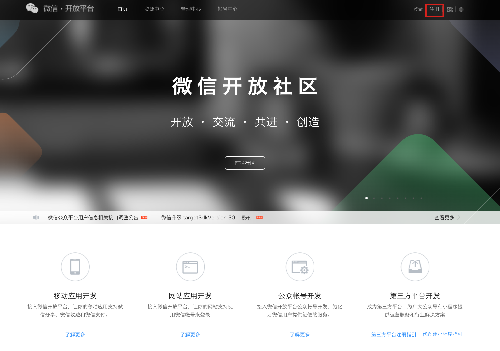
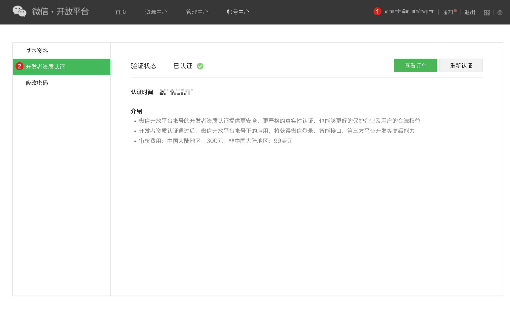
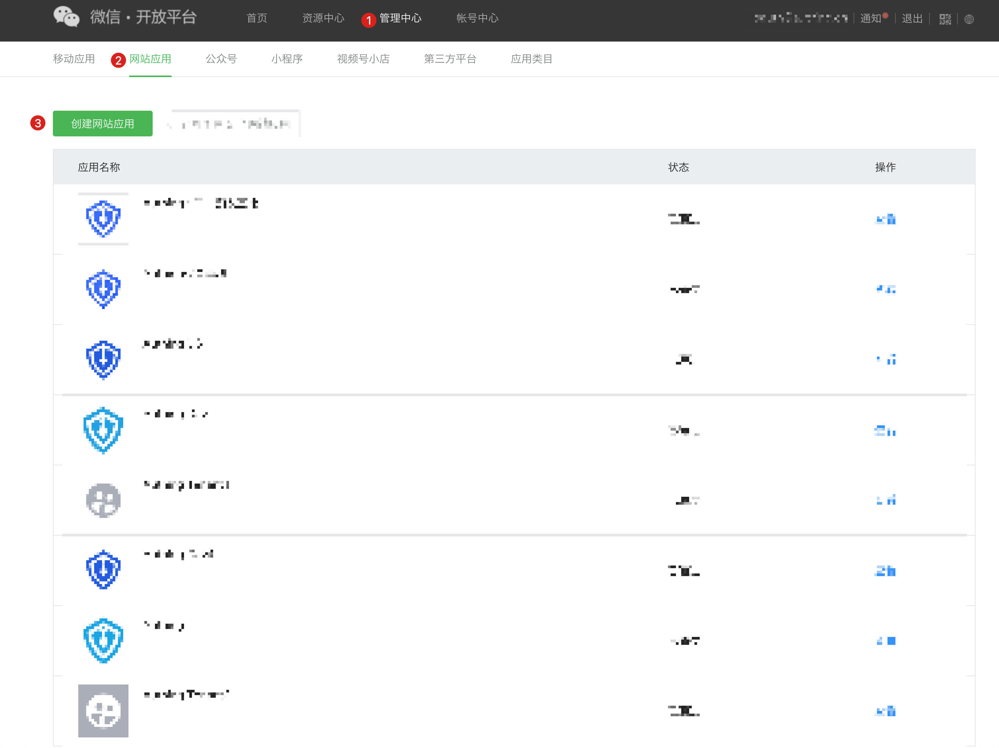
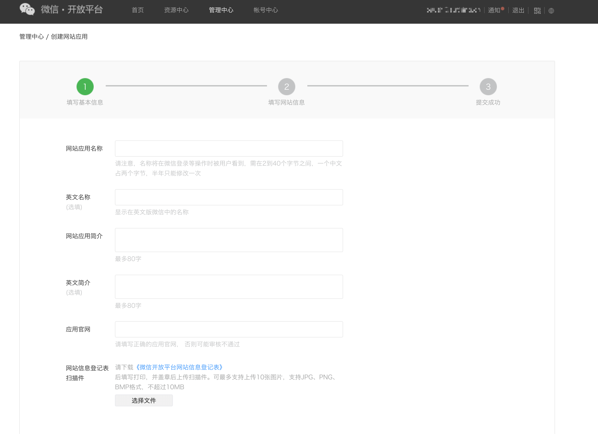
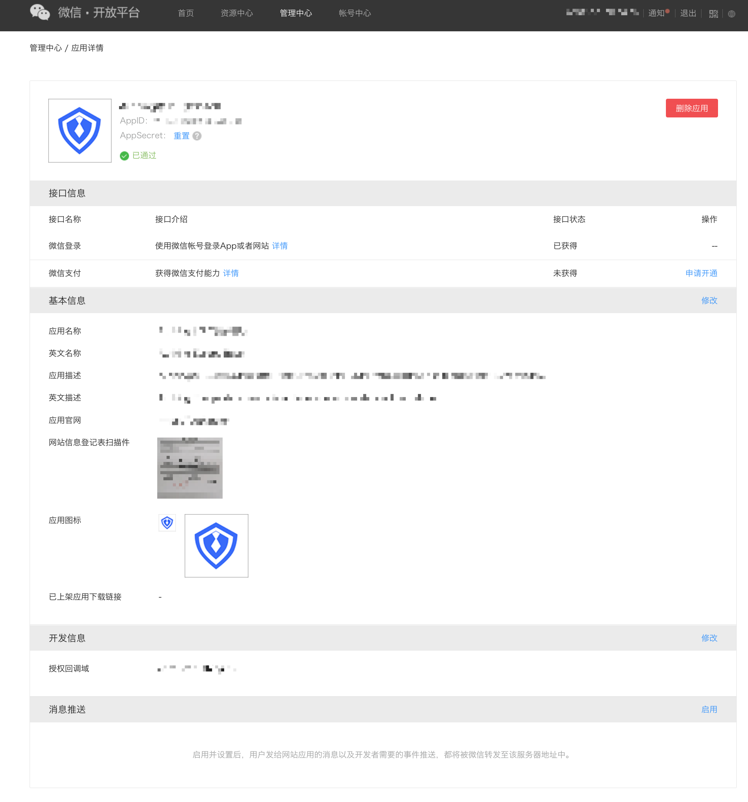
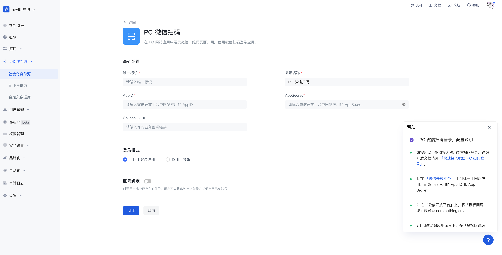
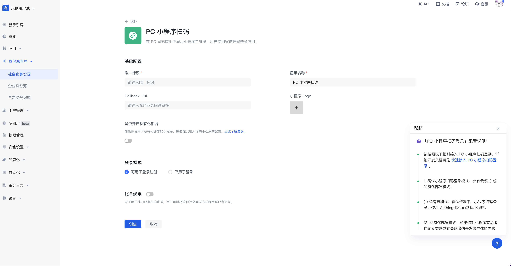
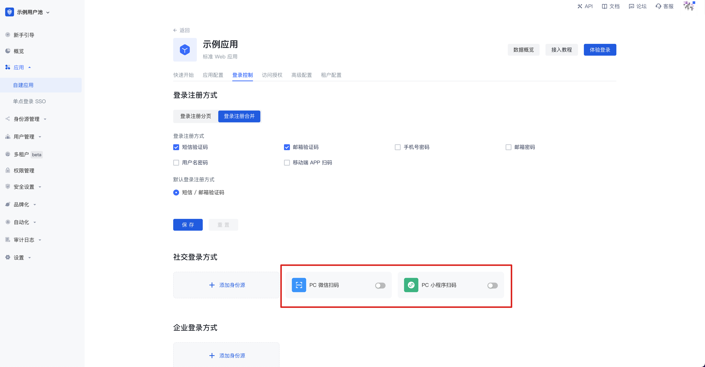

# 当你使用网页端微信应用进行开发

<LastUpdated/>

## 微信开放平台准备工作

### 注册微信开放平台账号​

在开始微信生态的应用开发前，你需要首先注册成为微信开放平台的一名开发者。如果你还没有微信开放平台的账号，请先 [前往注册](https://open.weixin.qq.com/wxaopen/regist/index)。

### 申请开发者资质认证

完成微信开放平台的账号注册后，你需要在账号中心填写开发者资质认证申请，并等待认证通过。

### 上线你的网站应用
  
#### 第一步：创建网站应用

1. 登录你的微信开放平台后，按照下面的步骤找到 **创建网站应用**：

2. 接着，你需要依次完成「填写基本信息」、「填写网站信息」，并「成功提交」。

#### 第二步：将你的网站应用提交审核

完成应用的创建后，你需要将应用提交至微信官方进行审核。为了确保你更容易通过审核，请提前阅读微信的 [应用审核规范](https://developers.weixin.qq.com/doc/oplatform/Website_App/operation.html)。

#### 第三步：待微信官方审核通过后上线

等待微信官方审核通过后，打开你的微信网站应用时，你将看到状态为「已审核」的应用，如图为一个已经通过审核的示例应用：

## 在 {{$localeConfig.brandName}} 实现微信登录能力

### 使用微信登录的开发者场景

你希望通过创建微信应用的方式，实现网页端微信登录的能力。根据上述步骤，你已经完成微信应用的创建。接下来，你不必再去阅读海量繁杂的微信文档，而是可以直接通过 {{$localeConfig.brandName}}，通过「零代码」的方式，为你的应用实现微信登录。

### 选择合适的微信登录方式

在「网页端应用」的开发场景，{{$localeConfig.brandName}} 支持微信生态全部的两种微信登录能力：

* PC 微信扫码登录

* PC 小程序扫码登录

另外，对于网页应用，{{$localeConfig.brandName}} 同时支持微信公众号扫码登录，你需要首先在微信公众平台上进行相应的配置，详情请查看 [当你使用微信公众号进行开发](/guides/wechat-ecosystem/wechat-public-account-app.md)。

### 配置流程

你可以按照下面的流程完成配置：

#### 第一步：将需要配置微信登录的应用集成在 {{$localeConfig.brandName}}

将你的应用集成在 {{$localeConfig.brandName}} 的方式请参考 [将你的应用接入到 {{$localeConfig.brandName}}](/guides/app-new/create-app/README.md)。

#### 第二步：在你的 {{$localeConfig.brandName}} 用户池中创建微信登录方式

{{$localeConfig.brandName}} 支持 20+ 种第三方账号登录方式，你可以查看 {{$localeConfig.brandName}} 支持的全部身份源 [连接外部身份源（Identity Provider）](/guides/connections/README.md)。

1. 配置 PC 微信扫码登录。 PC 微信扫码登录可以让你的用户使用微信身份安全登录第三方应用或网站。在 {{$localeConfig.brandName}} 中开启微信扫码登录之后，可实现通过 {{$localeConfig.brandName}} 快速获取微信用户基本开放信息和帮助用户实现基础开放功能。具体的配置流程详见 [PC 微信扫码](/guides/connections/social/wechat-pc/README.md)。

2. 配置 PC 小程序扫码登录。 这是 {{$localeConfig.brandName}} 的一个开创性的设计，在 {{$localeConfig.brandName}} 中开启扫描小登录二维码登录后可以获得微信官方的实名用户信息， 用户一键授权即可以真实号码完成注册或者登录，为开发者建立以手机号码为基础的账号体系。具体的配置流程详见 [微信 PC 小程序扫码](/guides/connections/social/wechat-miniprogram-qrconnect/README.md)。

#### 第三步：为完成集成的 {{$localeConfig.brandName}} 应用开启你配置的微信登录方式

完成第三方登录的配置后，在你已经完成集成的应用中开启对应的登录方式：

恭喜！你已经完成了微信登录的配置，现在可以在应用的「体验登录」中感受你实现的微信登录啦！

## 微信应用日常账号管理

微信平台上的用户账号使用 `OpenID` 和 `UnionID` 作为唯一标识。由于微信早年间并未要求所有应用必须加入微信开放平台，因此存在部分账号并不具备 `Unionid`。后期微信规范要求所有应用必须依托微信开放平台存在，这些借由微信开放平台创建的应用登录的用户同时具备 `OpenID` 和 `UnionID` 两个唯一标识。关于这两者的区别详情，请参阅 [微信生态账号体系介绍](/guides/wechat-ecosystem/README.md)。

基于微信的账号体系，你的用户在通过微信进行登录时，存在两种场景：

* 新用户通过微信登录

* 老用户通过微信登录

对于新老用户登录的不同场景，{{$localeConfig.brandName}} 支持通过「账号绑定」功能帮你保障你的用户在 {{$localeConfig.brandName}} 账号的唯一性。

有关「账号绑定」功能和使用详情，请参阅 [账号绑定](/guides/connections/account-binding.md)。

## 其他注意事项

当你在微信开放平台的应用已经下线或停用，那么你在 {{$localeConfig.brandName}} 集成的应用将不能再使用微信登录。