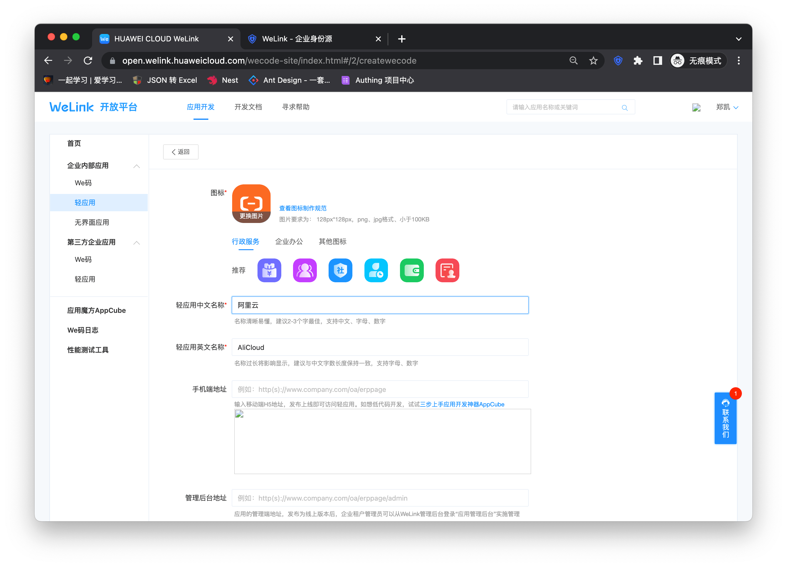
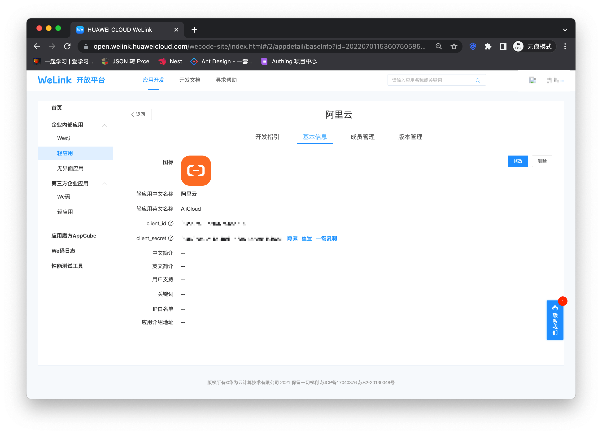
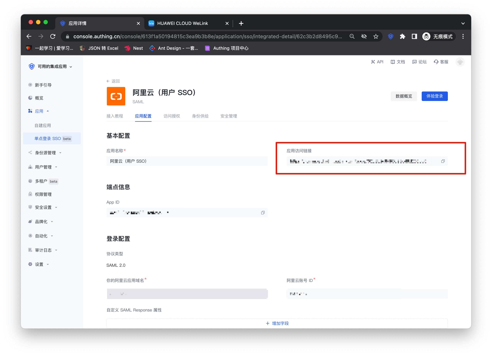
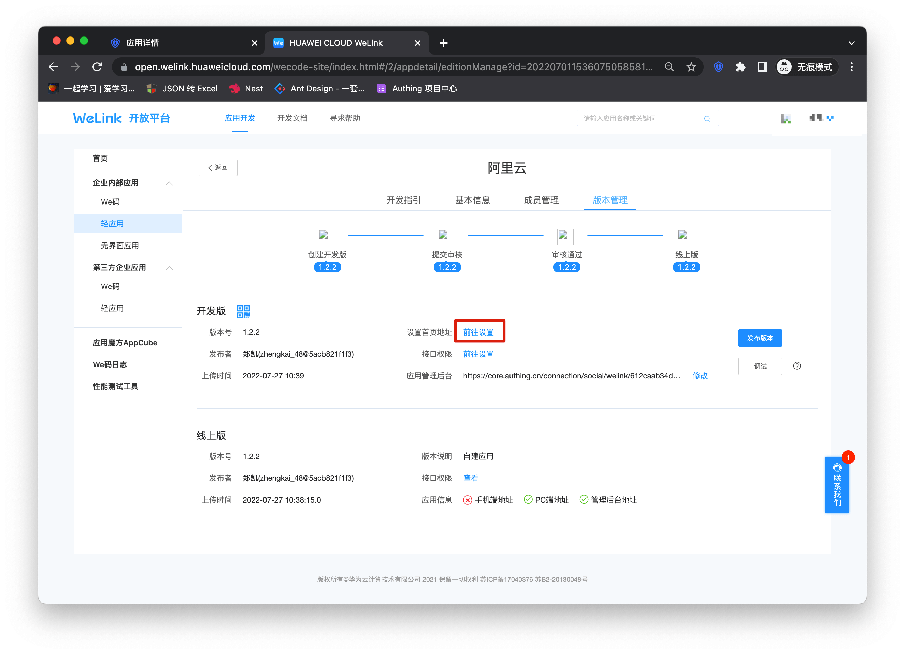
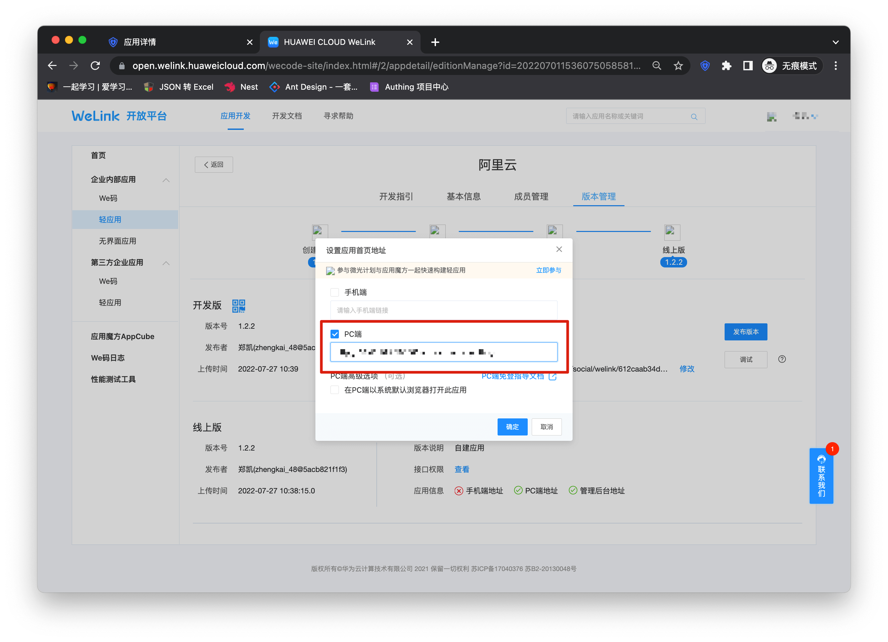
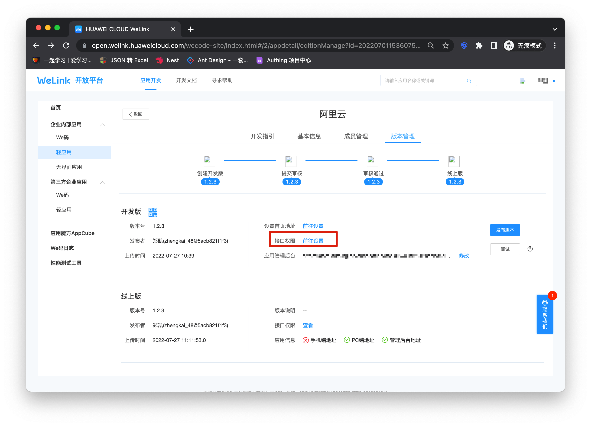
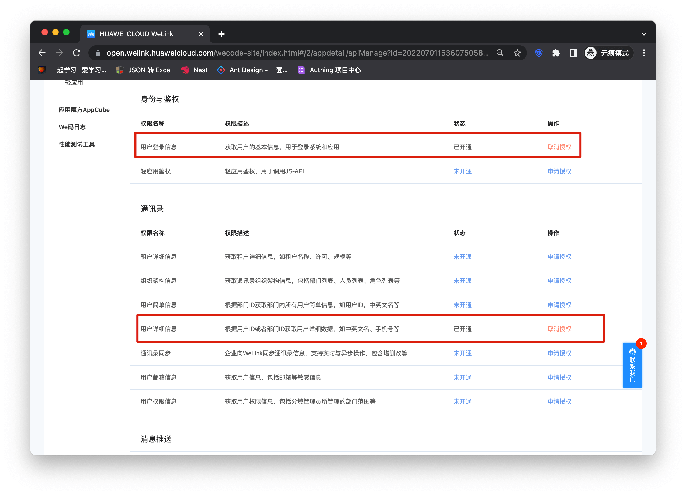
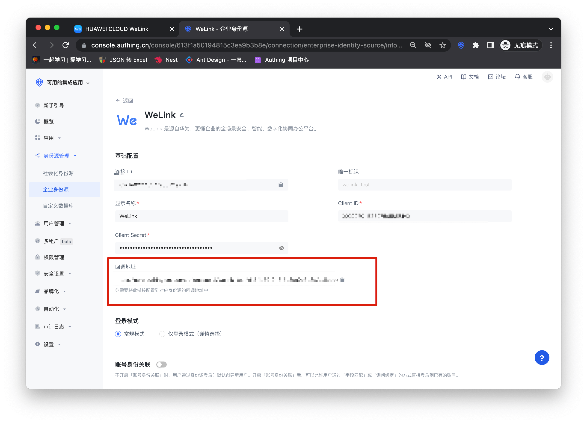
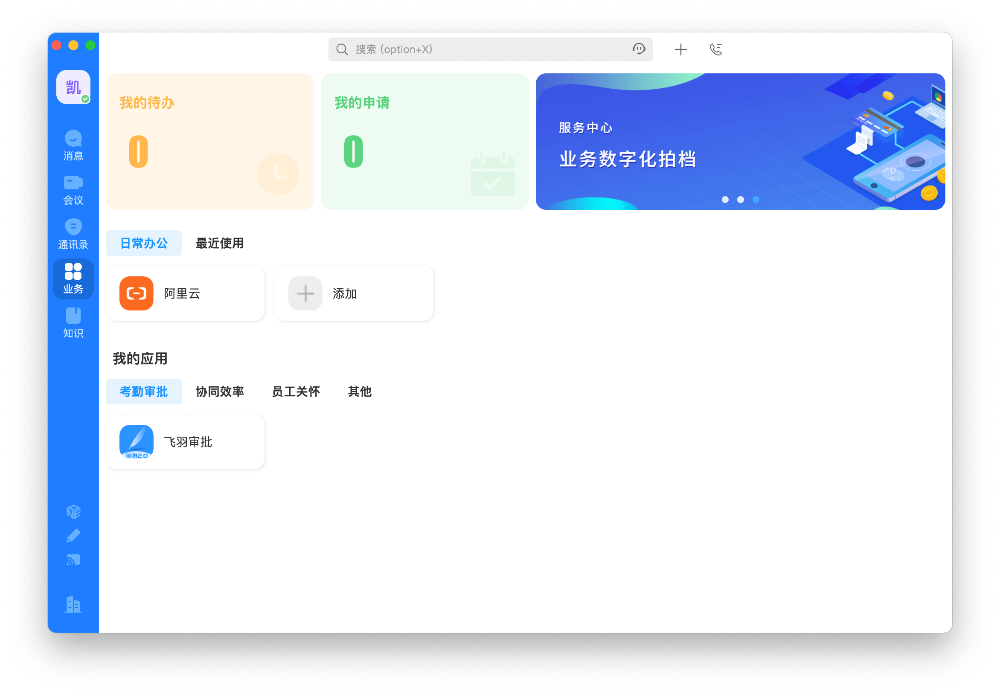
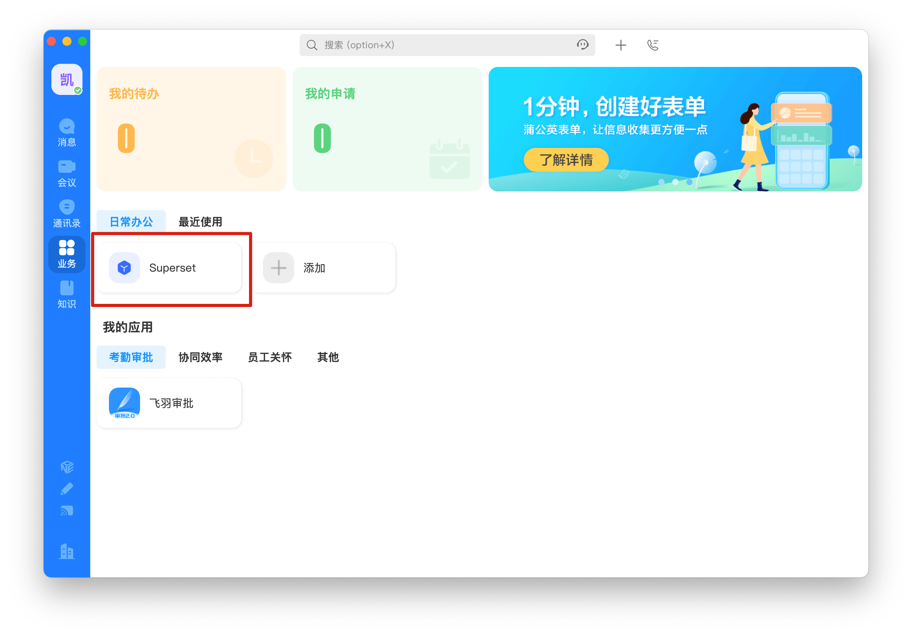

# Welink SSO 方案

<LastUpdated/>

传统的身份系统往往是由各种解决方案拼凑而成的，“身份数据”相互分离。统一账户管理的需求越发频繁且必要，通过使用集中的身份管理平台，可以极大改善用户的登录体验和 IT 办公效率，并有效提升访问安全。

我们经常被开发者问到，如何实现通过单一身份源、同一平台登录所有应用，并统一进行细颗粒度的权限管理。以 Welink 作为企业单一身份源快速添加阿里云为例，为大家提供一个极简的统一账户管理的解题思路。

## 设计思路

## 如何实现

### 第一步：将 Welink 配置为 Authing 身份源

具体 Welink 的身份源配置操作可见文档，[Welink](https://docs.authing.cn/v2/guides/connections/enterprise/welink/) 。

### 第二步：使用 Welink 单点登录阿里云

### 集成应用

1. 在完成了步骤一之后，相信你已经完成了 Welink 身份源的打通，接下来选择开放平台右侧边栏「企业内部应用」下的轻应用栏。然后点击右上角的「创建轻应用」开始应用创建流程。如下图填入应用的名称等基本信息，完成创建。

2. 应用创建成功

3. 进入阿里云配置详情页，复制应用访问链接。

4. 切换顶部 type ，进入到「版本管理」页面，点击设置首页地址后的前往设置，将前边复制的链接填入弹窗中的 PC 端链接。

5. 点击接口权限

6. 在权限详情页面开放用户登录信息以及用户详细信息权限。

7. 之后进入控制台将 Welink 身份源中的回调地址填入应用管理后台。

8. 点击「发布版本」，依据流程完成版本发布。

9. 此时你的应用已经进入 Welink 的工作面板，点击进入即可。

### 自建应用

对于自建应用，你需要进行如下操作：

1. 创建自建应用

> 首先需要创建自建应用并完成配置，创建应用参考 [如何创建自建应用](/guides/app-new/create-app/create-app.md)

2. 用户需要进入配置好的自建应用详情页，将其认证地址进行复制。

3. 与集成应用类似将认证地址复制到版本管理页面的设置首页地址的 PC 端链接里。之后步骤与集成应用一致，完成权限与应用管理后台设置后再进行应用发布即可使用。

